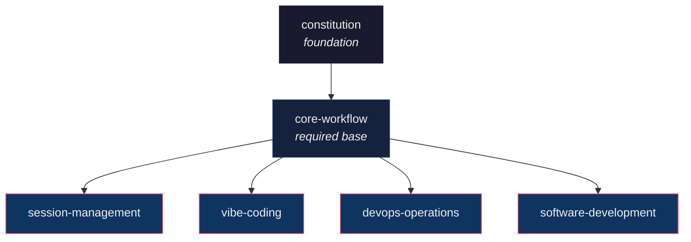

# AgentOps - Claude Code Plugin Marketplace

> **Production-ready patterns for AI-assisted development**

## What's Inside

**6 plugins** demonstrating 12-Factor AgentOps principles:

| Plugin | Description | Highlights |
|--------|-------------|------------|
| **constitution** | Foundational laws and guardrails | Nine Laws, 40% Rule, Git Discipline |
| **core-workflow** | Research → Plan → Implement → Learn | 4 agents, 5 commands |
| **session-management** | Long-lived sessions that survive context resets | Bundles, progress.json, session protocol |
| **vibe-coding** | 5 metrics, 6 levels, 12 failure patterns | Tracer tests, vibe-check CLI |
| **devops-operations** | Kubernetes, Helm, ArgoCD patterns | GitOps workflows |
| **software-development** | Python, JavaScript, Go development | TDD patterns |

---

## Quick Install

```bash
# Add marketplace
/plugin marketplace add boshu2/agentops

# Install featured plugins
/plugin install constitution@agentops
/plugin install core-workflow@agentops
/plugin install session-management@agentops
/plugin install vibe-coding@agentops
```

---

## Featured Plugins

### Constitution (Foundation)

**The rules that govern all agent operations.**

- **Nine Laws of an Agent** - Extract learnings, improve systems, document context
- **40% Rule** - Never exceed 40% token budget
- **Git Discipline** - Semantic commits, Knowledge OS patterns

```bash
/plugin install constitution@agentops
```

### Core Workflow (Required Base)

**Universal Research → Plan → Implement → Learn workflow.**


- 4 specialized agents (research, plan, implement, learn)
- 5 commands for workflow orchestration
- Human gates between phases

```bash
/plugin install core-workflow@agentops
```

### Session Management (Long-Lived Sessions)

**The real solution for multi-day projects.**

AI agents have goldfish memory - each session starts fresh. Session Management solves this:

- **Context Bundling** - Compress 60k tokens to 2-3k, survive context resets
- **Progress Tracking** - `claude-progress.json` tracks state across sessions
- **Session Protocol** - `/session-start`, `/session-end`, `/session-resume`

```bash
# Day 1
/session-start
# ... work ...
/bundle-save my-feature-research
/session-end

# Day 2
/session-resume
# Picks up exactly where you left off
```

```bash
/plugin install session-management@agentops
```

### Vibe Coding

**Measure and improve AI-assisted development.**

- **5 Core Metrics** - Iteration velocity, rework ratio, trust pass rate
- **6 Vibe Levels** - Classify task difficulty (0-5)
- **Tracer Tests** - Validate assumptions before coding

```bash
npm install -g @boshu2/vibe-check
/plugin install vibe-coding@agentops
```

---

## The 12 Factors

| Factor | Description |
|--------|-------------|
| I | Git Memory - Commits as knowledge writes |
| II | JIT Context - Load only what's needed |
| III | Single Responsibility - One agent = one job |
| IV | Validation Gates - Verify before proceeding |
| V | Operational Telemetry - Track metrics |
| VI | Session Continuity - Bundles preserve state |
| VII | Intelligent Routing - Route to right specialist |
| VIII | Human Gate Reviews - Approval at key points |
| IX | Pattern Extraction - Capture reusables |
| X | Continuous Improvement - Identify improvements |
| XI | Constitutional Guardrails - Enforce rules |
| XII | Domain Portability - Works across domains |

---

## Plugin Dependency Graph



---

## Create Your Own Plugin

### Structure

```
plugins/your-plugin/
├── .claude-plugin/
│   └── plugin.json       # Required: manifest
├── agents/               # AI specialists
├── commands/             # Slash commands
├── skills/               # Knowledge modules
└── README.md             # Documentation
```

### Plugin Manifest

```json
{
  "name": "your-plugin",
  "version": "1.0.0",
  "description": "What your plugin does",
  "dependencies": ["core-workflow"],
  "components": {
    "agents": ["agents/your-agent.md"],
    "commands": ["commands/your-command.md"]
  }
}
```

---

## Other Marketplaces

For more plugins, check these comprehensive catalogs:

| Marketplace | Size | Install |
|-------------|------|---------|
| [AITMPL](https://www.aitmpl.com) | 63+ plugins, 85+ agents | `/plugin marketplace add https://www.aitmpl.com/agents` |
| [Claude Code Templates](https://github.com/davila7/claude-code-templates) | 100+ templates | `/plugin marketplace add davila7/claude-code-templates` |
| [wshobson/agents](https://github.com/wshobson/agents) | 63 plugins | `/plugin marketplace add wshobson/agents` |

---

## Resources

- [12-Factor AgentOps](https://github.com/boshu2/12-factor-agentops) - Full framework documentation
- [vibe-check npm](https://www.npmjs.com/package/@boshu2/vibe-check) - CLI metrics tool
- [Claude Code Plugins Docs](https://docs.claude.com/en/docs/claude-code/plugins) - Official documentation

---

## License

Apache 2.0 - See [LICENSE](LICENSE)

---

**Created by:** Boden Fuller
**Purpose:** Production-ready AgentOps patterns
**Status:** Production
