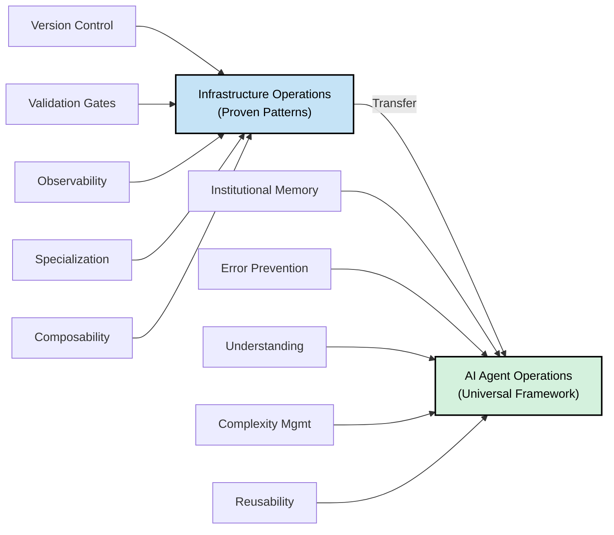
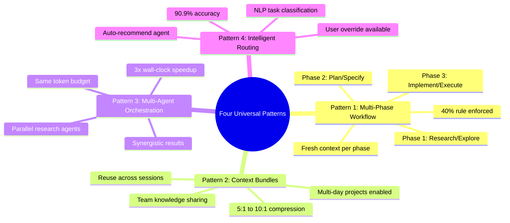
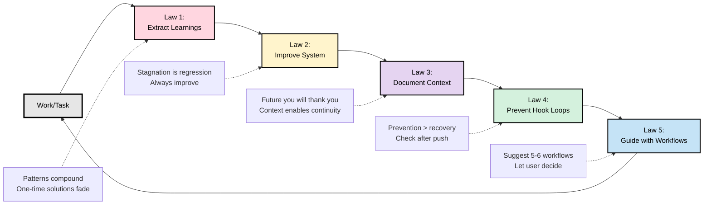

# AgentOps: Universal Framework for AI Agent Operations

<div align="center">

**Proven patterns for managing AI agents across any domain.**

<a href="https://www.apache.org/licenses/LICENSE-2.0">
    </a>
<a href="https://creativecommons.org/licenses/by-sa/4.0/">
    </a>


*Specification-driven operations using multi-phase workflows, context bundles, parallel orchestration, and intelligent routing.*

</div>

---

> [!IMPORTANT]
> **Production-Proven Framework** - These patterns have been validated across product development (40x speedup) and infrastructure operations (3x speedup). This reference implementation demonstrates universal applicability across domains.

> [!NOTE]
> **Built with AI Agents** - This framework was developed using Claude Code and documents operational patterns from AI-powered workflows. We practice what we document.

---

## The Problem

Everyone's building AI agents. Nobody's figured out how to operate them reliably at scale.

**The pattern:**

- Week 1: "This is amazing!"
- Week 4: Errors piling up
- Week 8: Back to manual work

**Sound familiar?** It mirrors the pre-DevOps era. We solved this for infrastructure. We know how to build reliable systems. **But operating AI agents reliably? We're still figuring that out.**

---

## The Insight

What works for infrastructure should work for AI agents:

- **Version control** for institutional memory
- **Validation gates** to catch errors early
- **Observability** to understand what's happening
- **Specialization** to manage complexity
- **Composable workflows** to enable reuse

**These aren't new ideas. They're proven in production infrastructure.**

This framework applies them to AI agent operations.



---

## What This Is

AgentOps is a **universal framework for AI agent operations** that works for:

- ✅ **Product Development** - Spec-driven feature development (40x speedup proven)
- ✅ **Infrastructure/DevOps** - Infrastructure-as-Code deployment (3x speedup proven)
- ⏳ **Incident Response/SRE** - Incident investigation and postmortems (pending validation)
- ⏳ **Data Engineering** - Pipeline design and implementation (pending validation)
- ⏳ **Your Domain** - Create a custom profile for any domain

---

## Public Framework vs. Internal Production

**This Repository (AgentOps):**
- ✅ Universal patterns and architecture (4 proven patterns)
- ✅ Profile templates and examples (product-dev, devops structures)
- ✅ Documentation and guides (how-to, case studies)
- ✅ Framework specification (theory and reference implementation)
- ✅ Public for community adoption and contribution

**Internal Only (GitOps, separate private repo):**
- 🔒 52+ production agents (team-specific implementation)
- 🔒 Team workflows and commands (internal only)
- 🔒 Infrastructure configuration (production credentials/secrets)
- 🔒 Institutional memory and learnings (team internal knowledge)

**Why the separation?**
1. **Reusability:** Framework stays pure, usable across organizations
2. **Security:** No internal configurations or agent implementations leak
3. **Clarity:** Framework patterns remain domain-agnostic examples
4. **Extensibility:** Others create profiles without copying internal agents

---

## Universal Architecture Layer

4 proven patterns that work across ALL domains:



### Pattern 1: Multi-Phase Workflow

Break complex work into 3 phases with human gates:

- **Phase 1:** Research/Explore (understand, gather info)
- **Phase 2:** Plan/Specify (detail exact changes)
- **Phase 3:** Implement/Execute (deploy with validation)

Each phase gets fresh context, 40% rule enforced.

### Pattern 2: Context Bundles

Compress intermediate artifacts (5:1 to 10:1 ratio):

- Save research findings, specification drafts
- Reuse across sessions (multi-day projects enabled)
- Share with team (prevent duplicate work)

### Pattern 3: Multi-Agent Orchestration

3 agents research simultaneously (3x wall-clock speedup):

- Code Explorer - searches codebase
- Documentation Researcher - reads best practices
- History Analyst - learns from past attempts

Same token budget, faster results.

### Pattern 4: Intelligent Routing

Auto-recommend best-fit agent (90.9% accuracy):

- NLP task classification
- Agent scoring and ranking
- Auto-load with user override

---

## Constitutional Foundation

**Always enforced, all domains:**



**Five Laws:**

1. **ALWAYS Extract Learnings** — Document patterns discovered
2. **ALWAYS Improve Self or System** — Identify 1+ improvement per session
3. **ALWAYS Document Context** — Capture why/solution/learning/impact
4. **ALWAYS Prevent Hook Loops** — Check after push, don't commit hook-modified files
5. **ALWAYS Guide with Workflows** — Suggest 5-6 relevant workflows

**Three Rules:**

1. ❌ NEVER modify read-only upstream
2. ✅ ALWAYS edit source of truth (never generated)
3. ✅ ALWAYS use semantic commits

**The 40% Rule:**

- Never exceed 40% context utilization per phase
- Prevents context collapse
- Enables multi-day projects via bundles

---

## Profile-Based Specialization

AgentOps core patterns + domain-specific profiles:

```
Core Kernel (All Domains)
  ├── Five Laws, Three Rules, 40% Rule
  ├── Constitutional enforcement via git hooks
  └── Universal architecture (patterns above)

Architecture Layer (All Domains)
  ├── Multi-phase workflows
  ├── Context bundles
  ├── Multi-agent orchestration
  └── Intelligent routing

Profiles (Domain-Specific)
  ├── Product-Dev Profile (8+ agents)
  ├── DevOps Profile (52+ agents)
  ├── SRE Profile (pending)
  ├── Data-Eng Profile (pending)
  └── Your Custom Profile (create with guide)
```

Each profile customizes:
- Specialized agents (8-50+ depending on domain)
- Domain-specific workflows
- Terminology and standards
- Examples and case studies

---

## Proven Results

### Product Development (Original)
- **Speedup:** 40x vs traditional development
- **Metric:** Feature completion time
- **Patterns:** All 4 universal patterns

### Infrastructure/DevOps (GitOps Integration, Nov 2025)
- **Research speedup:** 3x (30 min → 10 min via parallel agents)
- **Validation speedup:** 3x (30 sec → 10 sec via parallel checks)
- **New capability:** Multi-day projects via bundles
- **Team benefit:** Duplicate research prevention
- **Patterns:** All 4 universal patterns, 90.9% routing accuracy

### Multi-Domain Validation
✅ Same patterns work identically in product-dev and infrastructure
✅ Convergent evolution proves universality (not domain-specific)
⏳ Pending: SRE, Data Engineering, custom domains

---

## Quick Start

### For Product Development
```bash
# Use default profile (product-dev)
~/.agentops/scripts/project-install.sh default
```

### For Infrastructure/DevOps
```bash
# Use devops profile
~/.agentops/scripts/project-install.sh devops
```

### Create Custom Profile
See `docs/how-to/CREATE_CUSTOM_PROFILE.md`

---

## Documentation

### Getting Started
- `CONSTITUTION.md` - Five Laws, Three Rules, 40% Rule
- `docs/explanation/agentops-manifesto.md` - Why agentops matters
- `docs/how-to/` - Operational guides

### Architecture & Patterns
- `architecture/` - The 4 universal patterns
  - `phase-based-workflow.md` - Multi-phase execution
  - `context-bundles.md` - Compression and reuse
  - `multi-agent-orchestration.md` - Parallel agents
  - `intelligent-routing.md` - NLP routing (90.9% accuracy)
- `docs/explanation/PATTERN_EXTRACTION_METHODOLOGY.md` - How we identified universal patterns

### Profiles
- `profiles/product-dev/` - Product development specialization (template)
- `profiles/devops/` - Infrastructure/DevOps specialization (template)
- `profiles/[your-domain]/` - Your custom profile (template)

**Note:** Profile README files show structure and workflows. The actual production agents live in internal repositories (e.g., 52+ agents in private GitOps repo). Profiles in agentops are templates for others to build on.

### Case Studies
- `docs/case-studies/MULTI_DOMAIN_VALIDATION.md` - Validation across domains
- `docs/case-studies/CASE_STUDY_GITOPS_INTEGRATION.md` - Infrastructure application
- `docs/case-studies/[your-domain]/` - Your domain case study

### Building Profiles
- `docs/how-to/CREATE_CUSTOM_PROFILE.md` - Step-by-step guide

---

## Philosophy

**Core Vision: An Operating System for the Mind**

AgentOps isn't a framework—it's an **operating system for reliable AI agent operations**. Like a traditional OS that manages processes, memory, and resources, AgentOps manages:

- **Attention** (context windows, 40% rule prevents cognitive overload)
- **Work routing** (intelligent agents, like process scheduling)
- **Memory** (git-based institutional knowledge, like a file system)
- **Patterns** (constitutional laws, like system permissions)
- **Collaboration** (multi-agent orchestration, like multi-processing)
- **Continuous improvement** (extracts patterns, compounds over time)

**Why this matters:** The same patterns that optimize human cognitive load (ADHD burst cycles → 40% rule → phase-based work) work universally for AI agents, teams, and infrastructure. Not arbitrary design—based on how minds actually work.

**Convergent Evolution**:
- AgentOps (product development)
- GitOps/Knowledge OS (infrastructure)
- Both independently discovered the same patterns

This proves these are **universal laws of AI agent operation**, not domain-specific techniques.

**The Insight**:
All complex work benefits from:
1. Separate cognitive phases (research → plan → execute)
2. Reusable intermediate artifacts (bundles)
3. Multiple perspectives (parallel agents)
4. Intelligent specialization (routing)

These are universal human and AI challenges, applicable everywhere.

---

## Key Features

- ✅ Constitutional foundation (always enforced)
- ✅ JIT loading (40% rule prevents context collapse)
- ✅ Phase-based workflows (research → plan → implement)
- ✅ Context bundles (reuse across sessions, 5:1-10:1 compression)
- ✅ Multi-agent orchestration (3x speedup)
- ✅ Intelligent routing (90.9% accuracy)
- ✅ Profile system (customize for your domain)
- ✅ Git hooks (enforce best practices)
- ✅ Institutional memory (git-based knowledge base)

---

## Framework: 12-Factor AgentOps

This implementation follows the **[12-Factor AgentOps](https://github.com/boshu2/12-factor-agentops)** framework:

- **12-Factor AgentOps** = Theory & Specification (operational principles & research)
- **AgentOps** = Reference Implementation (working patterns & proven speedups)

See the [12-Factor AgentOps documentation](https://github.com/boshu2/12-factor-agentops) for the foundational principles, patterns, and thinking behind this work.

---

## License

**Apache License 2.0**

- **Code** (agents, profiles, workflows): Apache 2.0
- **Documentation** (patterns, guides): CC BY-SA 4.0 (same as 12-Factor AgentOps)

The Apache 2.0 license:
- Permits commercial use and modification
- Requires attribution
- Includes explicit patent grant
- Encourages community contribution and customization

This aligns with 12-Factor AgentOps and supports the goal of making AI agent operations reliable and extensible across any domain.

---

## Contributing

Want to create a profile for your domain? See `docs/how-to/CREATE_CUSTOM_PROFILE.md` and contribute your case study back to the community.

> [!TIP]
> Try these patterns in your domain and share what works. This framework improves through community feedback and validation.

---

## Acknowledgments

**Agent OS** ([agent-os](https://github.com/agent-os))

AgentOps patterns for multi-agent orchestration and specialized agent routing were informed by and build upon the work of the Agent OS project. We independently developed similar patterns for agent operations, discovered convergent evolution, and contributed enhancements including:

- Multi-phase workflow (research → plan → implement) integration
- Context bundles (session-spanning artifact compression)
- Intelligent routing (NLP-based agent classification)
- Profile system for domain-specific customization

Special thanks to the Agent OS team for open-sourcing infrastructure that enabled broader exploration of agent operational patterns.

---

<div align="center">

**Universal patterns for reliable AI agent operations.**

*Proven across product development, infrastructure automation, and complex workflows.*

*[Star this repo](https://github.com/boshu2/agentops) · [Report issues](https://github.com/boshu2/agentops/issues) · [12-Factor AgentOps](https://github.com/boshu2/12-factor-agentops)*

</div>
