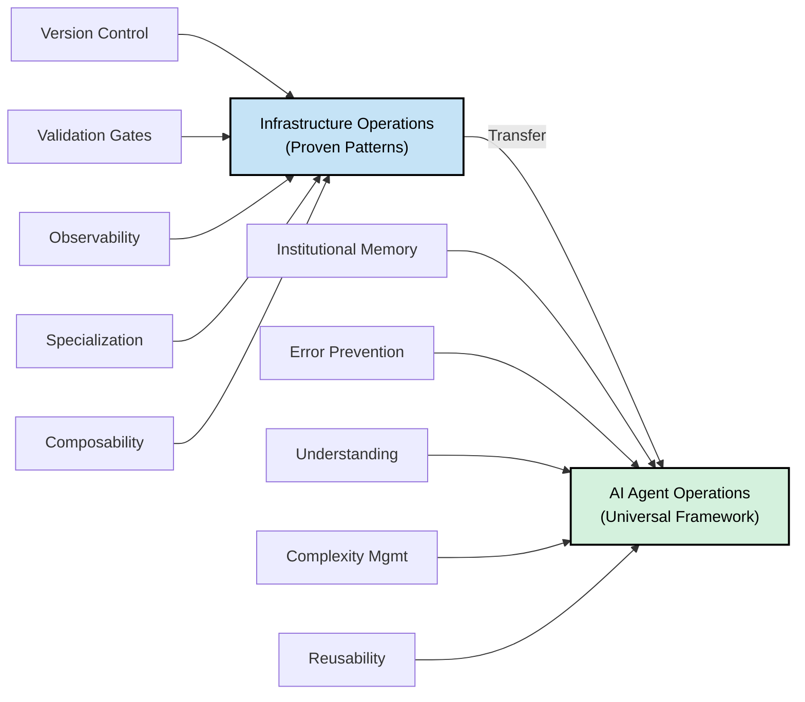
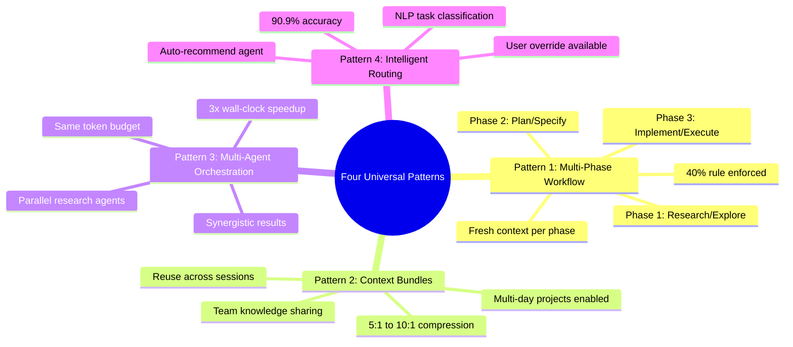
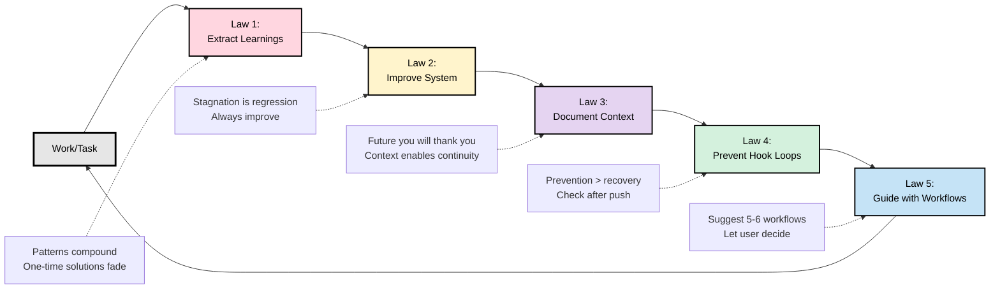

# AgentOps: Orchestrator for AI Agent Operating Systems

[](https://github.com/boshu2/agentops/actions/workflows/validate.yml)

<div align="center">

**Like Kubernetes orchestrates containers, agentops orchestrates AI agent systems.**

<a href="https://www.apache.org/licenses/LICENSE-2.0">
    </a>
<a href="https://creativecommons.org/licenses/by-sa/4.0/">
    </a>


*DevOps lifecycle management • Parallel execution • Service mesh • Multi-flavor support*

</div>

---

> [!IMPORTANT]
> **Production-Proven Framework** - These patterns have been validated across product development (40x speedup) and infrastructure operations (3x speedup). This reference implementation demonstrates universal applicability across domains.

> [!NOTE]
> **Built with AI Agents** - This framework was developed using Claude Code and documents operational patterns from AI-powered workflows. We practice what we document.

---

## Philosophical Foundation

Want to understand why AgentOps works? See [12-factor-agentops](https://github.com/boshu2/12-factor-agentops) for the framework, patterns, and research.

**Start there if you want to:**
- Understand AgentOps deeply
- Learn the Four Pillars and Five Laws
- Study operational patterns and theory
- Contribute new patterns or research

**See Also:** [12-Factor AgentOps README](https://github.com/boshu2/12-factor-agentops#readme) for the framework overview.

---

## The Problem

Everyone's building AI agents. Nobody's figured out how to operate them reliably at scale.

**The pattern:**

- Week 1: "This is amazing!"
- Week 4: Errors piling up
- Week 8: Back to manual work

**Sound familiar?** It mirrors the pre-DevOps era. We solved this for infrastructure. We know how to build reliable systems. **But operating AI agents reliably? We're still figuring that out.**

---

## The Insight

What works for infrastructure should work for AI agents:

- **Version control** for institutional memory
- **Validation gates** to catch errors early
- **Observability** to understand what's happening
- **Specialization** to manage complexity
- **Composable workflows** to enable reuse

**These aren't new ideas. They're proven in production infrastructure.**

This framework applies them to AI agent operations.



---

## What This Is

AgentOps is an **orchestration layer** for AI agent operating systems—the Kubernetes for knowledge work.

```
┌─────────────────────────────────────────┐
│  agentops (Orchestrator Layer)         │
│  • Schedules agent workloads            │
│  • Manages parallel execution           │
│  • Provides DevOps lifecycle            │
│  • Monitors performance                 │
└─────────────────────────────────────────┘
                    ▼
┌─────────────────────────────────────────┐
│  Agent Operating Systems (Flavors)      │
│  • product-dev (spec-first workflow)   │
│  • infrastructure-ops (research-driven)     │
│  • [community flavors]                  │
└─────────────────────────────────────────┘
```

**We don't replace agent systems—we orchestrate them.**

Use multiple agent OS flavors in ONE project:
- ✅ **product-dev** for product development (7-phase spec-first workflow)
- ✅ **infrastructure-ops** for infrastructure (3-phase research-driven)
- ✅ **devops** for Kubernetes/GitOps (52 specialized agents)
- ✅ **Your custom flavor** for your domain needs

**📘 [View Full Flavor Catalog](profiles/)** - Compare flavors, see decision tree, learn when to use each

**See** [`profiles/MULTI_FLAVOR_EXAMPLE.md`](profiles/MULTI_FLAVOR_EXAMPLE.md) **for a real-world scenario showing how multiple flavors work together in parallel.**

---

## Public Framework vs. Internal Production

**This Repository (AgentOps):**
- ✅ Universal patterns and architecture (4 proven patterns)
- ✅ Profile templates and examples (product-dev, devops structures)
- ✅ Documentation and guides (how-to, case studies)
- ✅ Framework specification (theory and reference implementation)
- ✅ Public for community adoption and contribution

**Internal Only (GitOps, separate private repo):**
- 🔒 52+ production agents (team-specific implementation)
- 🔒 Team workflows and commands (internal only)
- 🔒 Infrastructure configuration (production credentials/secrets)
- 🔒 Institutional memory and learnings (team internal knowledge)

**Why the separation?**
1. **Reusability:** Framework stays pure, usable across organizations
2. **Security:** No internal configurations or agent implementations leak
3. **Clarity:** Framework patterns remain domain-agnostic examples
4. **Extensibility:** Others create profiles without copying internal agents

---

## Universal Architecture Layer

4 proven patterns that work across ALL domains:



### Pattern 1: Multi-Phase Workflow

Break complex work into 3 phases with human gates:

- **Phase 1:** Research/Explore (understand, gather info)
- **Phase 2:** Plan/Specify (detail exact changes)
- **Phase 3:** Implement/Execute (deploy with validation)

Each phase gets fresh context, 40% rule enforced.

### Pattern 2: Context Bundles

Compress intermediate artifacts (5:1 to 10:1 ratio):

- Save research findings, specification drafts
- Reuse across sessions (multi-day projects enabled)
- Share with team (prevent duplicate work)

### Pattern 3: Multi-Agent Orchestration

3 agents research simultaneously (3x wall-clock speedup):

- Code Explorer - searches codebase
- Documentation Researcher - reads best practices
- History Analyst - learns from past attempts

Same token budget, faster results.

### Pattern 4: Intelligent Routing

Auto-recommend best-fit agent (90.9% accuracy):

- NLP task classification
- Agent scoring and ranking
- Auto-load with user override

---

## Constitutional Foundation

**Always enforced, all domains:**



**Five Laws:**

1. **ALWAYS Extract Learnings** — Document patterns discovered
2. **ALWAYS Improve Self or System** — Identify 1+ improvement per session
3. **ALWAYS Document Context** — Capture why/solution/learning/impact
4. **ALWAYS Prevent Hook Loops** — Check after push, don't commit hook-modified files
5. **ALWAYS Guide with Workflows** — Suggest 5-6 relevant workflows

**Three Rules:**

1. ❌ NEVER modify read-only upstream
2. ✅ ALWAYS edit source of truth (never generated)
3. ✅ ALWAYS use semantic commits

**The 40% Rule:**

- Never exceed 40% context utilization per phase
- Prevents context collapse
- Enables multi-day projects via bundles

---

## Orchestration Architecture

AgentOps provides the orchestration layer for multiple agent operating systems:

```
┌──────────────────────────────────────────────────────────┐
│         agentops (Orchestration Layer)                   │
│                                                           │
│  Core Capabilities:                                      │
│  • Workload scheduling (route to right agent system)    │
│  • Parallel execution (microservices pattern)           │
│  • Service mesh (agent-to-agent communication)          │
│  • DevOps lifecycle (CI/CD for agent work)              │
│  • Observability (metrics, monitoring, health)          │
│  • Constitutional enforcement (Five Laws, Three Rules)   │
└──────────────────────────────────────────────────────────┘
                             ▼
┌──────────────────────────────────────────────────────────┐
│         Agent Operating Systems (Profiles)               │
│                                                           │
│  profiles/spec-first-dev/      (agent-os inspired)       │
│   └── Product development workflows                      │
│                                                           │
│  profiles/research-plan-implement/  (gitops patterns)    │
│   └── 3-phase infrastructure workflows                   │
│                                                           │
│  profiles/[your-domain]/  (community contributed)        │
│   └── Your specialized workflows                         │
└──────────────────────────────────────────────────────────┘
```

**Each profile is an agent operating system** with its own:
- Workflow philosophy (spec-first, research-first, test-first, etc.)
- Agent definitions and commands
- Standards and conventions
- Use cases and patterns

**AgentOps orchestrates them all.**

---

## Proven Results

### Product Development (Original)
- **Speedup:** 40x vs traditional development
- **Metric:** Feature completion time
- **Patterns:** All 4 universal patterns

### Infrastructure/DevOps (GitOps Integration, Nov 2025)
- **Research speedup:** 3x (30 min → 10 min via parallel agents)
- **Validation speedup:** 3x (30 sec → 10 sec via parallel checks)
- **New capability:** Multi-day projects via bundles
- **Team benefit:** Duplicate research prevention
- **Patterns:** All 4 universal patterns, 90.9% routing accuracy

### Multi-Domain Validation
✅ Same patterns work identically in product-dev and infrastructure
✅ Convergent evolution proves universality (not domain-specific)
⏳ Pending: SRE, Data Engineering, custom domains

---

## Quick Start

### Step 1: Base Installation
```bash
curl -sSL https://raw.githubusercontent.com/boshu2/agentops/main/scripts/base-install.sh | bash
```

### Step 2: Project Installation
```bash
cd /path/to/your/project
~/.agentops/scripts/project-install.sh default
```

Choose your profile:
- `default` - Generic foundation (core framework, works across all domains)

For detailed instructions, see [INSTALL.md](INSTALL.md)

---

## Working Space: Launch Preparation (Nov 11 - Dec 1, 2025)

**Current Phase:** Alpha launch preparation
**Status:** Experimental working space (will be sanitized before public)

The `/launch/` directory contains work-in-progress content for the Dec 1 dual launch:

- **`/launch/case-studies/`** - Multi-domain validation (product-dev, devops, SRE, data-eng)
- **`/launch/profiles/`** - Domain-specific profile templates for community
- **`/launch/guides/`** - Contributor and adopter guides
- **`/launch/examples/`** - Working code examples and proof-of-concepts

See [`launch/README.md`](launch/README.md) for detailed workflow, timeline, and cleanup checklist.

**Before Dec 1:** All launch content is reviewed, sanitized, and moved to permanent locations (`/docs/case-studies/`, `/profiles/`, `/docs/how-to/`, etc.). The `/launch/` directory is removed.

---

## Repository Architecture (Core vs. Working Space)

### Core Framework (Permanent, Public-Ready)

```
agentops/
├── claude.md                          (kernel for contributors)
├── STRATEGY.md                        (mission & direction)
├── README.md                          (this file)
├── CONSTITUTION.md                    (Five Laws, Three Rules, 40% Rule)
├── INSTALL.md                         (installation guide)
│
├── architecture/                      (4 universal patterns)
│   ├── phase-based-workflow.md
│   ├── context-bundles.md
│   ├── multi-agent-orchestration.md
│   └── intelligent-routing.md
│
├── docs/
│   ├── explanation/                   (why patterns work)
│   │   ├── agentops-manifesto.md
│   │   └── PATTERN_EXTRACTION_METHODOLOGY.md
│   ├── how-to/                        (how to use patterns)
│   │   ├── CREATE_CUSTOM_PROFILE.md
│   │   └── [domain-specific guides]
│   └── case-studies/                  (finalized validations)
│       ├── MULTI_DOMAIN_VALIDATION.md
│       └── CASE_STUDY_GITOPS_INTEGRATION.md
│
├── profiles/                          (domain templates)
│   ├── default/
│   ├── product-dev/
│   ├── devops/
│   └── [community profiles]
│
├── scripts/                           (installation)
│   ├── base-install.sh
│   └── project-install.sh
│
└── .claude/                           (Claude Code config)
    ├── settings.json
    └── README.md
```

### Working Space (Experimental, Sanitized Before Dec 1)

```
agentops/launch/                       (← REMOVE before public release)
├── README.md                          (working space guide)
├── case-studies/                      (in-progress validations)
├── profiles/                          (draft profile templates)
├── guides/                            (draft contributor/user guides)
└── examples/                          (working proof-of-concepts)
```

---

## Documentation

### Getting Started
- `CONSTITUTION.md` - Five Laws, Three Rules, 40% Rule
- `docs/explanation/agentops-manifesto.md` - Why agentops matters
- `docs/how-to/` - Operational guides

### Architecture & Patterns
- `architecture/` - The 4 universal patterns
  - `phase-based-workflow.md` - Multi-phase execution
  - `context-bundles.md` - Compression and reuse
  - `multi-agent-orchestration.md` - Parallel agents
  - `intelligent-routing.md` - NLP routing (90.9% accuracy)
- `docs/explanation/PATTERN_EXTRACTION_METHODOLOGY.md` - How we identified universal patterns

### Profiles
- `profiles/product-dev/` - Product development specialization (template)
- `profiles/devops/` - Infrastructure/DevOps specialization (template)
- `profiles/[your-domain]/` - Your custom profile (template)

**Note:** Profile README files show structure and workflows. The actual production agents live in internal repositories (e.g., 52+ agents in private GitOps repo). Profiles in agentops are templates for others to build on.

### Case Studies
- `docs/case-studies/MULTI_DOMAIN_VALIDATION.md` - Validation across domains
- `docs/case-studies/CASE_STUDY_GITOPS_INTEGRATION.md` - Infrastructure application
- `docs/case-studies/[your-domain]/` - Your domain case study

### Building Profiles
- `docs/how-to/CREATE_CUSTOM_PROFILE.md` - Step-by-step guide

---

## Philosophy

**Core Vision: An Operating System for the Mind**

AgentOps isn't a framework—it's an **operating system for reliable AI agent operations**. Like a traditional OS that manages processes, memory, and resources, AgentOps manages:

- **Attention** (context windows, 40% rule prevents cognitive overload)
- **Work routing** (intelligent agents, like process scheduling)
- **Memory** (git-based institutional knowledge, like a file system)
- **Patterns** (constitutional laws, like system permissions)
- **Collaboration** (multi-agent orchestration, like multi-processing)
- **Continuous improvement** (extracts patterns, compounds over time)

**Why this matters:** The same patterns that optimize human cognitive load (ADHD burst cycles → 40% rule → phase-based work) work universally for AI agents, teams, and infrastructure. Not arbitrary design—based on how minds actually work.

**Convergent Evolution**:
- AgentOps (product development)
- GitOps/Knowledge OS (infrastructure)
- Both independently discovered the same patterns

This proves these are **universal laws of AI agent operation**, not domain-specific techniques.

**The Insight**:
All complex work benefits from:
1. Separate cognitive phases (research → plan → execute)
2. Reusable intermediate artifacts (bundles)
3. Multiple perspectives (parallel agents)
4. Intelligent specialization (routing)

These are universal human and AI challenges, applicable everywhere.

---

## Key Features

- ✅ Constitutional foundation (always enforced)
- ✅ JIT loading (40% rule prevents context collapse)
- ✅ Phase-based workflows (research → plan → implement)
- ✅ Context bundles (reuse across sessions, 5:1-10:1 compression)
- ✅ Multi-agent orchestration (3x speedup)
- ✅ Intelligent routing (90.9% accuracy)
- ✅ Profile system (customize for your domain)
- ✅ Git hooks (enforce best practices)
- ✅ Institutional memory (git-based knowledge base)

---

## Framework: 12-Factor AgentOps

This implementation follows the **[12-Factor AgentOps](https://github.com/boshu2/12-factor-agentops)** framework:

- **12-Factor AgentOps** = Theory & Specification (operational principles & research)
- **AgentOps** = Reference Implementation (working patterns & proven speedups)

See the [12-Factor AgentOps documentation](https://github.com/boshu2/12-factor-agentops) for the foundational principles, patterns, and thinking behind this work.

---

## License

**Apache License 2.0**

- **Code** (agents, profiles, workflows): Apache 2.0
- **Documentation** (patterns, guides): CC BY-SA 4.0 (same as 12-Factor AgentOps)

The Apache 2.0 license:
- Permits commercial use and modification
- Requires attribution
- Includes explicit patent grant
- Encourages community contribution and customization

This aligns with 12-Factor AgentOps and supports the goal of making AI agent operations reliable and extensible across any domain.

---

## Contributing

Want to create a profile for your domain? See `docs/how-to/CREATE_CUSTOM_PROFILE.md` and contribute your case study back to the community.

> [!TIP]
> Try these patterns in your domain and share what works. This framework improves through community feedback and validation.

---

## Acknowledgments

### Agent OS - Complementary, Not Competitive

**[agent-os](https://github.com/agent-os)** independently discovered that AI agents need operating systems. They built one focused on spec-first product development. We're building orchestration.

**The natural evolution:**
1. **Phase 1:** Build agent operating systems (agent-os, others) ← They are here
2. **Phase 2:** Orchestrate them together (agentops) ← We are here
3. **Phase 3:** Community ecosystem flourishes ← We build this together

**Our relationship:**
- **agent-os** = How ONE agent system works internally (their OS)
- **agentops** = How MULTIPLE agent systems work together (our orchestrator)

We came to similar conclusions from different angles:
- They approached from product development workflows
- We approached from DevOps/infrastructure operations

**The result:** `profiles/spec-first-dev/` in agentops is inspired by and credits agent-os. We orchestrate their patterns alongside others, making them more powerful through parallel execution, service mesh, and lifecycle management.

**Both can win:** agent-os gets wider adoption through agentops orchestration. agentops gets proven workflows from agent-os. Users get choice.

Special thanks to the agent-os team for pioneering agent operating systems and validating that this layer was needed.

---

<div align="center">

**Universal patterns for reliable AI agent operations.**

*Proven across product development, infrastructure automation, and complex workflows.*

*[Star this repo](https://github.com/boshu2/agentops) · [Report issues](https://github.com/boshu2/agentops/issues) · [12-Factor AgentOps](https://github.com/boshu2/12-factor-agentops)*

</div>
