# AgentOps: One Skill to Rule Them All

<div align="center">

<!-- Status & Build -->
[](https://github.com/boshu2/agentops/actions/workflows/validate.yml)
[]()
[]()
[]()
[]()
[](./docs/project/TRINITY.md)

<!-- License -->
[](https://www.apache.org/licenses/LICENSE-2.0)
[](https://creativecommons.org/licenses/by-sa/4.0/)

</div>

<div align="center">

**One Skill to Rule Them All - The Meta-Orchestrator for AI Agent Workflows**

*One command (`/orchestrate`) automatically discovers plugins, plans workflows, executes tasks, and learns patterns*

*Single-command orchestration • Autonomous 4-phase execution • Browsable pattern library • Neo4j knowledge graph*

</div>

---

> [!NOTE]
> **Part of the Trinity** — This repo (Orchestration) is part of the AgentOps ecosystem:
> - 🧠 [12-factor-agentops](https://github.com/boshu2/12-factor-agentops) — WHY patterns work (Philosophy)
> - ⚙️ [agentops](https://github.com/boshu2/agentops) — HOW to implement patterns (Orchestration) ← **You are here**
> - 🌐 [agentops-showcase](https://github.com/boshu2/agentops-showcase) — WHAT users experience (Presentation)
>
> See [TRINITY.md](./docs/project/TRINITY.md) for complete architecture.

---

## Table of Contents

- [Is This For You?](#is-this-for-you)
- [What Is This?](#what-is-this)
- [Meta Orchestration Model](#meta-orchestration-model-visual)
- [See It In Action](#see-it-in-action)
- [The Comparison Table](#the-comparison-table)
- [Implementation Status](#implementation-status)
- [Quick Start](#quick-start)
- [Architecture: Core + Profiles](#architecture-core--profiles)
- [Core Patterns](#core-patterns)
- [Proven Results](#proven-results)
- [Key Features](#key-features)
- [Documentation](#documentation)
- [Philosophy](#philosophy-brief)
- [License](#license)
- [Contributing](#contributing)
- [Acknowledgments](#acknowledgments)
- [Support](#support)
- [Appendix: The Trinity Architecture](#appendix-the-trinity-architecture)

---

## Is This For You?

### ✅ You should try AgentOps if you:
- Build complex AI agent workflows with multiple specialized agents
- Need intelligent plugin/pattern composition and discovery
- Want 3-40x speedup on agent workflows with proven patterns
- Need multi-day projects with context management
- Build workflows that other teams should reuse
- Operate under reliability constraints (federal, enterprise, mission-critical)

### ❌ This might not be for you if you:
- Just started with AI/LLMs (learn basics first, come back later)
- Need visual no-code tools right now (coming in roadmap)
- Want a single agent system (see [agent-os](https://github.com/agent-os) instead)
- Don't need orchestration (single-agent tools may be enough)

---

## What Is This?

**AgentOps is a meta orchestrator that composes AI agent plugins and workflows intelligently.**

AgentOps discovers available plugins, learns their patterns, and orchestrates them to solve complex tasks. It coordinates multiple specialized agents to execute workflows faster and more reliably than sequential execution.

**Key Capabilities:**
- **Plugin Discovery:** Automatically identify and catalog available agent plugins
- **Pattern Learning:** Extract reusable workflow patterns from successful executions
- **Intelligent Routing:** Route tasks to the most appropriate agent/plugin combination
- **Workflow Composition:** Orchestrate plugins across Research → Plan → Implement phases

> **Proven Results:** 40x speedup (product dev), 3x speedup (infrastructure), 90.9% routing accuracy
>
> *"Meta orchestration enables universal patterns across domains. Not plugin-specific tricks—intelligent composition laws."*

---

## One Skill to Rule Them All

AgentOps is **THE meta-skill** - a single command that orchestrates all other plugins and skills.

### The Magic: One Command Does Everything

```bash
/orchestrate "Deploy Next.js app to Kubernetes with monitoring"
```

**What happens automatically:**

```mermaid
graph LR
    A[/orchestrate] --> B[🔍 Discovery Phase]
    B --> C[📋 Planning Phase]
    C --> D[⚡ Execution Phase]
    D --> E[📚 Learning Phase]
    E --> F[✅ Complete + Pattern Saved]

    B -.->|Finds| B1[Next.js plugin]
    B -.->|Finds| B2[Docker plugin]
    B -.->|Finds| B3[K8s plugin]
    B -.->|Finds| B4[Prometheus plugin]

    C -.->|Plans| C1[Build → Push → Deploy → Monitor]

    D -.->|Executes| D1[All steps with validation]

    E -.->|Saves to| E1[Neo4j pattern library]
```

**All 4 phases execute automatically. No separate commands needed.**

### Browse Discovered Patterns

After `/orchestrate` runs, patterns are saved to Neo4j. Explore them:

```bash
# List all discovered patterns
/browse-patterns

# Inspect specific pattern
/inspect-pattern nextjs-k8s-deploy-1

# Reuse proven workflow
/replay-pattern nextjs-k8s-deploy-1
```

### Intelligent Prompt Engineering

Not sure how to phrase your request? Let the meta-orchestrator help:

```bash
/craft-prompt "analyze CSV data and make charts"

# Generates optimized prompt:
# "Load CSV from ./data/sales.csv, perform statistical analysis
#  (mean, median, std dev), identify trends and outliers, create
#  interactive Plotly visualizations (time series, distributions,
#  correlations), export as HTML dashboard"
#
# Detected plugins: pandas-analyzer, statistical-toolkit,
#                   plotly-visualizer, dashboard-generator
# Similar patterns: #42 (95% success), #67 (92% success)
```

### Neo4j Knowledge Graph Backend

Every execution builds institutional knowledge:

```
Knowledge Graph (Neo4j)
├── 400+ Plugins cataloged
├── Patterns discovered from executions
├── Success rates tracked
└── Relationships learned
    ├── Plugin A + Plugin B → 95% success
    ├── Task type → Best plugin combo
    └── Failure patterns → Avoid combinations
```

**The more you use `/orchestrate`, the smarter it gets.**

---

## Meta Orchestration Model (Visual)

```mermaid
graph TB
    subgraph Discovery["🔍 <b>Discovery Phase</b><br/>(Plugin Research)"]
        D1["📦 Plugin Catalog<br/><i>Available Agents</i>"]
        D2["🎯 Capability Matching<br/><i>Task Analysis</i>"]
        D3["📚 Pattern Library<br/><i>Known Workflows</i>"]

        D1 --> D2
        D2 --> D3
    end

    subgraph Planning["📋 <b>Planning Phase</b><br/>(Workflow Composition)"]
        P1["🔗 Plugin Composition<br/><i>Select Best Plugins</i>"]
        P2["🗺️ Execution Plan<br/><i>Dependencies & Order</i>"]
        P3["✅ Validation<br/><i>Feasibility Check</i>"]

        P1 --> P2
        P2 --> P3
    end

    subgraph Execution["⚡ <b>Execution Phase</b><br/>(Workflow Run)"]
        E1["🚀 Orchestrate Plugins<br/><i>Execute Plan</i>"]
        E2["🔄 Multi-Plugin Coordination<br/><i>Manage Dependencies</i>"]
        E3["📝 Result Capture<br/><i>Learn Patterns</i>"]

        E1 --> E2
        E2 --> E3
    end

    Discovery --> Planning
    Planning --> Execution
    Execution -->|"Feedback Loop"| Discovery

    classDef discoveryStyle fill:#3b82f6,stroke:#1e40af,stroke-width:2px,color:#fff
    classDef planningStyle fill:#10b981,stroke:#047857,stroke-width:2px,color:#fff
    classDef executionStyle fill:#ea580c,stroke:#c2410c,stroke-width:2px,color:#fff

    class D1,D2,D3 discoveryStyle
    class P1,P2,P3 planningStyle
    class E1,E2,E3 executionStyle
```



**Meta Orchestration = Intelligent plugin composition across phases.** Discover → Plan → Execute with continuous learning.

---

## See It In Action

### One Command - Complete Workflow

```bash
# Deploy containerized app to Kubernetes
/orchestrate "Build my Next.js app, push to registry, deploy to K8s cluster with Prometheus monitoring"

# What happens (all automatic):
#
# 🔍 Discovery Phase (30 seconds):
#   ✓ Found: dockerfile-builder plugin
#   ✓ Found: container-registry plugin
#   ✓ Found: kubernetes-deployer plugin
#   ✓ Found: prometheus-monitor plugin
#   ✓ Pattern match: "Container Web App Deployment" (92% success rate)
#
# 📋 Planning Phase (45 seconds):
#   ✓ Composed workflow: Build → Push → Deploy → Monitor
#   ✓ Dependency graph validated
#   ✓ Resource requirements checked
#   ✓ Execution plan approved
#
# ⚡ Execution Phase (3 minutes):
#   ✓ Built Docker image
#   ✓ Pushed to registry
#   ✓ Applied K8s manifests
#   ✓ Configured Prometheus scraping
#   ✓ All validation tests passed
#
# 📚 Learning Phase (15 seconds):
#   ✓ Pattern saved: "nextjs-k8s-prometheus-v1"
#   ✓ Success rate: 100% (1/1 executions)
#   ✓ Added to pattern library
#   ✓ Available for reuse via /replay-pattern

✅ Complete! Your app is deployed and monitored.

# Browse what was learned:
/browse-patterns
# → Shows: "nextjs-k8s-prometheus-v1" (just created)
#          "container-web-deployment" (base pattern, 92% success)
#          ... and 47 other related patterns
```

### Reuse Proven Patterns

```bash
# Same deployment for a different app? Just replay:
/replay-pattern nextjs-k8s-prometheus-v1

# Adjusts for current context automatically
```

**One command to rule them all. No manual plugin selection needed.**

---

## Meta Orchestration Concepts

| **Concept** | **Description** | **Benefit** |
|-----------|-----------------|-----------|
| **One Skill to Rule Them All** | Single `/orchestrate` command executes all phases | No complex workflows - just describe what you want |
| Plugin Discovery | Scan available agents and tools | Find optimal plugin combinations |
| Pattern Library | Catalog of known workflows | Reuse proven compositions |
| Intelligent Routing | Match tasks to plugin combinations | 90.9% routing accuracy |
| Phase Gates | Discover → Plan → Execute | Enforce quality, manage context (40% rule) |
| Pattern Learning | Extract patterns from executions | Improve future orchestrations |
| Dependency Management | Manage plugin execution order | Parallel execution where possible |
| Context Bundles | Compress intermediate results | Multi-day projects without context collapse |
| Observability | Git history + execution logs | Complete audit trail and learning |
| Multi-Plugin Orchestration | Coordinate multiple agents/tools | 3x speedup via parallel execution |

---

## Implementation Status

### ✅ Production Ready (80% Complete)
🟢🟢🟢🟢🟢🟢🟢🟢⚪⚪

**What's working now:**
- Core orchestration framework (proven across 2 domains)
- Phase-based workflows (Research → Plan → Implement, 40% rule)
- Multi-agent coordination (3x measured speedup, parallel execution)
- Context bundles (5:1 to 38:1 compression, multi-day projects)
- Intelligent routing (90.9% accuracy, 110 validation cases)
- Profile system (extensible domain templates: devops, product-dev)
- Constitutional enforcement (git hooks, Five Laws, Three Rules)
- Git-based institutional memory (native versioning, no databases)

### 🚧 Alpha Quality (60% Complete)
🟡🟡🟡🟡🟡🟡⚪⚪⚪⚪

**Use with caution:**
- Documentation (comprehensive but evolving rapidly)
- Installation (bash scripts work on macOS/Linux, Windows untested)
- Profile ecosystem (only 2 reference profiles so far)
- Multi-domain validation (proven in 2 domains, need SRE/data-eng/custom)

### 🔮 Future Roadmap (0-10% Complete)
🟣⚪⚪⚪⚪⚪⚪⚪⚪⚪

**Coming later:**
- Visual UI (no-code workflow builders like AutoGen Studio)
- Package manager (one-click profile install/update like Helm)
- MCP deep integration (leverage 500+ Model Context Protocol servers)
- Community profile library (ecosystem of domain templates)
- SaaS offering (hosted orchestration, not committed yet)

**Transparency:** This is alpha software forged in production use. Patterns are proven (40x speedup product-dev, 3x speedup infrastructure), but the framework is still generalizing. Your feedback shapes the evolution.

**📘 [Full Roadmap & Vision](docs/ROADMAP.md)**

---

## Quick Start

### Option 1: Core Only (Platform)

```bash
# Install just the orchestration platform
./scripts/install.sh

# Then create your own profile
cat docs/CREATE_PROFILE.md
```

### Option 2: Core + Community Profile

```bash
# Install platform + domain package
./scripts/install.sh --profile devops
# or --profile product-dev

# Start using immediately
/prime
```

### Option 3: Core + Custom Profile

```bash
# 1. Install core
./scripts/install.sh

# 2. Create your profile
cp -r profiles/example profiles/my-domain
vim profiles/my-domain/profile.yaml

# 3. Install your profile
./scripts/install.sh --profile my-domain
```

**Next steps:**
- **Get Started:** [Installation & First Steps](docs/GET_STARTED.md)
- **Create Profile:** [Custom Profile Guide](docs/CREATE_PROFILE.md)
- **Learn Why:** [Philosophy & Foundation](https://github.com/boshu2/12-factor-agentops)

---

## Plugins & Extensions

### Meta-Orchestrator: AI That Learns to Orchestrate AI Tools

**Status:** ⏳ In Development | **Type:** Anthropic Agent Skill | **Location:** `plugins/agentops-meta-orchestrator/`

An Agent Skill that learns how to orchestrate 400+ Claude Code plugins by analyzing capabilities and discovering meta-patterns. Instead of manually choosing plugins for each task, the Meta-Orchestrator automatically:

1. **Analyzes** plugin capabilities across 3 marketplaces (claude-code-templates, wshobson/agents, claude-code-plugins-plus)
2. **Discovers** meta-patterns about which plugins work well together
3. **Generates** optimal workflows for any task you describe
4. **Learns** continuously from successful orchestrations

#### How It Works: AgentOps Applied to Plugin Orchestration

The Meta-Orchestrator is a perfect example of the Trinity architecture in action—it applies AgentOps patterns to orchestrate other tools:

```
Research Phase (Pattern: Multi-Agent Orchestration)
├─ Sub-agents analyze plugins in parallel
├─ Extract capabilities, dependencies, integration patterns
└─ 3x faster than sequential analysis

Plan Phase (Pattern: Context Bundles)
├─ Synthesize patterns from research
├─ Match plugins to task requirements
└─ Generate workflow with validation checkpoints

Implement Phase (Pattern: Phase-Based Workflows)
├─ Execute plugin sequence with data flow
├─ Validate continuously at each step
└─ Handle errors gracefully (retry, fallback, alert)

Learn Phase (Pattern: Institutional Memory)
├─ Record successful patterns to library
├─ Update recommendations based on outcomes
└─ Share learnings for pattern reuse
```

#### Expected Results

- **3-5x speedup** in complex multi-plugin tasks
- **90%+ success rate** for generated workflows
- **Automatic pattern discovery** and reuse
- **Reduced cognitive load** (no manual plugin selection)

#### Technical Details

**Implementation proof:**
- Follows Anthropic Agent Skill spec v1.0
- ~1,500 line `SKILL.md` with comprehensive orchestration logic
- Custom commands: `/orchestrate` and `/discover-patterns`
- Reference templates for plugin analysis and pattern discovery
- Automated marketplace installation scripts

**Validation of Trinity architecture:**
1. ✅ Uses existing philosophy patterns (no theory changes needed)
2. ✅ Implements as plugin in orchestration layer
3. ✅ Demonstrated in showcase layer
4. ✅ Proves patterns work recursively (orchestrator orchestrating orchestration)

**Meta-insight:** The Meta-Orchestrator validates that AgentOps patterns are universal—it orchestrates plugins using the same patterns that organize the AgentOps ecosystem itself.

📘 **[Plugin Documentation](plugins/agentops-meta-orchestrator/README.md)** | **[Implementation Plan](plans/agentops-meta-orchestrator-skill-plan.md)**

---

## Architecture: Core + Profiles

**Think Airflow Core + Providers:**

```mermaid
graph TB
    subgraph Core["<b>AgentOps Core</b><br/>(Like Airflow Core)"]
        C1["📅 Scheduler<br/>Intelligent Routing"]
        C2["⚡ Executor<br/>Phase-Based Workflow"]
        C3["📦 DAG Parser<br/>Profile Loader"]
        C4["📊 Observability<br/>Git-Based Tracking"]

        C1 --> C2
        C2 --> C3
        C3 --> C4
    end

    Core ==>|"Extends via"| Profiles

    subgraph Profiles["<b>AgentOps Profiles</b><br/>(Like Airflow Providers)"]
        P1["🔧 devops<br/><i>K8s, CI/CD, Infra</i>"]
        P2["💻 product-dev<br/><i>APIs, UIs, DBs</i>"]
        P3["📊 data-eng<br/><i>Pipelines, Quality</i>"]
        P4["🎨 your-domain<br/><i>Custom Workflows</i>"]
    end

    classDef coreStyle fill:#16a34a,stroke:#15803d,stroke-width:3px,color:#fff
    classDef profileStyle fill:#a855f7,stroke:#9333ea,stroke-width:3px,color:#fff

    class C1,C2,C3,C4 coreStyle
    class P1,P2,P3,P4 profileStyle
```



**Core provides orchestration primitives:**
- Phase-based workflow execution (Research → Plan → Implement)
- Multi-agent coordination (parallel execution, 3x speedup)
- Context management (bundles, 5:1 to 38:1 compression)
- Intelligent routing (90.9% accuracy)
- Constitutional enforcement (Five Laws, Three Rules)

**Profiles add domain-specific DAGs:**
- Agents = Task definitions (specialized capabilities)
- Commands = DAG templates (pre-built workflows)
- Workflows = Complete orchestrations (end-to-end automation)
- Skills = Custom operators (validation + automation)

---

## Core Patterns (Airflow Equivalents)

4 proven orchestration patterns that work across ALL domains:

### Pattern 1: Phase-Based Workflows (= DAG Stages)

```mermaid
graph LR
    R["🔍 Research<br/><i>Gather Context</i>"]
    P["📋 Plan<br/><i>Define Changes</i>"]
    I["⚡ Implement<br/><i>Execute Work</i>"]

    R -->|"Human Gate"| P
    P -->|"Human Gate"| I

    R -.->|"Fresh Context"| RC["40% Rule<br/>Enforced"]
    P -.->|"Fresh Context"| PC["40% Rule<br/>Enforced"]
    I -.->|"Fresh Context"| IC["40% Rule<br/>Enforced"]

    classDef phaseStyle fill:#2563eb,stroke:#1e40af,stroke-width:3px,color:#fff
    classDef ruleStyle fill:#64748b,stroke:#475569,stroke-width:2px,color:#fff

    class R,P,I phaseStyle
    class RC,PC,IC ruleStyle
```



**Airflow concept:** DAGs define task dependencies and execution order

**AgentOps equivalent:** Workflows define phase dependencies (Research → Plan → Implement)

- Each phase = fresh context (like new task execution)
- Human gates between phases (like sensor tasks)
- 40% rule enforced (like memory limits)

### Pattern 2: Context Bundles (= XCom + Caching)

**Airflow concept:** XCom passes small data; external storage for large datasets

**AgentOps equivalent:** Bundles pass compressed context between sessions

- **5:1 to 38:1 compression ratio** measured
- Reuse across sessions (like cached intermediate results)
- Share with team (like shared data stores)
- Enable multi-day projects (like checkpointing)

### Pattern 3: Multi-Agent Orchestration (= Task Parallelization)

```mermaid
graph TB
    Start["Task:<br/>Research Auth System"] --> A1["🔍 Code Explorer"]
    Start --> A2["📚 Doc Explorer"]
    Start --> A3["🕰️ History Explorer"]

    A1 --> Sync["⚡ Synthesize<br/><i>3x Faster</i>"]
    A2 --> Sync
    A3 --> Sync

    Sync --> Bundle["📦 Context Bundle<br/><i>5:1 Compression</i>"]

    classDef taskStyle fill:#ea580c,stroke:#c2410c,stroke-width:3px,color:#fff
    classDef agentStyle fill:#0ea5e9,stroke:#0284c7,stroke-width:3px,color:#fff
    classDef resultStyle fill:#16a34a,stroke:#15803d,stroke-width:3px,color:#fff

    class Start taskStyle
    class A1,A2,A3 agentStyle
    class Sync,Bundle resultStyle
```



**Airflow concept:** Run independent tasks in parallel

**AgentOps equivalent:** Run independent agents in parallel

- 3 research agents simultaneously (like parallel DAG branches)
- **3x wall-clock speedup measured** (30 min → 10 min)
- Same total token budget (like same compute budget)
- Results synthesize (like downstream task combines outputs)

### Pattern 4: Intelligent Routing (= Dynamic Task Selection)

**Airflow concept:** BranchPythonOperator chooses execution path

**AgentOps equivalent:** Router chooses best-fit agent workflow

- **90.9% accuracy** (110 validation cases)
- NLP-based task classification
- Auto-recommend workflow with user override
- Right work to right executor (like pool/queue assignment)

**📘 [Deep Dive: Architecture & Patterns](docs/architecture/)**

---

## Proven Results

### Product Development
- **40x speedup** vs traditional development
- **Metric:** Feature completion time
- **Patterns:** All 4 universal patterns

### Infrastructure/DevOps
- **3x research speedup** (30 min → 10 min via parallel agents)
- **3x validation speedup** (30 sec → 10 sec via parallel checks)
- **90.9% routing accuracy** (110 validation cases)
- **New capability:** Multi-day projects via bundles

### Multi-Domain Validation
✅ Same patterns work identically in product-dev and infrastructure
✅ Convergent evolution proves universality (not domain-specific)
⏳ Pending: SRE, Data Engineering, custom domains

**📘 [Case Studies & Validation](docs/case-studies/)**

---

## Key Features (Airflow Equivalents)

- ✅ **Phase-based workflows** — Like DAG stages (research → plan → implement)
- ✅ **Intelligent routing** — Like Airflow scheduling (90.9% accuracy)
- ✅ **Multi-agent orchestration** — Like task parallelization (3x speedup)
- ✅ **Context bundles** — Like XCom on steroids (5:1-38:1 compression)
- ✅ **Constitutional enforcement** — Like Airflow retry/error handling
- ✅ **Profile system** — Like Airflow Providers (domain-specific extensions)
- ✅ **Git-based observability** — Like Airflow logs (native versioning)
- ✅ **40% rule** — Like memory limits (prevents context collapse)
- ✅ **Git hooks** — Like pre-flight checks (enforce quality gates)
- ✅ **Multimodal workflows** — Like visual monitoring (2.5-3.5x faster UI iteration)

---

## Multimodal Workflows (v0.3.0-alpha)

**NEW:** Agents can now **see** what they build through screenshot-based visual feedback loops.

### Visual Iteration Workflow

Instead of describing UI issues in text ("make the button bigger"), agents capture screenshots and analyze visually:

```bash
# 1. Build UI component
# 2. Capture screenshot
node scripts/screenshot.js http://localhost:3000 /tmp/ui.png --wait-until load

# 3. Read screenshot (Claude Code displays inline)
Read /tmp/ui.png

# 4. Visual analysis identifies ALL issues at once:
#    ❌ Button too small
#    ❌ Colors don't match design
#    ❌ Spacing inconsistent
#    ❌ Text not readable
#    ❌ Mobile layout broken
#    ❌ Icons missing

# 5. Fix all issues, recapture, verify
# Result: 2-4 iterations typical (vs 5-7 with text-only)
```

### Proven Results

**Week 1 validation with real Next.js app:**
- ✅ 2 iterations to completion (medium-complexity component)
- ✅ 10 minutes total time (vs 25-35 min text-only)
- ✅ 100% success rate (all visual criteria met)
- ✅ 2.5-3.5x speedup vs text-only feedback
- ✅ Comprehensive issue detection (6 issues identified in first iteration)

### What's Included

**Screenshot Tooling:**
- `screenshot.js` - Playwright-based screenshot capture
- `screenshot_wrapper.py` - Python wrapper for Bash integration
- `grafana_screenshot.sh` - Grafana dashboard helper
- 15-test suite (100% pass rate)
- Dev server compatibility fix (`--wait-until` flag)

**Documentation:**
- `references/multimodal-web-dev.md` - Complete visual iteration workflows (750 lines)
- `references/multimodal-monitoring.md` - Grafana/Prometheus visual iteration (390 lines)
- `patterns/discovered/2025-11-08-nextjs-login-form-multimodal.md` - Real example pattern (320 lines)

**Use Cases:**
- UI component development (dashboards, forms, navigation)
- Grafana dashboard layout iteration
- Prometheus metrics visualization
- Responsive design validation
- Design system compliance

### Key Discovery

**Next.js dev servers never reach 'networkidle'** - Hot reload keeps WebSocket connections open. Solution: Use `--wait-until load` instead.

```bash
# For dev servers (Next.js, React, Vue)
node screenshot.js http://localhost:3102 /tmp/ui.png --wait-until load --wait 3000

# For production builds
node screenshot.js https://example.com /tmp/ui.png --wait-until networkidle
```

**📘 [Multimodal Web Development Reference](skills/agentops-orchestrator/references/multimodal-web-dev.md)**
**📘 [Multimodal Monitoring Reference](skills/agentops-orchestrator/references/multimodal-monitoring.md)**

---

## Documentation

### Getting Started
- [Installation Guide](docs/GET_STARTED.md) - First steps and setup
- [Create Custom Profile](docs/CREATE_PROFILE.md) - Extend for your domain
- [Troubleshooting](docs/TROUBLESHOOTING.md) - Common issues and solutions

### Understanding AgentOps
- [Why AgentOps?](docs/WHY_AGENTOPS.md) - The problem, mission, and operational foundation
- [12-Factor AgentOps](https://github.com/boshu2/12-factor-agentops) - Philosophy and theory

> [!NOTE]
> The Twelve Factors are actively being drafted. Current candidates include Git Memory as Knowledge OS, Fresh Context Windows (40% Rule), Single-Responsibility Agents, and Validation Gates Before Execution. Follow progress in `12-factor-agentops/docs/research/12-factors-research.md` for the evolving list.

- [Architecture Patterns](docs/architecture/) - The 4 universal patterns
- [Case Studies](docs/case-studies/) - Real-world validation

### Community & Contribution
- [Contributing Guide](docs/community/CONTRIBUTING.md) - How to participate
- [Roadmap & Vision](docs/ROADMAP.md) - What's next
- [Adoption Guide](docs/ADOPTION_GUIDE.md) - Scale at every level

### Reference
- [CONSTITUTION.md](docs/explanation/CONSTITUTION.md) - Five Laws, Three Rules, 40% Rule
- [Commands Reference](docs/reference/commands/) - All available commands
- [Agents Reference](docs/reference/agents/) - Built-in agent personas

---

## Philosophy (Brief)

AgentOps applies Airflow's orchestration principles to AI agent workflows. Data pipelines and knowledge workflows are both computational workflows. The orchestration patterns that made data engineering reliable can make AI agent operations reliable too.

**Learn more:** [12-factor-agentops](https://github.com/boshu2/12-factor-agentops) for deep philosophy and research

---

## License

**Apache License 2.0** - Permits commercial use, requires attribution, includes patent grant.

---

## Contributing

Want to create a profile for your domain? See [CREATE_PROFILE.md](docs/CREATE_PROFILE.md) and contribute your case study back to the community.

> [!TIP]
> Try these patterns in your domain and share what works. This framework improves through community feedback and validation.

---

## Acknowledgments

**[agent-os](https://github.com/agent-os)** independently discovered that AI agents need operating systems. They built one focused on spec-first product development. We're building orchestration.

**Our relationship:**
- **agent-os** = How ONE agent system works internally (container runtime)
- **agentops** = How MULTIPLE agent systems work together (Kubernetes)

Same relationship as Kubernetes (orchestration) to Docker (runtime). Both can win.

---

## Support

### Get Help

**Questions or Issues?**
- 📖 [Documentation](docs/) - Comprehensive guides
- 💬 [GitHub Discussions](https://github.com/boshu2/agentops/discussions) - Community Q&A
- 🐛 [Issue Tracker](https://github.com/boshu2/agentops/issues) - Bug reports
- 📚 [FAQ](docs/FAQ.md) - Common questions
- 📘 [Troubleshooting](docs/TROUBLESHOOTING.md) - Solutions to common issues

**Contributing**
- 🤝 [Contributing Guide](docs/community/CONTRIBUTING.md) - How to help
- 📋 [Code of Conduct](docs/community/CODE_OF_CONDUCT.md) - Community standards
- 🔒 [Security Policy](docs/community/SECURITY.md) - Report vulnerabilities

**Stay Updated**
- ⭐ [Star this repo](https://github.com/boshu2/agentops) - Get notifications
- 📣 [Release Notes](docs/RELEASE-NOTES.md) - Version updates
- 🗺️ [Roadmap](docs/ROADMAP.md) - What's coming

---

## Appendix: The Trinity Architecture

AgentOps is part of a three-repository ecosystem:

**⚙️ agentops** (Orchestration) — **You are here**
**🧠 [12-factor-agentops](https://github.com/boshu2/12-factor-agentops)** (Philosophy)
**🌐 [agentops-showcase](https://github.com/boshu2/agentops-showcase)** (Presentation)

**See [TRINITY.md](./docs/project/TRINITY.md) for complete architecture details.**

---

<div align="center">

**Airflow for AI agent workflows. Universal patterns for reliable operations.**

*Proven across product development, infrastructure automation, and complex workflows.*

*[Star this repo](https://github.com/boshu2/agentops) · [Report issues](https://github.com/boshu2/agentops/issues) · [12-Factor AgentOps](https://github.com/boshu2/12-factor-agentops)*

</div>
