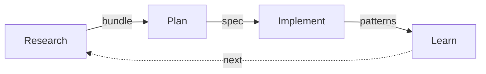

# Knowledge OS - Claude Code Plugin Marketplace

Production-ready patterns for AI-assisted development. The Research → Plan → Implement workflow, session persistence, and 55 specialized agents.

**[See it in action →](https://www.bodenfuller.com/workflow)**

## Quick Install

```bash
# Clone to your plugins directory
git clone https://github.com/boshu2/agentops.git ~/.claude/plugins/knowledge-os

# Or add as marketplace
/plugin marketplace add boshu2/agentops
```

## What's Included

| Category | Count | Description |
|----------|-------|-------------|
| **Commands** | 29 | RPI workflow, sessions, bundles, quality, documentation |
| **Agents** | 55 | Specialized agents across 8 domains |
| **Skills** | 7 | Domain knowledge packs |

## Core Workflow



### Essential Commands

```bash
/research          # Deep exploration before planning
/plan              # Create implementation plan
/implement         # Execute approved plan with validation

/session-start     # Initialize session with context
/session-end       # Save progress and summarize

/bundle-save       # Save context for multi-session work
/bundle-load       # Resume from saved context
```

## Agent Categories

| Domain | Count | Examples |
|--------|-------|----------|
| **Code Quality** | 8 | code-reviewer, test-generator, validation-planner |
| **Languages** | 7 | golang-pro, python-pro, typescript-pro, rust-pro, java-pro |
| **Architecture** | 6 | backend-architect, spec-architect, fullstack-developer |
| **DevOps** | 5 | deployment-engineer, incident-responder, error-detective |
| **Documentation** | 5 | api-documenter, doc-explorer, documentation-create-docs |
| **Data/ML** | 4 | data-engineer, ml-engineer, ai-engineer, mlops-engineer |
| **Security** | 3 | penetration-tester, risk-assessor, continuous-validator |
| **Meta** | 5 | context-manager, task-decomposition-expert, prompt-engineer |

### All Agents

<details>
<summary>55 agents (click to expand)</summary>

- accessibility-specialist
- ai-engineer
- api-documenter
- archive-researcher
- assumption-validator
- autonomous-worker
- backend-architect
- change-executor
- code-explorer
- code-review-improve
- code-reviewer
- connection-agent
- context-manager
- continuous-validator
- customer-support
- data-engineer
- data-scientist
- deployment-engineer
- doc-explorer
- document-structure-analyzer
- documentation-create-docs
- documentation-diataxis-auditor
- documentation-optimize-docs
- error-detective
- frontend-developer
- fullstack-developer
- golang-pro
- history-explorer
- incident-responder
- incidents-postmortems
- incidents-response
- ios-developer
- java-pro
- meta-memory-manager
- meta-observer
- meta-retro-analyzer
- ml-engineer
- mlops-engineer
- mobile-developer
- monitoring-alerts-runbooks
- network-engineer
- penetration-tester
- performance-engineer
- prompt-engineer
- python-pro
- risk-assessor
- rust-pro
- shell-scripting-pro
- spec-architect
- task-decomposition-expert
- test-generator
- tracer-bullet-deployer
- typescript-pro
- ui-ux-designer
- validation-planner

</details>

## Skills

| Skill | Purpose |
|-------|---------|
| **base** | Foundation patterns and templates |
| **brand-guidelines** | Consistent documentation styling |
| **doc-curator** | Documentation quality management |
| **git-workflow** | Git best practices and automation |
| **skill-creator** | Create new skills from patterns |
| **test-gap-scanner** | Identify missing test coverage |
| **testing** | Test patterns and frameworks |

## Vibe Levels

Trust calibration for AI collaboration:

| Level | Trust | Verification | Use For |
|-------|-------|--------------|---------|
| **L5** | 95% | Final only | Formatting, linting |
| **L4** | 80% | Spot check | Boilerplate, config |
| **L3** | 60% | Key outputs | Standard features |
| **L2** | 40% | Every change | New features |
| **L1** | 20% | Every line | Architecture, security |
| **L0** | 0% | Research only | Novel exploration |

## Vibe Coding Ecosystem

Based on [Vibe Coding](https://itrevolution.com/product/vibe-coding-book/) by Gene Kim & Steve Yegge.

### The FAAFO Promise

| Letter | Meaning | Result |
|--------|---------|--------|
| **F** | Fast | 10-16x productivity gains |
| **A** | Ambitious | Projects become feasible solo |
| **A** | Autonomous | Team-scale output from individuals |
| **F** | Fun | 50% more flow state time |
| **O** | Optionality | 120x more exploration options |

### Three Feedback Loops

| Loop | Timeframe | Focus |
|------|-----------|-------|
| **Inner** | Seconds | Individual prompts and responses |
| **Middle** | Hours | Work sessions or features |
| **Outer** | Days-weeks | Architecture and direction |

### The 40% Rule

Context utilization matters:
- **Below 40%** → 98% success rate
- **Above 60%** → 24% success rate

Higher context causes AI to forget instructions and contradict itself.

### Twelve Failure Patterns

Watch for: Tests Passing Lie, Fix Spiral, Eldritch Horror, Silent Deletion, Confident Hallucination, and others documented in the book.

## Related

- [Vibe Coding Book](https://itrevolution.com/product/vibe-coding-book/) - Gene Kim & Steve Yegge's methodology
- [Vibe Ecosystem](https://www.bodenfuller.com/builds/vibe-ecosystem) - Full ecosystem documentation
- [vibe-check](https://www.npmjs.com/package/@boshu2/vibe-check) - Measure your vibe coding metrics
- [bodenfuller.com/workflow](https://bodenfuller.com/workflow) - Watch the workflow in action

## License

MIT
