# AgentOps: Airflow for AI Agent Workflows

<!-- Status & Build -->
[](https://github.com/boshu2/agentops/actions/workflows/validate.yml)
[]()
[]()
[]()
[](./TRINITY.md)

<!-- License -->
[](https://www.apache.org/licenses/LICENSE-2.0)
[](https://creativecommons.org/licenses/by-sa/4.0/)

<div align="center">

**Like Airflow orchestrates data pipelines, AgentOps orchestrates AI agent workflows**

**Orchestrate AI agent workflows with the reliability of Apache Airflow. Research → Plan → Implement workflows that deliver 3-40x speedup.**

*DAG-like workflows • Task scheduling • Dependency management • Observable execution*

</div>

---

> [!NOTE]
> **Part of the Trinity** — This repo (implementation) is part of the AgentOps ecosystem:
> - 🧠 [12-factor-agentops](https://github.com/boshu2/12-factor-agentops) — WHY patterns work (Philosophy)
> - ⚙️ [agentops](https://github.com/boshu2/agentops) — HOW to implement (Implementation) ← **You are here**
> - 🌐 [agentops-showcase](https://github.com/boshu2/agentops-showcase) — WHAT users experience (Examples)
> 
> See [TRINITY.md](./TRINITY.md) for complete architecture.

---

## Table of Contents

- [Is This For You?](#is-this-for-you)
- [What Is This?](#what-is-this)
- [The Airflow Analogy](#the-airflow-analogy-visual)
- [See It In Action](#see-it-in-action)
- [The Comparison Table](#the-comparison-table)
- [Implementation Status](#implementation-status)
- [Quick Start](#quick-start)
- [Architecture: Core + Profiles](#architecture-core--profiles)
- [Core Patterns](#core-patterns-airflow-equivalents)
- [Proven Results](#proven-results)
- [Key Features](#key-features-airflow-equivalents)
- [Documentation](#documentation)
- [Philosophy](#philosophy-brief)
- [License](#license)
- [Contributing](#contributing)
- [Acknowledgments](#acknowledgments)
- [Support](#support)
- [Appendix: The Trinity Architecture](#appendix-the-trinity-architecture)

---

## Is This For You?

### ✅ You should try AgentOps if you:
- Use AI agents/LLMs in production workflows
- Know Airflow, Luigi, Prefect, or workflow orchestration
- Want 3-40x speedup on agent workflows with proven patterns
- Need multi-day projects with context management
- Build workflows that other teams should reuse
- Operate under reliability constraints (federal, enterprise, mission-critical)

### ❌ This might not be for you if you:
- Just started with AI/LLMs (learn basics first, come back later)
- Need visual no-code tools right now (coming in roadmap)
- Want a single agent system (see [agent-os](https://github.com/agent-os) instead)
- Don't need orchestration (single-agent tools may be enough)

---

## What Is This?

**AgentOps is Airflow for AI agent workflows.**

Just as Airflow orchestrates data pipelines (extract → transform → load), AgentOps orchestrates knowledge workflows (research → plan → implement). Same orchestration principles, different domain.

> **Proven Results:** 40x speedup (product dev), 3x speedup (infrastructure), 90.9% routing accuracy
> 
> *"Same patterns work identically across domains. Not domain-specific tricks—universal orchestration laws."*

---

## The Airflow Analogy (Visual)

```mermaid
graph TB
    subgraph Airflow["<b>Apache Airflow</b><br/>(Data Pipelines)"]
        A1["🗂️ DAG<br/><i>Pipeline Definition</i>"]
        A2["⚙️ Tasks<br/><i>Single Responsibility</i>"]
        A3["🔗 Dependencies<br/><i>Execution Order</i>"]
        A4["📅 Scheduler<br/><i>Smart Routing</i>"]
        A5["⚡ Executor<br/><i>Parallel Execution</i>"]
        A6["📊 Logs<br/><i>Observability</i>"]
        
        A1 --> A2
        A2 --> A3
        A3 --> A4
        A4 --> A5
        A5 --> A6
    end
    
    subgraph AgentOps["<b>AgentOps</b><br/>(Knowledge Workflows)"]
        B1["📦 Workflow Package<br/><i>Bundled Workflow</i>"]
        B2["🤖 Agents<br/><i>Specialized Capabilities</i>"]
        B3["🚦 Phase Gates<br/><i>Research → Plan → Implement</i>"]
        B4["🎯 Intelligent Routing<br/><i>90.9% Accuracy</i>"]
        B5["🚀 Multi-Agent Orchestration<br/><i>3x Speedup</i>"]
        B6["📝 Git Memory<br/><i>Native Versioning</i>"]
        
        B1 --> B2
        B2 --> B3
        B3 --> B4
        B4 --> B5
        B5 --> B6
    end
    
    A1 -.->|"<b>Same Pattern</b>"| B1
    A2 -.->|"<b>Same Pattern</b>"| B2
    A3 -.->|"<b>Same Pattern</b>"| B3
    A4 -.->|"<b>Same Pattern</b>"| B4
    A5 -.->|"<b>Same Pattern</b>"| B5
    A6 -.->|"<b>Same Pattern</b>"| B6
    
    classDef airflowStyle fill:#1e40af,stroke:#1e3a8a,stroke-width:3px,color:#fff
    classDef agentopsStyle fill:#ea580c,stroke:#c2410c,stroke-width:3px,color:#fff
    classDef connectionStyle stroke:#6b7280,stroke-width:2px,stroke-dasharray: 5 5
    
    class A1,A2,A3,A4,A5,A6 airflowStyle
    class B1,B2,B3,B4,B5,B6 agentopsStyle
```



**If you know Airflow, you already understand AgentOps.** Same mental model, different domain.

---

## See It In Action

### Airflow DAG (Data Pipeline)

```python
from airflow import DAG
from airflow.operators.python import PythonOperator

with DAG('data_pipeline', schedule_interval='@daily') as dag:
    extract = PythonOperator(
        task_id='extract',
        python_callable=extract_data
    )
    transform = PythonOperator(
        task_id='transform', 
        python_callable=transform_data
    )
    load = PythonOperator(
        task_id='load',
        python_callable=load_data
    )
    
    # Dependencies: extract → transform → load
    extract >> transform >> load
```

### AgentOps Workflow (Knowledge Pipeline)

```bash
# Phase 1: Research (parallel agents)
/research "How does our auth system work?"
# → Code Explorer searches codebase
# → Doc Explorer reads architecture docs  
# → History Explorer checks past decisions
# → Results bundled (5:1 compression)
# → Takes 10 min (was 30 min serial)

# Phase 2: Plan (uses research bundle)
/plan "Add OAuth2 support"
# → Spec Architect generates detailed plan
# → Uses research bundle context
# → Risk Assessor validates approach
# → Output: Implementation spec

# Phase 3: Implement (with validation)
/implement
# → Change Executor applies changes
# → Validation Planner creates tests
# → Constitutional enforcement (Five Laws)
# → 40% context rule enforced
# → Git hooks validate quality
```

**Same orchestration principles. Different domain. 3-40x faster.**

---

## The Comparison Table

| **Airflow Concept** | **AgentOps Equivalent** | **Why It Works** |
|---------------------|------------------------|------------------|
| DAG (pipeline) | Workflow Package | Declare dependencies, execute in order |
| Task | Agent (specialized capability) | Single responsibility, composable |
| Task dependencies | Phase gates (Research → Plan → Implement) | Enforce ordering, pass context |
| Scheduling | Intelligent routing | Right task to right executor |
| Retry logic | Constitutional enforcement | Prevent errors, ensure quality |
| XCom | Context bundles | Pass data between phases (5:1-38:1 compression) |
| Observability | Institutional memory (git) | Track everything, learn from history |
| Airflow UI | Git + IDE | Native tools, no new interfaces |
| Task parallelization | Multi-agent orchestration | 3x speedup via parallel execution |

---

## Implementation Status

### ✅ Production Ready (80% Complete)
🟢🟢🟢🟢🟢🟢🟢🟢⚪⚪

**What's working now:**
- Core orchestration framework (proven across 2 domains)
- Phase-based workflows (Research → Plan → Implement, 40% rule)
- Multi-agent coordination (3x measured speedup, parallel execution)
- Context bundles (5:1 to 38:1 compression, multi-day projects)
- Intelligent routing (90.9% accuracy, 110 validation cases)
- Profile system (extensible domain templates: devops, product-dev)
- Constitutional enforcement (git hooks, Five Laws, Three Rules)
- Git-based institutional memory (native versioning, no databases)

### 🚧 Alpha Quality (60% Complete)
🟡🟡🟡🟡🟡🟡⚪⚪⚪⚪

**Use with caution:**
- Documentation (comprehensive but evolving rapidly)
- Installation (bash scripts work on macOS/Linux, Windows untested)
- Profile ecosystem (only 2 reference profiles so far)
- Multi-domain validation (proven in 2 domains, need SRE/data-eng/custom)

### 🔮 Future Roadmap (0-10% Complete)
🟣⚪⚪⚪⚪⚪⚪⚪⚪⚪

**Coming later:**
- Visual UI (no-code workflow builders like AutoGen Studio)
- Package manager (one-click profile install/update like Helm)
- MCP deep integration (leverage 500+ Model Context Protocol servers)
- Community profile library (ecosystem of domain templates)
- SaaS offering (hosted orchestration, not committed yet)

**Transparency:** This is alpha software forged in production use. Patterns are proven (40x speedup product-dev, 3x speedup infrastructure), but the framework is still generalizing. Your feedback shapes the evolution.

**📘 [Full Roadmap & Vision](docs/ROADMAP.md)**

---

## Quick Start

### Option 1: Core Only (Platform)

```bash
# Install just the orchestration platform
./scripts/install.sh

# Then create your own profile
cat docs/CREATE_PROFILE.md
```

### Option 2: Core + Community Profile

```bash
# Install platform + domain package
./scripts/install.sh --profile devops
# or --profile product-dev

# Start using immediately
/prime
```

### Option 3: Core + Custom Profile

```bash
# 1. Install core
./scripts/install.sh

# 2. Create your profile
cp -r profiles/example profiles/my-domain
vim profiles/my-domain/profile.yaml

# 3. Install your profile
./scripts/install.sh --profile my-domain
```

**Next steps:**
- **Get Started:** [Installation & First Steps](docs/GET_STARTED.md)
- **Create Profile:** [Custom Profile Guide](docs/CREATE_PROFILE.md)
- **Learn Why:** [Philosophy & Foundation](https://github.com/boshu2/12-factor-agentops)

---

## Architecture: Core + Profiles

**Think Airflow Core + Providers:**

```mermaid
graph TB
    subgraph Core["<b>AgentOps Core</b><br/>(Like Airflow Core)"]
        C1["📅 Scheduler<br/>Intelligent Routing"]
        C2["⚡ Executor<br/>Phase-Based Workflow"]
        C3["📦 DAG Parser<br/>Profile Loader"]
        C4["📊 Observability<br/>Git-Based Tracking"]

        C1 --> C2
        C2 --> C3
        C3 --> C4
    end

    Core ==>|"Extends via"| Profiles

    subgraph Profiles["<b>AgentOps Profiles</b><br/>(Like Airflow Providers)"]
        P1["🔧 devops<br/><i>K8s, CI/CD, Infra</i>"]
        P2["💻 product-dev<br/><i>APIs, UIs, DBs</i>"]
        P3["📊 data-eng<br/><i>Pipelines, Quality</i>"]
        P4["🎨 your-domain<br/><i>Custom Workflows</i>"]
    end

    classDef coreStyle fill:#16a34a,stroke:#15803d,stroke-width:3px,color:#fff
    classDef profileStyle fill:#a855f7,stroke:#9333ea,stroke-width:3px,color:#fff

    class C1,C2,C3,C4 coreStyle
    class P1,P2,P3,P4 profileStyle
```



**Core provides orchestration primitives:**
- Phase-based workflow execution (Research → Plan → Implement)
- Multi-agent coordination (parallel execution, 3x speedup)
- Context management (bundles, 5:1 to 38:1 compression)
- Intelligent routing (90.9% accuracy)
- Constitutional enforcement (Five Laws, Three Rules)

**Profiles add domain-specific DAGs:**
- Agents = Task definitions (specialized capabilities)
- Commands = DAG templates (pre-built workflows)
- Workflows = Complete orchestrations (end-to-end automation)
- Skills = Custom operators (validation + automation)

---

## Core Patterns (Airflow Equivalents)

4 proven orchestration patterns that work across ALL domains:

### Pattern 1: Phase-Based Workflows (= DAG Stages)

```mermaid
graph LR
    R["🔍 Research<br/><i>Gather Context</i>"]
    P["📋 Plan<br/><i>Define Changes</i>"]
    I["⚡ Implement<br/><i>Execute Work</i>"]

    R -->|"Human Gate"| P
    P -->|"Human Gate"| I

    R -.->|"Fresh Context"| RC["40% Rule<br/>Enforced"]
    P -.->|"Fresh Context"| PC["40% Rule<br/>Enforced"]
    I -.->|"Fresh Context"| IC["40% Rule<br/>Enforced"]

    classDef phaseStyle fill:#2563eb,stroke:#1e40af,stroke-width:3px,color:#fff
    classDef ruleStyle fill:#64748b,stroke:#475569,stroke-width:2px,color:#fff

    class R,P,I phaseStyle
    class RC,PC,IC ruleStyle
```



**Airflow concept:** DAGs define task dependencies and execution order

**AgentOps equivalent:** Workflows define phase dependencies (Research → Plan → Implement)

- Each phase = fresh context (like new task execution)
- Human gates between phases (like sensor tasks)
- 40% rule enforced (like memory limits)

### Pattern 2: Context Bundles (= XCom + Caching)

**Airflow concept:** XCom passes small data; external storage for large datasets

**AgentOps equivalent:** Bundles pass compressed context between sessions

- **5:1 to 38:1 compression ratio** measured
- Reuse across sessions (like cached intermediate results)
- Share with team (like shared data stores)
- Enable multi-day projects (like checkpointing)

### Pattern 3: Multi-Agent Orchestration (= Task Parallelization)

```mermaid
graph TB
    Start["Task:<br/>Research Auth System"] --> A1["🔍 Code Explorer"]
    Start --> A2["📚 Doc Explorer"]
    Start --> A3["🕰️ History Explorer"]

    A1 --> Sync["⚡ Synthesize<br/><i>3x Faster</i>"]
    A2 --> Sync
    A3 --> Sync

    Sync --> Bundle["📦 Context Bundle<br/><i>5:1 Compression</i>"]

    classDef taskStyle fill:#ea580c,stroke:#c2410c,stroke-width:3px,color:#fff
    classDef agentStyle fill:#0ea5e9,stroke:#0284c7,stroke-width:3px,color:#fff
    classDef resultStyle fill:#16a34a,stroke:#15803d,stroke-width:3px,color:#fff

    class Start taskStyle
    class A1,A2,A3 agentStyle
    class Sync,Bundle resultStyle
```



**Airflow concept:** Run independent tasks in parallel

**AgentOps equivalent:** Run independent agents in parallel

- 3 research agents simultaneously (like parallel DAG branches)
- **3x wall-clock speedup measured** (30 min → 10 min)
- Same total token budget (like same compute budget)
- Results synthesize (like downstream task combines outputs)

### Pattern 4: Intelligent Routing (= Dynamic Task Selection)

**Airflow concept:** BranchPythonOperator chooses execution path

**AgentOps equivalent:** Router chooses best-fit agent workflow

- **90.9% accuracy** (110 validation cases)
- NLP-based task classification
- Auto-recommend workflow with user override
- Right work to right executor (like pool/queue assignment)

**📘 [Deep Dive: Architecture & Patterns](architecture/)**

---

## Proven Results

### Product Development
- **40x speedup** vs traditional development
- **Metric:** Feature completion time
- **Patterns:** All 4 universal patterns

### Infrastructure/DevOps
- **3x research speedup** (30 min → 10 min via parallel agents)
- **3x validation speedup** (30 sec → 10 sec via parallel checks)
- **90.9% routing accuracy** (110 validation cases)
- **New capability:** Multi-day projects via bundles

### Multi-Domain Validation
✅ Same patterns work identically in product-dev and infrastructure  
✅ Convergent evolution proves universality (not domain-specific)  
⏳ Pending: SRE, Data Engineering, custom domains

**📘 [Case Studies & Validation](docs/case-studies/)**

---

## Key Features (Airflow Equivalents)

- ✅ **Phase-based workflows** — Like DAG stages (research → plan → implement)
- ✅ **Intelligent routing** — Like Airflow scheduling (90.9% accuracy)
- ✅ **Multi-agent orchestration** — Like task parallelization (3x speedup)
- ✅ **Context bundles** — Like XCom on steroids (5:1-38:1 compression)
- ✅ **Constitutional enforcement** — Like Airflow retry/error handling
- ✅ **Profile system** — Like Airflow Providers (domain-specific extensions)
- ✅ **Git-based observability** — Like Airflow logs (native versioning)
- ✅ **40% rule** — Like memory limits (prevents context collapse)
- ✅ **Git hooks** — Like pre-flight checks (enforce quality gates)

---

## Documentation

### Getting Started
- [Installation Guide](docs/GET_STARTED.md) - First steps and setup
- [Create Custom Profile](docs/CREATE_PROFILE.md) - Extend for your domain
- [Troubleshooting](docs/TROUBLESHOOTING.md) - Common issues and solutions

### Understanding AgentOps
- [Why AgentOps?](docs/WHY_AGENTOPS.md) - The problem, mission, and operational foundation
- [12-Factor AgentOps](https://github.com/boshu2/12-factor-agentops) - Philosophy and theory
- [Architecture Patterns](architecture/) - The 4 universal patterns
- [Case Studies](docs/case-studies/) - Real-world validation

### Community & Contribution
- [Contributing Guide](CONTRIBUTING.md) - How to participate
- [Roadmap & Vision](docs/ROADMAP.md) - What's next
- [Adoption Guide](docs/ADOPTION_GUIDE.md) - Scale at every level

### Reference
- [CONSTITUTION.md](CONSTITUTION.md) - Five Laws, Three Rules, 40% Rule
- [Commands Reference](docs/reference/commands/) - All available commands
- [Agents Reference](docs/reference/agents/) - Built-in agent personas

---

## Philosophy (Brief)

AgentOps applies Airflow's orchestration principles to AI agent workflows. Data pipelines and knowledge workflows are both computational workflows. The orchestration patterns that made data engineering reliable can make AI agent operations reliable too.

**Learn more:** [12-factor-agentops](https://github.com/boshu2/12-factor-agentops) for deep philosophy and research

---

## License

**Apache License 2.0** - Permits commercial use, requires attribution, includes patent grant.

---

## Contributing

Want to create a profile for your domain? See [CREATE_PROFILE.md](docs/CREATE_PROFILE.md) and contribute your case study back to the community.

> [!TIP]
> Try these patterns in your domain and share what works. This framework improves through community feedback and validation.

---

## Acknowledgments

**[agent-os](https://github.com/agent-os)** independently discovered that AI agents need operating systems. They built one focused on spec-first product development. We're building orchestration.

**Our relationship:**
- **agent-os** = How ONE agent system works internally (container runtime)
- **agentops** = How MULTIPLE agent systems work together (Kubernetes)

Same relationship as Kubernetes (orchestration) to Docker (runtime). Both can win.

---

## Support

### Get Help

**Questions or Issues?**
- 📖 [Documentation](docs/) - Comprehensive guides
- 💬 [GitHub Discussions](https://github.com/boshu2/agentops/discussions) - Community Q&A
- 🐛 [Issue Tracker](https://github.com/boshu2/agentops/issues) - Bug reports
- 📚 [FAQ](docs/FAQ.md) - Common questions
- 📘 [Troubleshooting](docs/TROUBLESHOOTING.md) - Solutions to common issues

**Contributing**
- 🤝 [Contributing Guide](CONTRIBUTING.md) - How to help
- 📋 [Code of Conduct](CODE_OF_CONDUCT.md) - Community standards
- 🔒 [Security Policy](SECURITY.md) - Report vulnerabilities

**Stay Updated**
- ⭐ [Star this repo](https://github.com/boshu2/agentops) - Get notifications
- 📣 [Release Notes](RELEASE-NOTES.md) - Version updates
- 🗺️ [Roadmap](docs/ROADMAP.md) - What's coming

---

## Appendix: The Trinity Architecture

AgentOps is part of a three-repository ecosystem:

**⚙️ agentops** (Implementation) — **You are here**  
**🧠 [12-factor-agentops](https://github.com/boshu2/12-factor-agentops)** (Philosophy)  
**🌐 [agentops-showcase](https://github.com/boshu2/agentops-showcase)** (Examples - Coming Dec 1)

**See [TRINITY.md](./TRINITY.md) for complete architecture details.**

---

<div align="center">

**Airflow for AI agent workflows. Universal patterns for reliable operations.**

*Proven across product development, infrastructure automation, and complex workflows.*

*[Star this repo](https://github.com/boshu2/agentops) · [Report issues](https://github.com/boshu2/agentops/issues) · [12-Factor AgentOps](https://github.com/boshu2/12-factor-agentops)*

</div>
