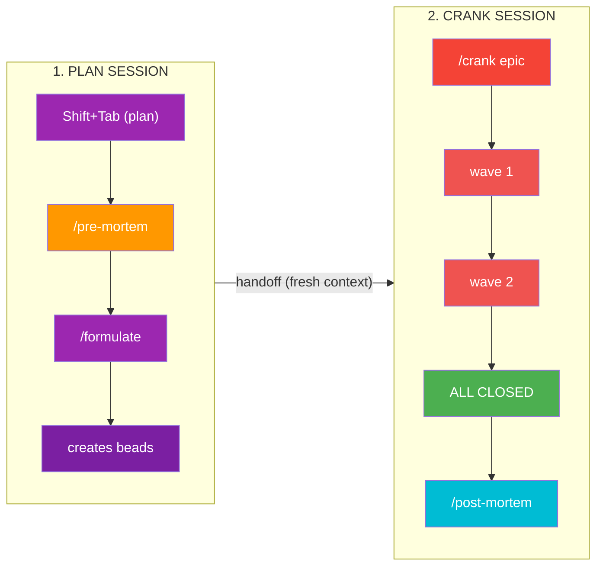
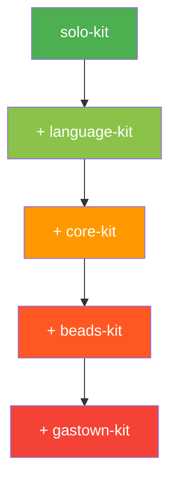

<h1 align="center">AgentOps</h1>

<pre align="center">
    ___                    __  ____
   /   | ____ ____  ____  / /_/ __ \____  _____
  / /| |/ __ `/ _ \/ __ \/ __/ / / / __ \/ ___/
 / ___ / /_/ /  __/ / / / /_/ /_/ / /_/ (__  )
/_/  |_\__, /\___/_/ /_/\__/\____/ .___/____/
      /____/                    /_/
</pre>

<p align="center">
  <a href="https://github.com/boshu2/agentops/releases/tag/v0.3.1"></a>
  <a href="https://github.com/boshu2/agentops/actions/workflows/validate.yml"></a>
  <a href="LICENSE"></a>
  <a href="https://docs.anthropic.com/en/docs/claude-code"></a>
  <a href="plugins/"></a>
  <a href="CONTRIBUTING.md"></a>
</p>

> **v0.3.0** - Added pre-mortem/post-mortem skills, synced RPI workflow, standardized plugin structure. All skills now see conversation context.

Claude Code plugins for AI-assisted development workflows. Just describe what you want - skills trigger automatically.

---

## Just Talk Naturally

Skills trigger from natural language. No slash commands required:

| You Say | Triggers |
|---------|----------|
| "I need to understand how auth works" | `/research` |
| "Let's plan out this feature" | `/formulate` |
| "What could go wrong with this approach?" | `/pre-mortem` |
| "Validate my changes" | `/vibe` |
| "Check for security issues" | `/vibe --security` |
| "What did we learn?" | `/retro` |
| "Wrap up this epic" | `/post-mortem` |

The skills detect intent and activate. Slash commands work too if you prefer them.

---

## The RPI Workflow

The complete Research → Plan → Implement workflow with validation gates:


| Stage | Command | What It Does |
|-------|---------|--------------|
| **Research** | `/research` | Deep codebase exploration, creates synthesis artifact |
| **Pre-mortem** | `/pre-mortem` | Simulate N iterations to find failure modes BEFORE implementing |
| **Plan** | `/formulate` | Create issues with dependencies, organize into waves |
| **Execute** | `/crank` | Run all waves until epic is closed |
| **Validate** | `/post-mortem` | Validate code + extract learnings + feed back into knowledge loop |

### Why Pre-mortem?

> "Simulate doing it 10 times and learn all the lessons so we don't have to."

Pre-mortem catches issues BEFORE you hit them:
- API mismatches discovered in simulation, not production
- Missing dependencies identified upfront
- Edge cases surfaced before coding starts

### Why Post-mortem?

Post-mortem closes the knowledge loop:
- Validates code quality (runs `/vibe`)
- Extracts learnings to `.agents/learnings/`
- Stores patterns in `.agents/patterns/`
- Feeds knowledge back to future `/research`

---

## The Killer Meta: Plan → Crank

For complex work, use two sessions:



**Why this works:**
- **Plan mode + /formulate** gives you review gates before execution
- **"Accept + Clear" handoff** - planning burns tokens, crank needs room
- **Fresh session gets**: the plan artifact, the beads, and context pointer

---

## Install

```bash
# Add marketplace
/plugin marketplace add boshu2/agentops

# Start with solo-kit (any language, any project)
/plugin install solo-kit@agentops

# Add language-specific support
/plugin install python-kit@agentops    # if Python
/plugin install go-kit@agentops        # if Go
/plugin install typescript-kit@agentops # if TypeScript
/plugin install shell-kit@agentops     # if Shell/Bash
```

---

## Plugin Architecture

### Tier 1: Solo Developer (Any Project)

| Plugin | Skills | Purpose |
|--------|--------|---------|
| **solo-kit** | `/research`, `/vibe`, `/bug-hunt`, `/complexity`, `/doc`, `/oss-docs`, `/golden-init` | **Start here** - essential validation and exploration |
| **general-kit** | Same as solo-kit | Zero-dependency portable version |

```bash
/plugin install solo-kit@agentops
```

### Tier 2: Language Kits

| Plugin | Standards | Hooks | Purpose |
|--------|-----------|-------|---------|
| **python-kit** | `python.md` | ruff, mypy | Python development |
| **go-kit** | `go.md` | gofmt, golangci-lint | Go development |
| **typescript-kit** | `typescript.md` | prettier, tsc | TypeScript/JavaScript |
| **shell-kit** | `shell.md` | shellcheck | Shell scripting |

### Tier 3: Team Workflows

| Plugin | Skills | Purpose | Requires |
|--------|--------|---------|----------|
| **core-kit** | `/research`, `/plan`, `/formulate`, `/implement`, `/crank`, `/retro`, `/pre-mortem`, `/post-mortem`, `/marketplace-release` | Full RPI workflow | [beads](https://github.com/steveyegge/beads) |
| **beads-kit** | `/beads`, `/status`, `/molecules` | Git-based issue tracking | beads |
| **pr-kit** | `/pr-research`, `/pr-plan`, `/pr-implement`, `/pr-validate`, `/pr-retro` | PR workflows | beads |
| **dispatch-kit** | `/dispatch`, `/handoff`, `/mail`, `/roles` | Multi-agent coordination | beads |
| **docs-kit** | `/doc`, `/doc-creator`, `/vibe-docs`, `/golden-init`, `/oss-docs`, `/code-map-standard` | Documentation generation | - |
| **vibe-kit** | `/vibe`, `/bug-hunt`, `/complexity` | Code validation with expert agents | - |

### Tier 4: Multi-Agent Orchestration

| Plugin | Skills | Purpose | Requires |
|--------|--------|---------|----------|
| **gastown-kit** | `/gastown`, `/crew`, `/polecat-lifecycle`, `/bd-routing` | Parallel workers | beads + [gastown](https://github.com/steveyegge/gastown) |

### Supporting Plugins

| Plugin | Purpose |
|--------|---------|
| **domain-kit** | Reference standards across 17 domains |

---

## Upgrade Path



---

## Recommended Setup

**Just exploring?**
```bash
/plugin marketplace add boshu2/agentops
/plugin install general-kit@agentops
```
Research, validation, documentation, expert agents - no external tools needed.

**Want the full RPI workflow?**
```bash
brew install beads
/plugin install core-kit@agentops
/plugin install beads-kit@agentops
```

**Multi-agent parallel execution?**
```bash
brew install beads gastown
/plugin install gastown-kit@agentops
/plugin install dispatch-kit@agentops
```

---

## All Skills Reference

### Research & Planning
| Skill | Plugin | Purpose |
|-------|--------|---------|
| `/research` | core-kit | Deep codebase exploration |
| `/product` | core-kit | Customer-first brief (PR/FAQ) |
| `/pre-mortem` | core-kit | Simulate failures before implementing |
| `/plan` | core-kit | Epic decomposition into beads issues |
| `/formulate` | core-kit | Create reusable formula templates |

### Execution
| Skill | Plugin | Purpose |
|-------|--------|---------|
| `/implement` | core-kit | Execute single beads issue |
| `/implement-wave` | core-kit | Parallel execution of multiple issues |
| `/crank` | core-kit | Autonomous epic execution until done |

### Validation
| Skill | Plugin | Purpose |
|-------|--------|---------|
| `/vibe` | vibe-kit | Comprehensive code validation (8 aspects) |
| `/bug-hunt` | vibe-kit | Git archaeology + root cause analysis |
| `/complexity` | vibe-kit | Cyclomatic complexity analysis |
| `/vibe-docs` | docs-kit | Validate docs match deployment reality |

### Knowledge
| Skill | Plugin | Purpose |
|-------|--------|---------|
| `/retro` | core-kit | Extract learnings from completed work |
| `/post-mortem` | core-kit | Validate + learn + feed back into flywheel |

### Documentation
| Skill | Plugin | Purpose |
|-------|--------|---------|
| `/doc` | docs-kit | Generate documentation |
| `/doc-creator` | docs-kit | Create corpus/standards docs |
| `/oss-docs` | docs-kit | Scaffold OSS documentation |
| `/golden-init` | docs-kit | Initialize repo with golden template |
| `/code-map-standard` | docs-kit | Generate code-map documentation |

### Issue Tracking
| Skill | Plugin | Purpose |
|-------|--------|---------|
| `/beads` | beads-kit | Git-based issue tracking |
| `/status` | beads-kit | Quick status check |
| `/molecules` | beads-kit | Workflow templates |

### PR Workflows
| Skill | Plugin | Purpose |
|-------|--------|---------|
| `/pr-research` | pr-kit | Upstream codebase exploration |
| `/pr-plan` | pr-kit | Strategic contribution planning |
| `/pr-implement` | pr-kit | Fork-based implementation |
| `/pr-validate` | pr-kit | Isolation/scope validation |
| `/pr-retro` | pr-kit | Learn from PR outcomes |

### Multi-Agent
| Skill | Plugin | Purpose |
|-------|--------|---------|
| `/gastown` | gastown-kit | Gas Town status and utilities |
| `/dispatch` | dispatch-kit | Work assignment |
| `/handoff` | dispatch-kit | Cross-session continuity |
| `/mail` | dispatch-kit | Agent communication |

### Meta
| Skill | Plugin | Purpose |
|-------|--------|---------|
| `/marketplace-release` | core-kit | Plugin release workflow |

---

## Learn More

| Resource | Description |
|----------|-------------|
| [levels/](levels/) | Progressive tutorials from basics to full automation |
| [reference/](reference/) | Framework docs (PDC, FAAFO, failure patterns) |
| [CONTRIBUTING.md](CONTRIBUTING.md) | How to contribute |
| [CHANGELOG.md](CHANGELOG.md) | Version history |

---

## License

MIT
