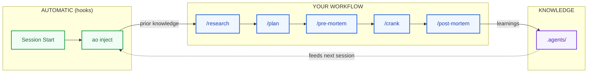
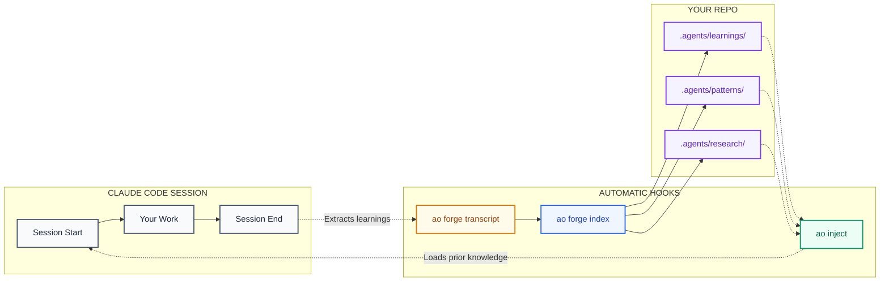
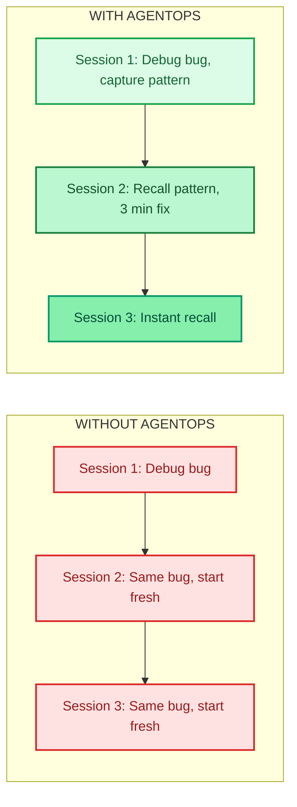

# AgentOps

**The Knowledge Engine for Claude Code**

> Stop starting from zero. Your agent learns, remembers, and compounds knowledge across sessions.

---

## The Problem

AI coding agents are brilliant but amnesiac. They solve a bug today, forget it tomorrow. You explain your architecture once, explain it again next week. Every session starts cold.

**AgentOps fixes this.** It gives your agent a persistent, git-tracked memory that compounds over time.

---

## How It Works



| Step | What Happens |
|------|--------------|
| **Session Start** | Hooks inject relevant knowledge from past sessions |
| **/research** | Mine your knowledge base before diving in |
| **/plan** | Break work into tracked issues with dependencies |
| **/pre-mortem** | Simulate failures *before* they happen |
| **/crank** | Autonomous loop: implement → validate → commit → repeat |
| **/post-mortem** | Extract learnings, index for future sessions |

**The flywheel:** Each cycle feeds the next. Knowledge compounds.

---

## Installation

**Note:** Installation differs by platform. Claude Code has a built-in plugin system. Codex and OpenCode require manual setup.

### Claude Code (Recommended)

```bash
# 1. Install the CLI
brew install boshu2/agentops/agentops

# 2. Initialize your repo
ao init

# 3. Install hooks (this is where the magic happens)
ao hooks install

# 4. Verify
ao badge
```

### Codex

Tell Codex:

```
Fetch and follow instructions from https://raw.githubusercontent.com/boshu2/agentops/refs/heads/main/.codex/setup.md
```

### OpenCode

Tell OpenCode:

```
Fetch and follow instructions from https://raw.githubusercontent.com/boshu2/agentops/refs/heads/main/.opencode/setup.md
```

### Verify Installation

The hooks should fire automatically. Check that knowledge injection works:

```bash
# Start a Claude Code session - you should see injected context
claude

# Or manually test
ao inject --dry-run
```

---

## The Workflow

**Chaos + Filter + Ratchet = Progress**

Each phase produces chaos, filters it for quality, then ratchets progress permanently. You can always add more chaos, but you can't un-ratchet.

```mermaid
flowchart TB
    %% Professional color palette based on split-complementary color theory
    classDef research fill:#eff6ff,stroke:#2563eb,stroke-width:2px,color:#1e40af
    classDef plan fill:#eef2ff,stroke:#4f46e5,stroke-width:2px,color:#3730a3
    classDef caution fill:#fffbeb,stroke:#d97706,stroke-width:2px,color:#92400e
    classDef implement fill:#f8fafc,stroke:#475569,stroke-width:2px,color:#1e293b
    classDef success fill:#ecfdf5,stroke:#059669,stroke-width:2px,color:#065f46
    classDef knowledge fill:#f5f3ff,stroke:#7c3aed,stroke-width:2px,color:#5b21b6
    classDef decision fill:#fff1f2,stroke:#e11d48,stroke-width:2px,color:#9f1239

    subgraph WORKFLOW["THE BROWNIAN RATCHET"]
        direction TB

        subgraph R["1. RESEARCH"]
            R1[Mine prior knowledge]
            R2[Explore codebase]
            R3[Create synthesis doc]
            R1 --> R2 --> R3
        end

        subgraph P["2. PLAN"]
            P1[Define spec]
            P2[Create beads issues]
            P3[Set dependencies]
            P1 --> P2 --> P3
        end

        subgraph PM["3. PRE-MORTEM"]
            PM1[Simulate N iterations]
            PM2[Find failure modes]
            PM3[Update spec]
            PM1 --> PM2 --> PM3
        end

        subgraph C["4. CRANK"]
            C1[Pick issue] --> C2[Implement]
            C2 --> C3{Vibe OK?}
            C3 -->|No| C2
            C3 -->|Yes| C4[Commit]
            C4 --> C5{More issues?}
            C5 -->|Yes| C1
            C5 -->|No| DONE[Done]
        end

        subgraph PO["5. POST-MORTEM"]
            PO1[Extract learnings]
            PO2[Run full vibe]
            PO3{Matches spec?}
            PO1 --> PO2 --> PO3
        end

        R3 --> P1
        P3 --> PM1
        PM3 --> C1
        DONE --> PO1
    end

    PO3 -->|No| C1
    PO3 -->|Yes| GOAL{Matches goal?}
    GOAL -->|No| R1
    GOAL -->|Yes| LOCK[RATCHET LOCKED]

    subgraph FLY["KNOWLEDGE FLYWHEEL"]
        direction LR
        LOCK --> INDEX[ao forge index]
        INDEX --> STORE[".agents/"]
        STORE --> INJECT[ao inject]
        INJECT -.-> R1
    end

    class R,R1,R2,R3 research
    class P,P1,P2,P3 plan
    class PM,PM1,PM2,PM3 caution
    class C,C1,C2,C4 implement
    class C5,DONE success
    class PO,PO1,PO2 caution
    class C3,PO3,GOAL decision
    class LOCK,INDEX,STORE,INJECT knowledge
```



---

## What Each Phase Does

| Phase | What Happens | Output |
|-------|--------------|--------|
| **Research** | Mine prior knowledge, explore codebase, synthesize findings | `.agents/research/` |
| **Plan** | Define spec, create tracked issues with dependencies | `.beads/` issues |
| **Pre-Mortem** | Simulate failures before they happen, update spec | Hardened spec |
| **Crank** | Autonomous loop: implement → validate → commit → repeat | Merged code |
| **Post-Mortem** | Extract learnings, validate against spec and goal | `.agents/learnings/` |

---

## How It's Automated

You don't manually run `ao` commands. Hooks do it for you.



**SessionStart**: Injects relevant prior knowledge (weighted by freshness + utility)

**SessionEnd**: Extracts learnings and indexes them for future sessions

---

## The Escape Velocity Equation

Knowledge decays without reinforcement. But when retrieval × usage exceeds decay, knowledge compounds.



**The Math:**

```
dK/dt = I(t) - δK + σρK

Where:
  δ = 0.17/week    (knowledge decay rate)
  σ = retrieval effectiveness
  ρ = citation rate

Goal: σ × ρ > δ → Knowledge compounds faster than it fades
```

---

## What's Inside

### Skills

| Skill | Triggers | What It Does |
|-------|----------|--------------|
| `/research` | "research", "explore", "investigate" | Deep codebase exploration with knowledge mining |
| `/plan` | "create a plan", "break down" | Convert goals into tracked beads issues |
| `/pre-mortem` | "what could go wrong", "simulate" | Find failure modes before implementation |
| `/crank` | "execute", "go", "ship it" | Autonomous implementation loop |
| `/vibe` | "validate", "check quality" | 9-aspect code validation |
| `/post-mortem` | "what did we learn", "wrap up" | Extract and index learnings |

### CLI Commands

| Command | Purpose |
|---------|---------|
| `ao inject` | Inject knowledge into current session |
| `ao forge search` | Search CASS-indexed sessions |
| `ao forge index` | Index artifacts for retrieval |
| `ao forge transcript` | Extract learnings from transcripts |
| `ao feedback` | Mark learnings as helpful/harmful |
| `ao ratchet` | Track provenance chain |
| `ao hooks install` | Install SessionStart/End hooks |

---

## Storage Architecture

Everything lives in your repo. Portable, version-controlled, yours.

```
.agents/
  learnings/     # Extracted insights (with confidence + maturity)
  patterns/      # Reusable solutions
  research/      # Deep dive outputs
  retros/        # Session retrospectives
  deltas/        # Spec vs reality mismatches
  specs/         # Validated specifications
  ao/            # Search indices
```

---

## The Science

Built on peer-reviewed research, not vibes.

| Concept | Source | Finding |
|---------|--------|---------|
| **Knowledge Decay** | Darr, Argote & Epple (1995) | Organizational knowledge depreciates ~17%/week without reinforcement |
| **Memory Reinforcement** | Ebbinghaus (1885) | Each retrieval strengthens memory and slows future decay |
| **MemRL** | Zhang et al. (2025) | Two-phase retrieval (semantic + utility) enables self-evolving agents |

---

## Credits

Built on excellent open-source work:

| Tool | Author | What We Use | Link |
|------|--------|-------------|------|
| **beads** | Steve Yegge | Git-native issue tracking | [steveyegge/beads](https://github.com/steveyegge/beads) |
| **CASS** | Dicklesworthstone | Session indexing and search | [coding_agent_session_search](https://github.com/Dicklesworthstone/coding_agent_session_search) |
| **cass-memory** | Dicklesworthstone | Confidence decay, maturity tracking | [cass_memory_system](https://github.com/Dicklesworthstone/cass_memory_system) |
| **multiclaude** | dlorenc | The "Brownian Ratchet" pattern | [dlorenc/multiclaude](https://github.com/dlorenc/multiclaude) |

---

## Optional: Parallel Execution

For larger projects, **gastown** enables parallel agent execution:

```
/crank (single agent) --> gastown (multiple polecats in parallel)
```

Each polecat works in isolation. CI validates. Passing work merges. Failures don't cascade.

---

## License

MIT
