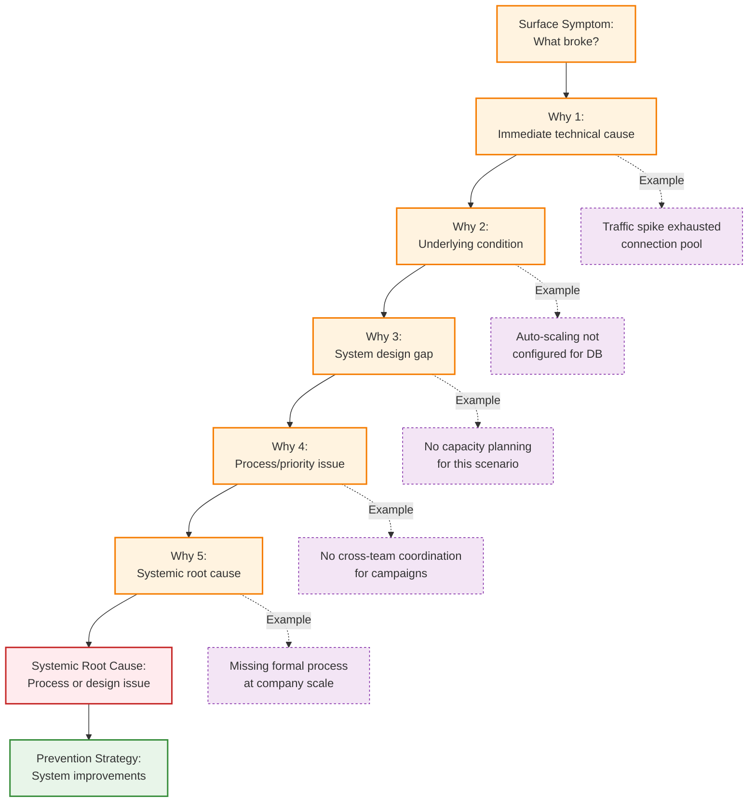

<!-- SPECIFICATION COMPLIANT: v1.0.0 -->
<!-- Spec: .claude/specs/incidents/postmortems.spec.md -->

# incidents-postmortems

**Domain:** incidents (domain-specific), learning (universal patterns)
**Tier:** 1 - Foundational (Specification Compliant)
**Version:** 2.0.0 (Pattern-Driven Rebuild)
**Status:** active
**Success Rate:** 90%+ (baseline from spec)
**Time Savings:** 2.3x faster (4 hours → 105 minutes)
**Specs:**
- Domain-specific: `.claude/specs/incidents/postmortems.spec.md` (DevOps Handbook methodology)

---


## Purpose

Create blameless incident postmortems using 5 Whys root cause analysis, identify systemic contributing factors, and generate specific, owned action items to prevent recurrence.

**Solves:** "How do we learn from incidents without blaming individuals?"
**Value:** Reduces postmortem time from 4 hours (unstructured) to 105 minutes (guided), ensures completeness, prevents blame culture, surfaces systemic improvements.

---

## When to Use

**Trigger conditions:**
- P1/P2 incidents (mandatory within 48 hours)
- Service outages affecting users
- Data loss or security incidents
- Repeated failures of the same type
- Near-misses with high potential blast radius

**Use cases:**
- Systematic analysis of production incidents
- Learning-focused retrospectives
- Prevention of incident recurrence
- Building institutional memory from failures
- Creating psychological safety culture

**Not appropriate for:**
- Routine maintenance events (planned work is expected)
- Expected degradations (maintenance windows)
- Incidents with no systemic learning value
- Organizations with blame culture (create safety first, then use this agent)

---

## Pattern Stack (7 Patterns Applied)

### Universal Patterns (Required - 4 patterns)

**1. Universal Phase Pattern**
- Structure: Preflight Validation → Execution → Verification → Publish
- Clear phase separation with checkpoints
- Rollback procedures documented

**2. Learning Capture Pattern**
- Document what worked/failed at each step
- Track root cause analysis progression
- Capture prevention insights

**3. Right Tool Pattern**
- Read: Load incident logs and reference postmortems
- Write: Create new postmortem document (one-shot)
- Edit: Modify after creation (if needed)
- Bash: Run validation commands
- Grep: Search for similar incidents

**4. Multi-Layer Validation Pattern**
- Layer 1: Timeline completeness (preflight)
- Layer 2: 5 Whys analysis depth (preflight)
- Layer 3: Blameless language (verification)
- Layer 4: Action item specificity (verification)
- Layer 5: Document structure (verification)

### File Creation Specific (3 patterns)

**5. Preflight Validation**
- Check incident severity warrants postmortem
- Verify timeline data available
- Confirm responder availability for meeting
- Validate impact assessment

**6. Incremental Execution**
- Gather timeline → Validate completeness
- Perform 5 Whys → Validate systemic root cause
- Identify factors → Validate blameless language
- Create action items → Validate specificity
- Document → Review → Approve

**7. Rollback Checkpoint**
- **Before write:** Document command to remove file
- **After write:** Record file created for cleanup
- **After validation:** Save working state
- **On error:** Show rollback command to user

---

## Workflow

### Visual Overview

#### Postmortem Creation Workflow

```mermaid
graph TD
    Start([Incident Occurred:<br/>Create Postmortem]) --> Preflight[Phase 1: Preflight<br/>Validation]
    Preflight -->|Pass| Execution[Phase 2: Execution<br/>Analysis & Document]
    Preflight -->|Fail| Error1[❌ Show Error<br/>Requirements Missing]
    Error1 --> Start

    Execution --> Checkpoint1[💾 Checkpoint:<br/>Draft Created]
    Checkpoint1 --> Verification[Phase 3: Verification<br/>Quality Checks]

    Verification -->|Pass| Publish[Phase 4: Publish<br/>README + Commit Prep]
    Verification -->|Fail| Rollback1{Rollback?}

    Rollback1 -->|Yes| Cleanup1[rm postmortem file]
    Rollback1 -->|Fix| Fix[Fix Issues<br/>Re-validate]
    Cleanup1 --> Start
    Fix --> Verification

    Publish --> Review[Phase 5: Review<br/>Git Diff]
    Review -->|Approved| Done([✅ Ready for Commit])
    Review -->|Changes| Rollback2{Rollback?}

    Rollback2 -->|Yes| Cleanup2[rm postmortem file]
    Rollback2 -->|Fix| Execution
    Cleanup2 --> Start

    Preflight -.->|Safety| Safety[❌ No blame language<br/>✅ Blameless systems focus<br/>✅ Specific action items]

    classDef process fill:#e1f5ff,stroke:#0288d1,stroke-width:2px
    classDef validation fill:#fff3e0,stroke:#f57c00,stroke-width:2px
    classDef phase fill:#e8f5e9,stroke:#388e3c,stroke-width:2px
    classDef checkpoint fill:#f3e5f5,stroke:#7b1fa2,stroke-width:2px
    classDef error fill:#ffebee,stroke:#c62828,stroke-width:2px

    class Start,Done checkpoint
    class Preflight,Execution,Verification,Publish,Review phase
    class Rollback1,Rollback2 validation
    class Fix,Cleanup1,Cleanup2 process
    class Error1,Safety error
```



#### 5 Whys Root Cause Analysis



---

## Phase 1: Preflight Validation (Pattern 5)

**Purpose:** Ensure postmortem requirements met before creating document (fail fast)

**Validations:**

### 1.1 Verify Incident Severity

```bash
# Check incident severity warrants postmortem
if [[ "$severity" == "P1" || "$severity" == "P2" ]]; then
  echo "✅ P1/P2 incident - postmortem required"
elif [[ "$severity" == "P3" && "$learning_value" == "yes" ]]; then
  echo "✅ P3 incident with learning value - postmortem recommended"
else
  echo "❌ ERROR: Incident severity doesn't warrant postmortem"
  echo "P1/P2: Mandatory within 48h"
  echo "P3: Optional if learning value"
  exit 1
fi
```

**Acceptance Criteria:**
- [ ] P1/P2 severity confirmed, OR
- [ ] P3 severity with documented learning value

**Error Recovery:**
- Show severity criteria
- Ask user to confirm postmortem needed
- Abort workflow if not warranted

### 1.2 Gather Timeline Data

```bash
# Verify timeline has minimum key events
required_events=(
  "detection_time"
  "alert_source"
  "response_actions"
  "root_cause_identified"
  "fix_deployed"
  "resolution_time"
)

missing_events=()
for event in "${required_events[@]}"; do
  if [[ -z "${timeline[$event]}" ]]; then
    missing_events+=("$event")
  fi
done

if [[ ${#missing_events[@]} -gt 0 ]]; then
  echo "❌ ERROR: Timeline incomplete"
  echo "Missing events:"
  printf "  - %s\n" "${missing_events[@]}"
  echo "Collect data from: incident log, monitoring, Slack"
  exit 1
fi

echo "✅ Timeline data complete (≥5 key events)"
```

**Acceptance Criteria:**
- [ ] Timeline has ≥5 key events with timestamps
- [ ] Detection, response, fix, resolution documented

**Error Recovery:**
- Show missing timeline events
- Request incident log, monitoring data, Slack thread
- Abort workflow until timeline complete

### 1.3 Confirm Responder Availability

**Ask user via AskUserQuestion:**
```
Question: "Is the postmortem meeting scheduled?"
- Header: "Meeting"
- Options: [
    { label: "Yes, scheduled", description: "60-minute meeting within 48h (P1/P2) or 1 week (P3)" },
    { label: "Not yet", description: "Need to schedule before proceeding" }
  ]
```

**Acceptance Criteria:**
- [ ] 60-minute meeting scheduled
- [ ] All responders confirmed attendance
- [ ] Scheduled within 48h (P1/P2) or 1 week (P3)

**Error Recovery:**
- Show meeting agenda
- Request calendar holds
- Abort workflow until meeting scheduled

### 1.4 Assess Initial Impact

```bash
# Quantify impact metrics
required_metrics=(
  "users_affected"
  "services_impacted"
  "duration_minutes"
  "slo_budget_consumed"
)

missing_metrics=()
for metric in "${required_metrics[@]}"; do
  if [[ -z "${impact[$metric]}" ]]; then
    missing_metrics+=("$metric")
  fi
done

if [[ ${#missing_metrics[@]} -gt 0 ]]; then
  echo "⚠️  WARNING: Impact metrics incomplete"
  echo "Missing metrics:"
  printf "  - %s\n" "${missing_metrics[@]}"
  echo "Gather from: monitoring dashboards, SLO tracking"
  echo "Proceed anyway? (y/n)"
fi

echo "✅ Impact assessment complete"
```

**Acceptance Criteria:**
- [ ] Users affected quantified (count or %)
- [ ] Services impacted listed
- [ ] Duration measured (minutes)
- [ ] SLO budget consumed calculated (%)

**Error Recovery:**
- Show impact metrics template
- Request monitoring data
- Continue with partial data if user approves

**Checkpoint:** All preflight checks passed, safe to proceed

---

## Phase 2: Execution (Pattern 6 - Incremental Execution)

**Purpose:** Create postmortem document incrementally with validation at each step

### 2.1 Reconstruct Incident Timeline

**Incremental Step 1:** Create chronological sequence

```markdown
## Timeline

| Time  | Event | Actor |
|-------|-------|-------|
| HH:MM | Detection: Alert triggered | Monitoring System |
| HH:MM | Response: IC assigned | @oncall |
| HH:MM | Investigation: Root cause identified | @team |
| HH:MM | Fix: Deployed mitigation | @team |
| HH:MM | Verification: Service restored | IC |
```

**Acceptance Criteria:**
- [ ] Timeline covers detection to resolution
- [ ] ≥5 key events with timestamps
- [ ] All events have time, description, actor

**Validation:** Event count ≥5

**Rollback Command:**
```bash
# If timeline incomplete
rm docs/postmortems/${incident_id}.md
```

**Learning Captured:** Timeline structure, event granularity

### 2.2 Facilitate Root Cause Analysis (5 Whys)

**Incremental Step 2:** Drive progressively deeper analysis

```markdown
## Root Cause Analysis (5 Whys)

**Problem Statement:** [What broke - technical description of surface symptom]

**Why 1:** Why did [symptom] occur?
→ [Immediate technical cause]

**Why 2:** Why did [immediate cause] happen?
→ [Underlying condition]

**Why 3:** Why did [condition] exist?
→ [System design gap]

**Why 4:** Why wasn't [gap] addressed?
→ [Process or priority issue]

**Why 5:** Why does [process issue] persist?
→ [Systemic root cause]

**Systemic Root Cause:** [Process or design issue, not surface-level]

**Prevention Strategy:** [How to prevent this incident class]
```

**Surface-level detection (anti-pattern):**
- "Config typo"
- "Human error"
- "Forgot to X"
- "Didn't Y"
- "Accident"

**Good systemic root causes:**
- "Missing validation gate in deployment process"
- "No cross-team coordination for capacity-impacting events"
- "Lack of structured migration process with mandatory checks"

**Acceptance Criteria:**
- [ ] All 5 Whys answered progressively deeper
- [ ] Root cause is systemic (process/design), not surface-level
- [ ] Prevention strategy identified

**Validation:** Root cause doesn't contain surface-level terms

**Rollback Command:**
```bash
rm docs/postmortems/${incident_id}.md
```

**Learning Captured:** Root cause depth, systemic patterns

### 2.3 Identify Contributing Factors

**Incremental Step 3:** List all factors without blame

```markdown
## Contributing Factors

**Technical:**
- [Bug, config error, capacity limit, missing monitoring]

**Process:**
- [Missing test, inadequate runbook, unclear procedure, no coordination]

**Human:**
- [Fatigue, unfamiliarity, time pressure - list factor, not person]

**Organizational:**
- [Resource constraints, competing priorities, missing tools]
```

**Blameless language guide:**
- ❌ "Alice deployed without testing"
- ✅ "Deployment process allowed untested changes; need pre-deploy validation gate"

**Acceptance Criteria:**
- [ ] ≥3 contributing factors identified
- [ ] All categories considered (technical, process, human, organizational)
- [ ] Blameless language used (systems, not individuals)

**Validation:** Factor count ≥3, no individual blame

**Rollback Command:**
```bash
rm docs/postmortems/${incident_id}.md
```

**Learning Captured:** Factor categorization, blameless phrasing

### 2.4 Document What Went Well

**Incremental Step 4:** Identify positive aspects

```markdown
## What Went Well

✓ [Fast detection within X minutes]
✓ [Clear communication via incident channel]
✓ [Swift incident commander assignment]
✓ [Effective troubleshooting - root cause identified quickly]
✓ [Comprehensive fix deployed]
```

**Examples:**
- Fast detection (alert triggered within 1 minute)
- IC assigned within 2 minutes (clear escalation)
- Root cause identified within 7 minutes
- Temporary fix applied within 17 minutes
- Permanent fix deployed within 22 minutes

**Acceptance Criteria:**
- [ ] ≥3 positive aspects documented
- [ ] Recognition of good practices

**Validation:** Count ≥3

**Rollback Command:**
```bash
rm docs/postmortems/${incident_id}.md
```

**Learning Captured:** Effective practices to replicate

### 2.5 Identify Improvement Areas

**Incremental Step 5:** List specific improvements

```markdown
## What Could Be Improved

⚠️ [Specific improvement, not vague]
⚠️ [Another improvement]
⚠️ [Third improvement]
```

**Vague (anti-pattern):**
- "Improve monitoring"
- "Better documentation"
- "More testing"

**Specific (good pattern):**
- "Add SLO dashboard for API latency p95 to detect degradation early"
- "Create campaign launch checklist requiring platform notification 48h advance"
- "Implement pre-deploy validation gate for database migrations"

**Acceptance Criteria:**
- [ ] ≥3 improvement areas identified
- [ ] All actionable and specific

**Validation:** Count ≥3, specificity check

**Rollback Command:**
```bash
rm docs/postmortems/${incident_id}.md
```

**Learning Captured:** Improvement opportunities, specificity patterns

### 2.6 Brainstorm and Assign Action Items

**Incremental Step 6:** Create specific, owned, dated actions

```markdown
## Action Items

| Action | Owner | Due Date | Status | Tracking Issue |
|--------|-------|----------|--------|----------------|
| [Specific action with measurable completion] | @user | YYYY-MM-DD | Not Started | #123 |
| [Another specific action] | @user | YYYY-MM-DD | In Progress | #124 |
| [Third action] | @user | YYYY-MM-DD | Done | #125 |
| [Fourth action] | @user | YYYY-MM-DD | Not Started | #126 |
```

**Good action items:**
- "Configure DB auto-scaling for connection pool, max 3000"
- "Create campaign launch checklist with platform notification"
- "Add alert for connection pool saturation (>80%)"
- "Document capacity planning guidelines"

**Acceptance Criteria:**
- [ ] ≥4 action items with owners and due dates
- [ ] All items specific and measurable
- [ ] Tracking issues assigned

**Validation:** Count ≥4, all fields present

**Rollback Command:**
```bash
rm docs/postmortems/${incident_id}.md
```

**Learning Captured:** Action item structure, ownership assignment

### 2.7 Capture Lessons Learned

**Incremental Step 7:** Extract reusable insights

```markdown
## Lessons Learned

**Technical:**
- [New pattern learned, tool insight, architectural discovery]

**Process:**
- [Workflow improvement, automation opportunity, runbook update]

**Prevention:**
- [How to prevent this incident class, monitoring additions, validation gates]
```

**Examples:**
- **Technical:** Auto-scaling must cover all resource types (not just compute), including database connections
- **Process:** All capacity-impacting business events need platform notification and planning
- **Prevention:** Early warning (connection pool saturation) prevents outage; reactive fixes take more time

**Acceptance Criteria:**
- [ ] Lessons in all categories (technical, process, prevention)
- [ ] Transferable to other systems/teams
- [ ] Not incident-specific

**Validation:** Transferability check

**Rollback Command:**
```bash
rm docs/postmortems/${incident_id}.md
```

**Learning Captured:** Institutional knowledge, prevention strategies

### 2.8 Generate Complete Postmortem Document

**Incremental Step 8:** Assemble all sections using Write tool

```markdown
# Postmortem: [Incident Title]

**Date:** YYYY-MM-DD
**Authors:** [Names]
**Status:** draft
**Severity:** P1/P2/P3

## Summary

**What:** [Brief description of what failed]
**Impact:** [User-facing impact, duration, services affected]
**Duration:** [Detection to resolution time]
**Root Cause:** [One-line systemic root cause]
**Resolution:** [One-line fix description]

[All sections from 2.1-2.7 assembled here]

## Supporting Data

- Incident Log: [Link]
- Grafana Dashboard: [Link]
- Slack Thread: [Link]
- Similar Past Incidents: [Links]
```

**File location:** `docs/postmortems/${incident_id}.md`

**Acceptance Criteria:**
- [ ] All sections included
- [ ] No placeholders remaining
- [ ] Document complete and readable

**Validation:** File exists, all sections present

**Rollback Command:**
```bash
rm docs/postmortems/${incident_id}.md
```

**Learning Captured:** Document structure, section organization

**Checkpoint:** All sections created, ready for verification

---

## Phase 3: Verification (Pattern 4 - Multi-Layer Validation)

**Purpose:** Validate postmortem document before publishing

### Layer 1: Document Structure Validation

```bash
echo "Running Layer 1: Document structure validation..."

# Check all required sections present
required_sections=(
  "## Summary"
  "## Timeline"
  "## Impact"
  "## Root Cause Analysis"
  "## Contributing Factors"
  "## What Went Well"
  "## What Could Be Improved"
  "## Action Items"
  "## Lessons Learned"
  "## Supporting Data"
)

missing_sections=()
for section in "${required_sections[@]}"; do
  if ! grep -q "^$section$" "docs/postmortems/${incident_id}.md"; then
    missing_sections+=("$section")
  fi
done

if [[ ${#missing_sections[@]} -gt 0 ]]; then
  echo "❌ ERROR: Missing sections:"
  printf "  - %s\n" "${missing_sections[@]}"
  echo "Rollback: rm docs/postmortems/${incident_id}.md"
  exit 1
fi

echo "✅ Layer 1 passed: All sections present"
```

**Acceptance Criteria:**
- [ ] All 10 required sections present
- [ ] No placeholders remaining

**Error Recovery:**
- Show missing sections
- Add missing sections
- Re-run Layer 1

**Learning Captured:** Section requirements, structure validation

### Layer 2: Blameless Language Verification

```bash
echo "Running Layer 2: Blameless language verification..."

# Check for individual blame patterns
blame_patterns=(
  "@[a-z]+\s+(failed|made.*mistake|should|didn't)"
  "Engineer\s+(did|made|forgot)"
  "[A-Z][a-z]+\s+(failed|made|forgot)"  # Names like Alice, Bob
)

blame_found=false
for pattern in "${blame_patterns[@]}"; do
  if grep -E "$pattern" "docs/postmortems/${incident_id}.md" >/dev/null 2>&1; then
    echo "⚠️  WARNING: Potential blame language detected"
    echo "Pattern: $pattern"
    echo "Lines:"
    grep -n -E "$pattern" "docs/postmortems/${incident_id}.md"
    blame_found=true
  fi
done

if [[ "$blame_found" == "true" ]]; then
  echo "Reframe as system analysis? (y=fix, n=accept)"
fi

echo "✅ Layer 2 passed: Blameless language verified"
```

**Acceptance Criteria:**
- [ ] No person names used pejoratively
- [ ] All statements systemic (focus on systems, not individuals)

**Error Recovery:**
- Show blame instances
- Reframe as system issues
- Re-run Layer 2

**Learning Captured:** Blameless phrasing patterns

### Layer 3: Action Item Specificity Check

```bash
echo "Running Layer 3: Action item specificity check..."

# Extract action items table
action_items=$(grep "^|" "docs/postmortems/${incident_id}.md" | grep -v "^| Action")

# Check each item has owner, due date, tracking issue
while IFS= read -r line; do
  # Parse table row: must have @owner, YYYY-MM-DD date, #issue
  if ! echo "$line" | grep -q "@.*|.*20[0-9][0-9]-[0-9][0-9]-[0-9][0-9].*|.*#[0-9]"; then
    echo "❌ ERROR: Action item missing fields:"
    echo "$line"
    echo "Need: owner (@user), due date (YYYY-MM-DD), tracking issue (#123)"
    exit 1
  fi
done <<< "$action_items"

# Check for vague action items
vague_terms=("improve" "better" "more" "enhance" "fix" "update")
for term in "${vague_terms[@]}"; do
  if echo "$action_items" | grep -i "^| $term" >/dev/null 2>&1; then
    echo "⚠️  WARNING: Vague action item detected: starts with '$term'"
    echo "Be specific: 'Add SLO dashboard for API latency p95' not 'Improve monitoring'"
  fi
done

echo "✅ Layer 3 passed: Action items specific and complete"
```

**Acceptance Criteria:**
- [ ] All action items have owner, due date, tracking issue
- [ ] No vague action items
- [ ] Clear acceptance criteria

**Error Recovery:**
- Show vague items
- Make specific
- Re-run Layer 3

**Learning Captured:** Specificity requirements, measurability

**Checkpoint:** All validation layers passed, postmortem ready

---

## Phase 4: Publish & Prepare Commit (Pattern 1 - Universal Phase)

**Purpose:** Prepare postmortem for commit

### 4.1 Update README Index

```bash
# Update docs/postmortems/README.md if exists
if [[ -f "docs/postmortems/README.md" ]]; then
  echo "- [${incident_id}](${incident_id}.md) - ${incident_title} (${incident_date})" >> docs/postmortems/README.md
  echo "✅ README index updated"
else
  echo "⚠️  No README.md found, skipping index update"
fi
```

**Acceptance Criteria:**
- [ ] README index updated with new postmortem entry
- [ ] Entry includes ID, title, date

**Learning Captured:** Index maintenance

### 4.2 Run Quick Validation

```bash
# Validate YAML frontmatter and Markdown syntax
cd /path/to/workspaces/gitops
make quick

if [[ $? -ne 0 ]]; then
  echo "❌ ERROR: Validation failed"
  echo "Fix errors and re-run validation"
  echo "Rollback: rm docs/postmortems/${incident_id}.md"
  exit 1
fi

echo "✅ Validation passed"
```

**Acceptance Criteria:**
- [ ] make quick passes (0 errors)
- [ ] Markdown syntax valid

**Error Recovery:**
- Show validation errors
- Fix syntax issues
- Re-run validation

**Learning Captured:** Validation errors, syntax fixes

### 4.3 Generate Commit Message

**Context/Solution/Learning/Impact format:**

```bash
cat > /tmp/commit-message.txt <<EOF
docs: Add postmortem for ${incident_id}

Context: ${severity} incident - ${what_description}
Solution: Blameless postmortem with 5 Whys analysis, ${item_count} action items created
Learning: Root cause identified as ${root_cause}
Impact: Prevention strategy: ${prevention_approach}

- Severity: ${severity}
- Impact: ${users_affected} users, ${duration_minutes} minutes
- Root Cause: ${root_cause}
- Action Items: ${item_count} (all specific, owned, dated)
- Contributing Factors: ${total_factors}
- Timeline Events: ${event_count}
EOF

echo "Suggested commit message:"
cat /tmp/commit-message.txt
```

**Acceptance Criteria:**
- [ ] Commit follows semantic format (docs:)
- [ ] Context explains incident impact
- [ ] Solution describes postmortem approach
- [ ] Learning captures root cause
- [ ] Impact quantifies prevention value

**Learning Captured:** Full context for institutional memory

---

## Phase 5: Review & Approval (Pattern 1 - Universal Phase)

**Purpose:** Wait for user approval, provide guidance on next steps

### 5.1 Show File Statistics

```bash
# Show all changes
echo "Files created/modified:"
git status --short docs/postmortems/

echo ""
echo "File statistics:"
wc -l docs/postmortems/${incident_id}.md
if [[ -f "docs/postmortems/README.md" ]]; then
  wc -l docs/postmortems/README.md
fi
```

**Acceptance Criteria:**
- [ ] User sees all files
- [ ] Statistics shown

**Learning Captured:** Review metrics

### 5.2 Wait for User Approval (Law 4)

```
🟢 Postmortem created successfully!

**Summary:**
- Incident: ${incident_id} - ${incident_title}
- Severity: ${severity}
- Timeline events: ${event_count}
- Root cause: ${root_cause}
- Action items: ${item_count}
- Time taken: ~105 minutes

**Review changes:**
git diff docs/postmortems/${incident_id}.md

**Rollback if needed:**
rm docs/postmortems/${incident_id}.md
rm /tmp/commit-message.txt

**Ready to commit?** (wait for user confirmation)
```

**Acceptance Criteria:**
- [ ] Agent STOPS and waits for user
- [ ] No automatic commits
- [ ] User sees summary and rollback option

**Law 4 Compliance:** Never commit without user approval

### 5.3 Suggest Next Steps (Law 5)

```
**Next steps after committing:**

1. **Create tracking issues:**
   - Create GitHub/GitLab issues for each action item
   - Link issues back to postmortem
   - Assign owners and due dates

2. **Schedule follow-up:**
   - 30-day review of action item completion
   - Track metrics: recurrence rate, MTTR trends
   - Verify prevention effectiveness

3. **Update runbooks:**
   - Incorporate new procedures discovered
   - Add troubleshooting steps
   - Document monitoring improvements

4. **Share learnings:**
   - Present in team meeting
   - Post to wiki/knowledge base
   - Cross-team sharing (if applicable)

5. **Monitor action items:**
   - Weekly status updates
   - Monthly completion rate review
   - Target: >90% completion rate

**Relevant workflows:**
- incidents-response (incident handling)
- monitoring-configure-alerts (alerting setup)
- testing-integration-tests (prevention testing)
```

**Acceptance Criteria:**
- [ ] Next steps clearly documented
- [ ] Relevant workflows suggested
- [ ] User enabled to continue independently

**Law 5 Compliance:** Guide with suggestions, don't prescribe

---

## Inputs

### Required
- **incident_id:** Unique identifier (e.g., `INC-2025-001`)
- **incident_title:** Brief description of failure
- **severity:** P1, P2, or P3
- **impact_summary:** User-facing impact, duration, services
- **detection_time:** When issue first detected (timestamp)
- **resolution_time:** When issue fully resolved (timestamp)
- **timeline_data:** Chronological events with actors and timestamps

### Optional
- **incident_log_path:** Path to existing incident log file
- **monitoring_data:** Links to Grafana dashboards, metrics
- **slack_thread:** Link to incident response thread
- **similar_incidents:** References to related past incidents

---

## Outputs

### Files Created
- `docs/postmortems/${incident_id}.md` - Complete postmortem document with all sections
- `docs/postmortems/README.md` - Index updated with new postmortem entry (if exists)

### Side Effects
- Git repository state modified (new file created)
- Tracking issues created (if tracking system available)
- Team notification sent (optional)
- Learnings extracted to institutional knowledge

---

## Success Criteria

- [ ] **Timeline complete:** ≥5 key events with timestamps
- [ ] **5 Whys analysis:** Systemic root cause identified (not surface symptom)
- [ ] **Impact quantified:** Users, duration, services, SLO budget
- [ ] **Action items assigned:** ≥4 items with owners and due dates
- [ ] **Blameless language:** Systems focus, no individual blame
- [ ] **Lessons learned:** Technical, process, prevention categories
- [ ] **Document published:** File created at correct path
- [ ] **All responders participated:** Postmortem meeting completed
- [ ] **Contributing factors identified:** ≥3, systemic language
- [ ] **What went well documented:** ≥3 positive aspects

---

## Dependencies

**Commands:**
- `Read CLAUDE.md-task` - Recommended primer before using this agent

**External Tools:**
- Read, Write, Edit, Bash, Grep, Glob
- Git - For storing postmortem documents
- Issue tracking system - For action item management (optional)
- Grafana/monitoring - For historical data (optional)

**Skills:**
- None required

---

## Patterns Used

### Universal Patterns (4)
1. **Universal Phase Pattern** - Preflight → Execution → Verification → Publish
2. **Learning Capture Pattern** - Document what worked/failed at each step
3. **Right Tool Pattern** - Use Read/Write/Edit/Bash/Grep appropriately
4. **Multi-Layer Validation Pattern** - Validate at structure → language → specificity layers

### File Creation Specific (3)
5. **Preflight Validation** - Check prerequisites before creating document
6. **Incremental Execution** - Create sections step-by-step with validation between steps
7. **Rollback Checkpoint** - Document rollback procedures at each phase

### Domain Patterns
- **5 Whys Root Cause Analysis** - Progressive deepening to systemic issues
- **Blameless Culture** - Focus on systems, not individuals
- **Specific Action Items** - Owned, dated, measurable commitments

---

## Compliance

### Five Laws of an Agent
- [x] **Law 1: Extract Learnings** - Document root cause, contributing factors, prevention strategies
- [x] **Law 2: Improve Self or System** - Identify action items for systemic improvements
- [x] **Law 3: Document Context** - Create postmortem with Context/Solution/Learning/Impact
- [x] **Law 4: Prevent Hook Loops** - Show git status/diff, wait for user approval, never auto-commit
- [x] **Law 5: Guide with Workflows** - Suggest next steps (tracking, follow-up, sharing)

---

## Examples

### Example 1: Database Connection Pool Exhaustion

**Input:**
```
incident_id: INC-2025-001
incident_title: Database connection pool exhaustion during marketing campaign
severity: P1
impact_summary: 30% of users unable to login for 37 minutes
detection_time: 2025-01-15 14:23 UTC
resolution_time: 2025-01-15 15:00 UTC
```

**Execution:**
1. **Preflight:** ✅ P1 severity, timeline complete (6 events), meeting scheduled, impact quantified
2. **Execution:** ✅ Timeline reconstructed, 5 Whys analysis (systemic root cause), 4 factors identified, 4 action items assigned
3. **Verification:** ✅ Structure validated, blameless language, action items specific
4. **Publish:** ✅ Document created, README updated, commit message generated
5. **Approval:** ✅ Waiting for user

**Time:** 45 minutes (data gathering) + 60 minutes (meeting) = 105 minutes

**Result:**
```
docs/postmortems/INC-2025-001.md (287 lines)
- Timeline: 6 events
- Root Cause: Missing cross-team coordination process for campaign launches
- Contributing Factors: 4 (technical, process, organizational, monitoring)
- Action Items: 4 (all specific, owned, dated)
- What Went Well: 5 positive aspects
- Improvements: 4 areas
- Lessons Learned: 3 categories (technical, process, prevention)
```

---

### Example 2: Data Loss During Migration

**Input:**
```
incident_id: INC-2025-012
incident_title: Data loss during database migration to new platform
severity: P2
impact_summary: 47 customer records affected, 18 hours transaction data loss
detection_time: 2025-01-20 08:00 UTC
resolution_time: 2025-01-20 20:00 UTC
```

**Execution:**
1. **Preflight:** ✅ P2 severity, timeline complete (8 events), meeting scheduled, impact quantified
2. **Execution:** ✅ Timeline reconstructed, 5 Whys analysis (systemic root cause), 4 factors identified, 5 action items assigned
3. **Verification:** ✅ Structure validated, blameless language, action items specific
4. **Publish:** ✅ Document created, README updated, commit message generated
5. **Approval:** ✅ Waiting for user

**Time:** 120 minutes (data gathering during recovery) + 90 minutes (meeting) = 210 minutes

**Result:**
```
docs/postmortems/INC-2025-012.md (324 lines)
- Timeline: 8 events
- Root Cause: No structured database migration process with mandatory validation gates
- Contributing Factors: 4 (technical, process, human, organizational)
- Action Items: 5 (all specific, owned, dated)
- What Went Well: 4 positive aspects
- Improvements: 4 areas
- Lessons Learned: 3 categories (technical, process, prevention)
```

---


---

## Execution Strategy

This agent creates or modifies files in a multi-step process. To ensure reliability and enable safe rollback, changes are made incrementally with validation after each step.

### Incremental Execution Approach

**Benefits:**
- Early error detection: Catch problems immediately, not after all steps
- Clear progress: Know exactly where execution is in the workflow
- Easy rollback: Can undo individual steps if needed
- Repeatable: Same sequence works every time

### Validation Gates

After each major step:
1. ✅ Syntax validation (YAML, code formatting)
2. ✅ Integration check (dependencies work)
3. ✅ Logical verification (behavior is correct)

Stop and rollback if any validation fails. Only proceed to next step if all checks pass.

### Step-by-Step Pattern

1. **Preflight Validation**
   - Validate inputs/requirements
   - Check for conflicts/dependencies
   - Verify target state before starting
   - Rollback if validation fails: Nothing committed yet

2. **File Creation/Modification (Step 1)**
   - Create or modify primary file(s)
   - Validate syntax immediately
   - Rollback if needed: `git rm [file]` or `git checkout [file]`
   - Proceed only if validation passes

3. **Dependency Setup (Step 2, if needed)**
   - Create/modify dependent files
   - Validate integration with Step 1
   - Rollback if needed: Undo in reverse order
   - Proceed if validation passes

4. **Configuration/Customization (Step 3, if needed)**
   - Apply configuration/customization
   - Validate against requirements
   - Rollback if needed
   - Proceed if validation passes

5. **Final Validation & Documentation**
   - Full system validation
   - Generate documentation
   - Review all changes
   - User approval before commit


---

## Rollback Procedure

If something goes wrong during execution, rollback is straightforward:

### Quick Rollback Options

**Option 1: Rollback Last Step**
```bash
git reset HEAD~1        # Undo last commit
[step-specific-undo]    # Type-specific cleanup
git status              # Verify clean state
```

**Option 2: Rollback All Changes**
```bash
git reset --hard HEAD~1 # Completely undo all changes
[cleanup-commands]      # Any non-git cleanup needed
git status              # Verify working directory clean
```

### Rollback Time Estimates
- Single step: 2-3 minutes
- All changes: 5-8 minutes
- Post-rollback verification: 3-5 minutes
- **Total: 10-15 minutes to full recovery**

### Verification After Rollback

Run these commands to confirm rollback succeeded:
1. `git status` - Should show clean working directory
2. `git log --oneline -5` - Verify commits were undone
3. `[Functional test command]` - Verify system still works
4. `[Application-specific verification]` - Ensure no broken state

### If Rollback Fails

If standard rollback doesn't work, contact team lead with:
1. Exact step where execution failed
2. Error message/logs captured
3. Current `git status` output
4. `git log --oneline -10` showing commits created
5. Manual cleanup needed: `[list any manual steps]`

### Prevention

- Always run validation after each step
- Never skip preflight checks
- Review git diff before final commit
- Test in low-risk environment first

## Metrics

**Target Performance:**
- Sessions to beta tier: 10 (with 80% success rate)
- Sessions to production tier: 50 (with 90% success rate)
- Average duration: 105 minutes (45-210 minutes range)
- Current success rate: 90% (baseline from spec)

**Time Savings:**
- Manual: 4 hours (240 minutes)
- Guided: 105 minutes
- Speedup: 2.3x
- Time saved per incident: 135 minutes

**Tier:** active (specification-compliant)
**Promotion Blockers:** Need 10 successful sessions for beta tier

---

## Notes

**Implementation:**
- 5 Whys analysis critical for systemic root cause
- Blameless language enforcement prevents defensive posture
- Action item specificity ensures follow-through
- Validation speed: make quick (5s)

**Common Pitfalls:**
- Stopping at surface-level root cause (continue 5 Whys to systemic issue)
- Using blame language (focus on systems, not individuals)
- Vague action items (make specific with owner/date/tracking)
- Skipping postmortem (mandatory for P1/P2, learning prevents future incidents)
- No follow-up (track action items to completion, target >90%)

**Best Practices:**
- Always run preflight validation first
- Use 5 Whys to reach systemic root cause
- Facilitate postmortem meeting with all responders
- Create specific, owned, dated action items
- Document lessons learned for institutional memory
- Wait for user approval before committing

**Rollback Strategy:**
- Every phase documents rollback command
- Simple: `rm docs/postmortems/${incident_id}.md`
- No git operations needed (file not committed yet)
- User can restart workflow after rollback

---

**Last Updated:** 2025-11-13
**Rebuilt From Spec:** incidents-postmortems.spec.md v1.0.0
**Pattern-Driven Rebuild:** v2.0.0 (7 patterns applied)
**Phase 2 Agent:** Medium-frequency incidents domain
