<!-- SPECIFICATION COMPLIANT: v1.0.0 -->
<!-- Spec: .claude/specs/documentation/create-docs.spec.md -->

# documentation-create-docs

**Domain:** documentation (domain-specific), general (universal patterns)
**Tier:** 1 - Foundational (Specification Compliant)
**Version:** 2.0.0 (Pattern-Driven Rebuild)
**Status:** active
**Success Rate:** 85%+ (baseline from spec)
**Time Savings:** 2x faster with Diátaxis structure
**Specs:**
- Domain-specific: `.claude/specs/documentation/create-docs.spec.md` (Diátaxis framework)
- Universal: File Creation pattern stack (7 patterns)

---


## Purpose

Guide creation of clear and maintainable documentation using the Diátaxis framework, which organizes documentation into 4 types (tutorials, how-to guides, references, explanations) based on audience needs.

**Solves:** "How do I write documentation that actually helps people?"
**Value:** Ensures documentation consistency, improves clarity, reduces support burden by 40-60% through better docs.

---

## When to Use

**Trigger conditions:**
- User needs to create new documentation for a feature or system
- User wants guidance on documentation structure and organization
- User needs to improve existing documentation quality
- User wants to ensure audience-first approach to documentation

**Use cases:**
- Create how-to guides for common tasks
- Write tutorial for onboarding new team members
- Create reference documentation for APIs
- Write explanations of architectural decisions
- Organize documentation following Diátaxis framework

**Not appropriate for:**
- Code comments (use code itself)
- Quick notes (use wiki or notepads)
- Internal-only ephemeral documentation (use knowledge base)

---

## Pattern Stack (7 Patterns Applied)

### Universal Patterns (Required - 4 patterns)

**1. Universal Phase Pattern**
- Structure: Preflight → Discovery → Planning → Execution → Validation → Documentation → Review
- Clear phase separation with checkpoints
- Rollback procedures documented
- Time budgets: 5m→10m→10m→20m→10m→10m→5m (Total: 70 minutes)

**2. Learning Capture Pattern**
- Document what worked/failed at each step
- Track Diátaxis type selection rationale
- Capture validation insights (broken links, untested commands)

**3. Right Tool Pattern**
- Read: Load reference docs and examples
- Write: Create new documentation files (one-shot)
- Edit: Modify after creation (if needed)
- Bash: Run validation commands (test commands, verify paths)
- Grep: Search for related documentation

**4. Multi-Layer Validation Pattern**
- Layer 1: Diátaxis type validation (preflight)
- Layer 2: Content structure (follows template)
- Layer 3: Command testing (all examples work)
- Layer 4: Link validation (all cross-references resolve)
- Layer 5: Audience review (scannable, appropriate tone)

### File Creation Specific (3 patterns)

**5. Preflight Validation**
- Check Diátaxis type selection (Tutorial/How-To/Reference/Explanation)
- Verify target audience clear (new developer, operator, AI agent)
- Confirm documentation goal defined
- Validate no duplicate documentation exists

**6. Incremental Execution**
- Create outline → Validate structure
- Write sections → Test examples
- Add cross-links → Verify links
- Run validation → Fix errors → Re-validate
- Document → Review → Approve

**7. Rollback Checkpoint**
- **Before creation:** Document command to remove file
- **After creation:** Record file path for cleanup
- **After validation:** Save working state
- **On error:** Show rollback command to user

---

## Workflow

### Visual Overview

#### Documentation Creation Workflow

```mermaid
graph TD
    Start([User Request:<br/>Create Documentation]) --> Preflight[Phase 1: Preflight<br/>5 minutes]
    Preflight -->|Pass| Discovery[Phase 2: Discovery<br/>10 minutes]
    Preflight -->|Fail| Error1[❌ Show Error<br/>Recovery Steps]
    Error1 --> Start

    Discovery --> Planning[Phase 3: Planning<br/>10 minutes]
    Planning --> Execution[Phase 4: Execution<br/>20 minutes]

    Execution --> Checkpoint1[💾 Checkpoint:<br/>File Created]
    Checkpoint1 --> Validation[Phase 5: Validation<br/>10 minutes]

    Validation -->|Pass| Document[Phase 6: Documentation<br/>10 minutes]
    Validation -->|Fail| Rollback1{Rollback?}

    Rollback1 -->|Yes| Cleanup1[rm doc-file]
    Rollback1 -->|Fix| Fix[Fix Errors<br/>Re-validate]
    Cleanup1 --> Start
    Fix --> Validation

    Document --> Review[Phase 7: Review<br/>5 minutes]
    Review -->|Approved| Done([✅ Ready for Commit])
    Review -->|Changes| Rollback2{Rollback?}

    Rollback2 -->|Yes| Cleanup2[rm doc-file]
    Rollback2 -->|Fix| Execution
    Cleanup2 --> Start

    Preflight -.->|Safety| Safety[✅ Audience-first approach<br/>✅ No duplicate docs<br/>✅ Test all examples]

    classDef process fill:#e1f5ff,stroke:#0288d1,stroke-width:2px
    classDef validation fill:#fff3e0,stroke:#f57c00,stroke-width:2px
    classDef phase fill:#e8f5e9,stroke:#388e3c,stroke-width:2px
    classDef checkpoint fill:#f3e5f5,stroke:#7b1fa2,stroke-width:2px
    classDef error fill:#ffebee,stroke:#c62828,stroke-width:2px

    class Start,Done checkpoint
    class Preflight,Discovery,Planning,Execution,Document,Review phase
    class Validation,Rollback1,Rollback2 validation
    class Fix,Cleanup1,Cleanup2 process
    class Error1,Safety error
```



#### Diátaxis Type Selection Decision Tree

```mermaid
graph TD
    Start{What is the<br/>documentation goal?} --> Q1{Is the reader<br/>learning basics?}

    Q1 -->|Yes, beginner| Tutorial[Tutorial<br/>Learning-oriented]
    Q1 -->|No, has experience| Q2{Is the reader<br/>solving a problem?}

    Q2 -->|Yes, specific task| HowTo[How-To Guide<br/>Problem-oriented]
    Q2 -->|No| Q3{Is the reader<br/>looking up info?}

    Q3 -->|Yes, needs specs| Reference[Reference<br/>Information-oriented]
    Q3 -->|No| Q4{Is the reader<br/>seeking understanding?}

    Q4 -->|Yes, wants context| Explanation[Explanation<br/>Understanding-oriented]
    Q4 -->|Unclear| Error[❌ Clarify goal<br/>with user]

    Tutorial -.-> E1[Example: quickstart.md<br/>learning-path.md<br/>First-time setup]
    HowTo -.-> E2[Example: workflow-guide.md<br/>troubleshooting.md<br/>Specific procedures]
    Reference -.-> E3[Example: api-reference.md<br/>makefile-reference.md<br/>Complete specs]
    Explanation -.-> E4[Example: architecture.md<br/>branching-strategy.md<br/>Why/how concepts]

    Tutorial --> Location1[📁 docs/tutorials/]
    HowTo --> Location2[📁 docs/how-to/]
    Reference --> Location3[📁 docs/reference/]
    Explanation --> Location4[📁 docs/explanation/]

    classDef decision fill:#fff3e0,stroke:#f57c00,stroke-width:2px
    classDef pattern fill:#e1f5ff,stroke:#0288d1,stroke-width:2px
    classDef example fill:#e8f5e9,stroke:#388e3c,stroke-width:1px,stroke-dasharray: 3 3
    classDef location fill:#f3e5f5,stroke:#7b1fa2,stroke-width:2px

    class Start,Q1,Q2,Q3,Q4 decision
    class Tutorial,HowTo,Reference,Explanation pattern
    class E1,E2,E3,E4 example
    class Error error
    class Location1,Location2,Location3,Location4 location
```



**Diátaxis Type Distribution:**
- How-To Guides: 45% (most common - practical task-oriented)
- Reference: 30% (technical specifications, APIs)
- Explanation: 20% (architectural decisions, concepts)
- Tutorials: 5% (onboarding, learning paths)

---

## Phase 1: Preflight Validation (Pattern 5)

**Time Budget:** 5 minutes
**Purpose:** Catch errors before creating any files (fail fast)

**Validations:**

### 1.1 Validate Diátaxis Type Selection

```bash
# Check type is one of 4 valid Diátaxis types
valid_types=("tutorial" "how-to" "reference" "explanation")

if [[ ! " ${valid_types[@]} " =~ " $doc_type " ]]; then
  echo "❌ ERROR: Invalid Diátaxis type: $doc_type"
  echo "Valid types:"
  echo "  - tutorial (learning-oriented, hands-on)"
  echo "  - how-to (problem-oriented, goal-focused)"
  echo "  - reference (information-oriented, complete specs)"
  echo "  - explanation (understanding-oriented, conceptual)"
  exit 1
fi
```

**Acceptance Criteria:**
- [ ] Type is one of 4 Diátaxis types
- [ ] Type appropriate for documentation goal
- [ ] Target audience clear (beginner/practitioner/specialist)

**Error Recovery:**
- Show valid type list with descriptions
- Guide user through decision tree
- Abort workflow until valid type selected

### 1.2 Verify Target Audience Clear

```bash
# Check audience is defined and appropriate
if [[ -z "$target_audience" ]]; then
  echo "❌ ERROR: Target audience not defined"
  echo "Define audience to adjust tone and detail level:"
  echo "  - new developer (beginner-friendly)"
  echo "  - operator/SRE (operational focus)"
  echo "  - AI agent (structured, unambiguous)"
  echo "  - specialist (technical depth)"
  exit 1
fi

echo "✅ Target audience: $target_audience"
```

**Acceptance Criteria:**
- [ ] Audience explicitly defined
- [ ] Tone appropriate for audience
- [ ] Detail level matches audience expertise

**Error Recovery:**
- Ask user to define audience
- Suggest audience based on Diátaxis type
- Abort workflow until audience clear

### 1.3 Check Documentation Doesn't Exist

```bash
# Check target file doesn't exist
doc_path="docs/${doc_type}/${topic}.md"

if [[ -f "$doc_path" ]]; then
  echo "❌ ERROR: Documentation already exists at $doc_path"
  echo "Options:"
  echo "  1. Choose different topic name"
  echo "  2. Edit existing: use documentation-edit agent"
  echo "  3. Remove existing: rm $doc_path"
  exit 1
fi

echo "✅ Target path available: $doc_path"
```

**Acceptance Criteria:**
- [ ] Target file doesn't exist
- [ ] No file conflicts
- [ ] Directory exists (`docs/{type}/`)

**Error Recovery:**
- Show existing file path
- Offer options: rename, edit, or remove
- Abort workflow until conflict resolved

### 1.4 Validate Documentation Goal Clear

```bash
# Verify clear goal statement
if [[ -z "$doc_goal" ]]; then
  echo "❌ ERROR: Documentation goal not defined"
  echo "What should readers know/do after reading?"
  echo ""
  echo "Examples by type:"
  echo "  Tutorial: 'Reader can deploy first application in 10 minutes'"
  echo "  How-To: 'Reader can troubleshoot ArgoCD sync failures'"
  echo "  Reference: 'Reader can look up all Makefile targets'"
  echo "  Explanation: 'Reader understands why 40% rule matters'"
  exit 1
fi

echo "✅ Documentation goal: $doc_goal"
```

**Acceptance Criteria:**
- [ ] Goal explicitly stated
- [ ] Goal measurable/verifiable
- [ ] Goal appropriate for Diátaxis type

**Error Recovery:**
- Ask user to define goal
- Provide examples based on type
- Abort workflow until goal clear

**Checkpoint:** All preflight checks passed, safe to proceed

---

## Phase 2: Discovery (Pattern 1 - Universal Phase)

**Time Budget:** 10 minutes
**Purpose:** Research existing documentation and understand patterns

### 2.1 Research Existing Documentation

```bash
# Find related documentation
echo "Searching for related docs..."
Grep pattern="$topic_keyword" path="docs/" output_mode="files_with_matches"

# Read similar documents for reference
for doc in "${related_docs[@]}"; do
  echo "Reading: $doc"
  Read "$doc"
done

# Document 3-5 insights:
# - Existing content on this topic
# - Gaps this doc will fill
# - Cross-linking opportunities
# - Tone/style patterns
```

**Acceptance Criteria:**
- [ ] Related documentation identified
- [ ] Gaps understood
- [ ] Cross-linking opportunities noted
- [ ] Existing patterns observed

**Error Handling:**
If no related docs found, proceed but document as new topic area.

**Learning Captured:** Related content, documentation gaps, linking opportunities

### 2.2 Study Diátaxis Type Templates

```bash
# Read templates for chosen type
case "$doc_type" in
  tutorial)
    Read docs/tutorials/template.md
    # Learning-oriented: hands-on, immediate feedback
    ;;
  how-to)
    Read docs/how-to/template.md
    # Problem-oriented: goal-focused, step-by-step
    ;;
  reference)
    Read docs/reference/template.md
    # Information-oriented: complete, accurate specs
    ;;
  explanation)
    Read docs/explanation/template.md
    # Understanding-oriented: concepts, context, why
    ;;
esac

# Document key template elements:
# - Required sections
# - Structural patterns
# - Tone expectations
```

**Acceptance Criteria:**
- [ ] Template structure understood
- [ ] Required sections identified
- [ ] Tone expectations clear

**Error Handling:**
If template unavailable, use Diátaxis framework guidelines.

**Learning Captured:** Template structure, required sections, tone patterns

### 2.3 Gather Examples

```bash
# Find 2-3 similar documents for reference
Glob pattern="docs/${doc_type}/*.md"

# Read examples
for example in "${examples[@]}"; do
  echo "Studying example: $example"
  Read "$example"
done

# Document patterns:
# - Section organization
# - Example formatting
# - Cross-link style
# - Visual elements (tables, diagrams)
```

**Acceptance Criteria:**
- [ ] 2-3 examples studied
- [ ] Patterns identified
- [ ] Style consistency understood

**Error Handling:**
If no examples found, use Diátaxis guidelines directly.

**Learning Captured:** Documentation patterns, formatting styles, examples

---

## Phase 3: Planning (Pattern 1 - Universal Phase)

**Time Budget:** 10 minutes
**Purpose:** Confirm approach and gather requirements before execution

### 3.1 Confirm Diátaxis Type (with User)

**Ask user via AskUserQuestion:**
```
Question 1: "What should readers accomplish after reading?"
- Header: "Goal"
- Options: [
    { label: "Learn basics", description: "Tutorial - hands-on learning for beginners" },
    { label: "Solve specific problem", description: "How-To - goal-focused steps for practitioners" },
    { label: "Look up information", description: "Reference - complete specifications" },
    { label: "Understand concepts", description: "Explanation - conceptual understanding" }
  ]

Question 2: "Who is the primary audience?"
- Header: "Audience"
- Options: [
    { label: "New developer", description: "Beginner-friendly, assumes little prior knowledge" },
    { label: "Practitioner", description: "Experienced, needs practical guidance" },
    { label: "Specialist", description: "Expert-level, technical depth" },
    { label: "AI agent", description: "Structured, unambiguous, machine-readable" }
  ]
```

**Type recommendation with rationale:**
- **Tutorial**: Reader is learning basics, needs hands-on experience
- **How-To**: Reader has specific problem, needs practical solution
- **Reference**: Reader needs to look up specs, API details
- **Explanation**: Reader wants to understand why/how concepts work

**Acceptance Criteria:**
- [ ] Diátaxis type confirmed
- [ ] Rationale documented
- [ ] Audience expectations clear

**Error Handling:**
If type unclear, show decision tree and ask more questions.

**Learning Captured:** Why this type was chosen, audience considerations

### 3.2 Gather Content Requirements

**For Tutorial:**
- Learning outcome (what reader will accomplish)
- Prerequisites (what reader needs before starting)
- Time estimate (how long tutorial takes)
- Hands-on exercises (step-by-step activities)

**For How-To:**
- Problem statement (what issue this solves)
- Prerequisites (required tools/knowledge)
- Step-by-step procedure
- Validation steps (how to verify success)

**For Reference:**
- Component/API being documented
- Complete specification (all options, parameters)
- Examples for each major feature
- Version information

**For Explanation:**
- Concept being explained
- Context (why this matters)
- Alternatives (other approaches)
- Implications (when to use/avoid)

**For all types:**
- Title and purpose statement
- Key concepts to cover
- Examples to include
- Cross-links to related docs

**Acceptance Criteria:**
- [ ] All required inputs collected
- [ ] Optional inputs gathered (if provided)
- [ ] Requirements documented for execution

**Checkpoint:** Type confirmed, requirements gathered, ready to execute

---

## Phase 4: Execution (Pattern 6 - Incremental Execution)

**Time Budget:** 20 minutes
**Purpose:** Create documentation incrementally with validation at each step

### Confidence-Driven Automation

**Pattern:** Automated decisions based on confidence thresholds for documentation creation

**Decision Points:**
1. **Diátaxis type selection** (Phase 3.1)
2. **File location** (Phase 1.3)
3. **Target audience** (Phase 1.2)
4. **Template selection** (Phase 2.2)

**Confidence Thresholds:**

| Confidence | Behavior | Example |
|------------|----------|---------|
| **95%+** | ✅ Proceed automatically | Clear goal matches single Diátaxis type |
| **80-94%** | ⚠️ Proceed with warning | Type likely but could overlap (tutorial/explanation) |
| **60-79%** | ❓ Ask confirmation | User goal unclear, suggest type |
| **<60%** | ❌ Stop and clarify | Cannot determine appropriate type, need more info |

**Diátaxis Type Selection Confidence:**

```bash
# Example: Diátaxis type selection confidence
doc_type_confidence=$(calculate_doc_type_confidence "$doc_goal" "$target_audience")

# Analyze documentation goal for type signals
if [[ "$doc_goal" =~ "learn"|"tutorial"|"getting started"|"first time" ]]; then
  # Tutorial: learning-oriented
  doc_type_confidence=95
  recommended_type="tutorial"
  type_rationale="Goal indicates hands-on learning for beginners"
elif [[ "$doc_goal" =~ "solve"|"fix"|"troubleshoot"|"how to"|"procedure" ]]; then
  # How-To: problem-oriented
  doc_type_confidence=95
  recommended_type="how-to"
  type_rationale="Goal indicates specific problem-solving task"
elif [[ "$doc_goal" =~ "look up"|"reference"|"API"|"spec"|"complete list" ]]; then
  # Reference: information-oriented
  doc_type_confidence=95
  recommended_type="reference"
  type_rationale="Goal indicates need for specifications/lookups"
elif [[ "$doc_goal" =~ "understand"|"explain"|"why"|"concept"|"architecture" ]]; then
  # Explanation: understanding-oriented
  doc_type_confidence=95
  recommended_type="explanation"
  type_rationale="Goal indicates conceptual understanding needed"
elif [[ "$doc_goal" =~ "deploy"|"configure"|"set up" ]]; then
  # Could be tutorial or how-to (lower confidence)
  doc_type_confidence=75
  recommended_type="how-to"
  type_rationale="Goal suggests task-oriented, but could be learning path"
else
  # Unclear goal, cannot determine type
  doc_type_confidence=50
  recommended_type="unknown"
  type_rationale="Goal unclear, need more context"
fi

# Apply confidence thresholds
if [[ $doc_type_confidence -ge 95 ]]; then
  echo "✅ [95%+ confidence] Selected Diátaxis type: $recommended_type"
  echo "Rationale: $type_rationale"
  doc_type="$recommended_type"
elif [[ $doc_type_confidence -ge 80 ]]; then
  echo "⚠️  [80-94% confidence] Recommended type: $recommended_type"
  echo "Rationale: $type_rationale"
  echo "Template: docs/$recommended_type/template.md"
  doc_type="$recommended_type"
elif [[ $doc_type_confidence -ge 60 ]]; then
  echo "❓ [60-79% confidence] Suggested type: $recommended_type"
  echo "Alternatives:"
  echo "  - tutorial: Learning-oriented (hands-on for beginners)"
  echo "  - how-to: Problem-oriented (goal-focused steps)"
  echo "  - reference: Information-oriented (complete specs)"
  echo "  - explanation: Understanding-oriented (concepts/context)"
  read -p "Use $recommended_type? (y/n): " response
  if [[ "$response" == "y" ]]; then
    doc_type="$recommended_type"
  else
    echo "Please specify type (tutorial/how-to/reference/explanation):"
    read -r doc_type
  fi
else
  echo "❌ [<60% confidence] Cannot determine appropriate Diátaxis type"
  echo "Please clarify documentation goal:"
  echo "  - What should readers accomplish after reading?"
  echo "  - Are they learning basics, solving problems, looking up info, or seeking understanding?"
  exit 1
fi
```

**File Location Confidence:**

```bash
# Example: File location confidence
location_confidence=$(calculate_location_confidence "$doc_type" "$topic")

# Check if target directory exists
if [[ -d "docs/$doc_type/" ]]; then
  location_confidence=95
  target_path="docs/$doc_type/$topic.md"
else
  location_confidence=60
  target_path="docs/$doc_type/$topic.md"  # Will need to create directory
fi

# Check for existing file
if [[ -f "$target_path" ]]; then
  location_confidence=0  # Conflict detected
fi

if [[ $location_confidence -ge 95 ]]; then
  echo "✅ [95%+ confidence] File location: $target_path"
elif [[ $location_confidence -ge 80 ]]; then
  echo "⚠️  [80-94% confidence] File location: $target_path"
  echo "Note: Directory exists, no conflicts"
elif [[ $location_confidence -ge 60 ]]; then
  echo "❓ [60-79% confidence] File location: $target_path"
  echo "Note: Directory may need to be created"
  read -p "Proceed with $target_path? (y/n): " response
  [[ "$response" == "y" ]] || exit 1
else
  echo "❌ [<60% confidence] File conflict or invalid location"
  echo "Target: $target_path"
  if [[ -f "$target_path" ]]; then
    echo "File already exists. Options:"
    echo "  1. Choose different topic name"
    echo "  2. Edit existing: use documentation-edit agent"
    echo "  3. Remove existing: rm $target_path"
  fi
  exit 1
fi
```

**Target Audience Confidence:**

```bash
# Example: Target audience confidence
audience_confidence=$(calculate_audience_confidence "$doc_type" "$specified_audience")

# Audience appropriateness by Diátaxis type
case "$doc_type" in
  tutorial)
    if [[ "$specified_audience" =~ "new"|"beginner"|"first time" ]]; then
      audience_confidence=95
      recommended_audience="new developer"
    else
      audience_confidence=70
      recommended_audience="new developer"  # Tutorial typically for beginners
    fi
    ;;
  how-to)
    if [[ "$specified_audience" =~ "operator"|"practitioner"|"developer" ]]; then
      audience_confidence=95
      recommended_audience="$specified_audience"
    else
      audience_confidence=80
      recommended_audience="practitioner"
    fi
    ;;
  reference)
    # Reference suitable for all audiences (95% confidence always)
    audience_confidence=95
    recommended_audience="${specified_audience:-developer}"
    ;;
  explanation)
    if [[ "$specified_audience" =~ "specialist"|"architect" ]]; then
      audience_confidence=95
      recommended_audience="$specified_audience"
    else
      audience_confidence=85
      recommended_audience="${specified_audience:-practitioner}"
    fi
    ;;
esac

if [[ $audience_confidence -ge 95 ]]; then
  echo "✅ [95%+ confidence] Target audience: $recommended_audience"
  target_audience="$recommended_audience"
elif [[ $audience_confidence -ge 80 ]]; then
  echo "⚠️  [80-94% confidence] Recommended audience: $recommended_audience"
  echo "Type: $doc_type (typically for this audience)"
  target_audience="$recommended_audience"
elif [[ $audience_confidence -ge 60 ]]; then
  echo "❓ [60-79% confidence] Suggested audience: $recommended_audience"
  read -p "Use $recommended_audience? (y/n): " response
  if [[ "$response" == "y" ]]; then
    target_audience="$recommended_audience"
  else
    echo "Specify audience (new developer/operator/specialist/AI agent):"
    read -r target_audience
  fi
else
  echo "❌ [<60% confidence] Cannot determine appropriate audience"
  echo "Please specify target audience explicitly"
  exit 1
fi
```

**Benefits:**
- ✅ Reduces type selection overhead (95%+ confidence when goal clear)
- ✅ Prevents file conflicts automatically (location validation)
- ✅ Ensures audience-appropriate tone (confidence-driven selection)
- ✅ Improves documentation workflow speed (auto-proceed when type obvious)

### 4.1 Create Initial Structure

```bash
# Create documentation file with frontmatter
doc_path="docs/${doc_type}/${topic}.md"

cat > "$doc_path" <<EOF
# $title

**Type:** $doc_type
**Audience:** $target_audience
**Goal:** $doc_goal
**Created:** $(date +%Y-%m-%d)
**Last Updated:** $(date +%Y-%m-%d)

---

EOF

# Validate file created
if [[ ! -f "$doc_path" ]]; then
  echo "❌ ERROR: Failed to create file"
  echo "Rollback: (no cleanup needed, file not created)"
  exit 1
fi

echo "✅ File created: $doc_path"
```

**Acceptance Criteria:**
- [ ] File created at correct path
- [ ] Frontmatter includes type, audience, goal, dates

**Rollback Command:**
```bash
# If creation fails
rm -f "$doc_path"
```

**Learning Captured:** File structure, frontmatter format

### 4.2 Add Content Sections (Incremental)

**Incremental Step 1:** Add type-specific sections

**For Tutorial:**
```bash
cat >> "$doc_path" <<EOF
## What You'll Learn

$learning_outcome

## Prerequisites

- $prerequisite_1
- $prerequisite_2

## Time Required

Approximately $time_estimate minutes

## Step 1: $first_step_title

$first_step_content

**Validation:** $first_step_validation

## Step 2: $second_step_title

$second_step_content

**Validation:** $second_step_validation

## What You've Accomplished

$accomplishment_summary

## Next Steps

- $next_step_1
- $next_step_2

## Troubleshooting

$troubleshooting_content

## Related Documentation

- [$related_doc_1]($related_doc_1_path)
- [$related_doc_2]($related_doc_2_path)

EOF
```

**For How-To:**
```bash
cat >> "$doc_path" <<EOF
## Problem

$problem_statement

## Prerequisites

- $prerequisite_1
- $prerequisite_2

## Solution

### Step 1: $step_1_title

\`\`\`bash
$step_1_command
\`\`\`

Expected output:
\`\`\`
$step_1_output
\`\`\`

### Step 2: $step_2_title

\`\`\`bash
$step_2_command
\`\`\`

Expected output:
\`\`\`
$step_2_output
\`\`\`

## Validation

Verify the solution worked:
\`\`\`bash
$validation_command
\`\`\`

## Troubleshooting

| Error | Cause | Fix |
|-------|-------|-----|
| $error_1 | $cause_1 | $fix_1 |
| $error_2 | $cause_2 | $fix_2 |

## Related Documentation

- [$related_doc_1]($related_doc_1_path)

EOF
```

**For Reference:**
```bash
cat >> "$doc_path" <<EOF
## Overview

$component_description

## Version

**Current:** $version
**Last Updated:** $(date +%Y-%m-%d)

## API/Commands

| Command | Description | Parameters | Example |
|---------|-------------|------------|---------|
| $cmd_1 | $desc_1 | $params_1 | $example_1 |
| $cmd_2 | $desc_2 | $params_2 | $example_2 |

## Configuration

\`\`\`yaml
$config_example
\`\`\`

### Options

| Option | Type | Default | Description |
|--------|------|---------|-------------|
| $opt_1 | $type_1 | $default_1 | $desc_opt_1 |
| $opt_2 | $type_2 | $default_2 | $desc_opt_2 |

## Examples

### Example 1: $example_1_title

\`\`\`bash
$example_1_code
\`\`\`

### Example 2: $example_2_title

\`\`\`bash
$example_2_code
\`\`\`

## See Also

- [$related_1]($related_1_path)

EOF
```

**For Explanation:**
```bash
cat >> "$doc_path" <<EOF
## Purpose

$concept_purpose

## Context

$background_context

## Rationale

$reasoning_explanation

## How It Works

$mechanism_explanation

## Alternatives

| Approach | Pros | Cons | When to Use |
|----------|------|------|-------------|
| $alt_1 | $pros_1 | $cons_1 | $when_1 |
| $alt_2 | $pros_2 | $cons_2 | $when_2 |

## Implications

$implications_explanation

## Examples

$concrete_examples

## Related Concepts

- [$concept_1]($concept_1_path)
- [$concept_2]($concept_2_path)

EOF
```

**Acceptance Criteria:**
- [ ] All required sections added
- [ ] Content follows template structure
- [ ] Examples included where appropriate

**Validation:** File contains all expected section headers

**Rollback Command:**
```bash
rm -f "$doc_path"
```

**Learning Captured:** Section organization, content patterns

### 4.3 Add Cross-Links

**Incremental Step 2:** Link to related documentation

```bash
# Find related docs for cross-linking
Grep pattern="$topic_keyword" path="docs/" output_mode="files_with_matches"

# Add "Related Documentation" section if not exists
if ! grep -q "## Related Documentation" "$doc_path"; then
  cat >> "$doc_path" <<EOF

## Related Documentation

EOF
fi

# Add cross-links
for related_doc in "${related_docs[@]}"; do
  doc_title=$(grep "^# " "$related_doc" | head -1 | sed 's/^# //')
  relative_path=$(realpath --relative-to="$(dirname "$doc_path")" "$related_doc")
  echo "- [$doc_title]($relative_path)" >> "$doc_path"
done

echo "✅ Cross-links added"
```

**Acceptance Criteria:**
- [ ] Related docs identified
- [ ] Cross-links added to "Related Documentation" section
- [ ] Paths are relative (not absolute)

**Validation:** Links section exists with at least 1 link

**Rollback Command:**
```bash
rm -f "$doc_path"
```

**Learning Captured:** Cross-linking patterns, documentation mesh

**Checkpoint:** All content created, ready for validation

---

## Phase 5: Validation (Pattern 4 - Multi-Layer Validation)

**Time Budget:** 10 minutes
**Purpose:** Validate documentation at multiple layers before commit

### Layer 1: Structure Validation

```bash
echo "Running Layer 1: Structure validation..."

# Check required sections exist based on type
case "$doc_type" in
  tutorial)
    required_sections=("What You'll Learn" "Prerequisites" "Step 1" "What You've Accomplished")
    ;;
  how-to)
    required_sections=("Problem" "Prerequisites" "Solution" "Validation")
    ;;
  reference)
    required_sections=("Overview" "API/Commands" "Examples")
    ;;
  explanation)
    required_sections=("Purpose" "Context" "Rationale" "How It Works")
    ;;
esac

for section in "${required_sections[@]}"; do
  if ! grep -q "## $section" "$doc_path"; then
    echo "❌ ERROR: Missing required section: $section"
    echo "Rollback: rm -f $doc_path"
    exit 1
  fi
done

echo "✅ Layer 1 passed: Structure valid"
```

**Acceptance Criteria:**
- [ ] All required sections present
- [ ] Section order follows template
- [ ] Frontmatter complete

**Error Recovery:**
- Show missing sections
- Add missing sections
- Re-run Layer 1

**Learning Captured:** Template compliance, section requirements

### Layer 2: Command Testing

```bash
echo "Running Layer 2: Command testing..."

# Extract all bash commands from code blocks
commands=$(grep -A 100 '```bash' "$doc_path" | grep -B 100 '```' | grep -v '```')

# Test each command (in dry-run if possible)
for cmd in "${commands[@]}"; do
  echo "Testing: $cmd"

  # Skip examples marked as placeholders
  if [[ "$cmd" =~ \<.*\> ]]; then
    echo "⚠️  Skipping placeholder: $cmd"
    continue
  fi

  # Test command (with appropriate flags)
  if ! eval "$cmd"; then
    echo "❌ ERROR: Command failed: $cmd"
    echo "Fix command or mark as example only"
    echo "Rollback: rm -f $doc_path"
    exit 1
  fi
done

echo "✅ Layer 2 passed: All commands tested"
```

**Acceptance Criteria:**
- [ ] All commands tested
- [ ] Expected outputs documented
- [ ] Placeholders clearly marked

**Error Recovery:**
- Show failing command
- Fix command or mark as example
- Re-run Layer 2

**Learning Captured:** Command accuracy, testing requirements

### Layer 3: Link Validation

```bash
echo "Running Layer 3: Link validation..."

# Extract all markdown links
links=$(grep -o '\[.*\](.*\.md)' "$doc_path" | grep -o '(.*\.md)' | tr -d '()')

# Verify each link resolves
for link in "${links[@]}"; do
  # Convert relative path to absolute
  abs_path="$(dirname "$doc_path")/$link"

  if [[ ! -f "$abs_path" ]]; then
    echo "❌ ERROR: Broken link: $link"
    echo "Target does not exist: $abs_path"
    echo "Rollback: rm -f $doc_path"
    exit 1
  fi
done

echo "✅ Layer 3 passed: All links valid"
```

**Acceptance Criteria:**
- [ ] All links resolve to existing files
- [ ] No broken cross-references
- [ ] Relative paths correct

**Error Recovery:**
- Show broken link
- Fix path or create target doc
- Re-run Layer 3

**Learning Captured:** Link validation, path resolution

### Layer 4: Markdown Syntax

```bash
echo "Running Layer 4: Markdown syntax..."

# Check for common markdown errors
# - Unclosed code blocks
# - Malformed tables
# - Invalid heading levels

# Count code block delimiters (must be even)
backtick_count=$(grep -c '```' "$doc_path")
if (( backtick_count % 2 != 0 )); then
  echo "❌ ERROR: Unclosed code block (odd number of ```)"
  echo "Rollback: rm -f $doc_path"
  exit 1
fi

# Validate tables (if any)
if grep -q '|' "$doc_path"; then
  # Check table header separator exists
  if ! grep -q '|-' "$doc_path"; then
    echo "⚠️  WARNING: Tables may be malformed (no separator line)"
  fi
fi

echo "✅ Layer 4 passed: Markdown syntax valid"
```

**Acceptance Criteria:**
- [ ] Code blocks closed
- [ ] Tables properly formatted
- [ ] Heading hierarchy logical

**Error Recovery:**
- Show syntax error
- Fix markdown
- Re-run Layer 4

**Learning Captured:** Markdown issues, formatting patterns

### Layer 5: Audience Review

```bash
echo "Running Layer 5: Audience review..."

# Scan for audience appropriateness
case "$target_audience" in
  "new developer")
    # Check for jargon without explanation
    jargon_terms=("ArgoCD" "Kustomize" "Helm" "operator")
    for term in "${jargon_terms[@]}"; do
      if grep -q "$term" "$doc_path" && ! grep -q "${term}.*:" "$doc_path"; then
        echo "⚠️  WARNING: Term '$term' may need explanation for beginners"
      fi
    done
    ;;
  "AI agent")
    # Check for ambiguous instructions
    if grep -qi "maybe\|might\|could\|should consider" "$doc_path"; then
      echo "⚠️  WARNING: Ambiguous language detected (AI agents prefer definitive instructions)"
    fi
    ;;
esac

# Check scannability (tables, lists, clear headings)
if ! grep -q '##' "$doc_path"; then
  echo "❌ ERROR: No section headings (not scannable)"
  exit 1
fi

if ! grep -qE '\* \|\-\|^[0-9]+\.' "$doc_path"; then
  echo "⚠️  WARNING: No lists or tables (consider adding for scannability)"
fi

echo "✅ Layer 5 passed: Audience review complete"
```

**Acceptance Criteria:**
- [ ] Tone appropriate for audience
- [ ] Technical terms explained (for beginners)
- [ ] Scannable format (lists, tables, headers)
- [ ] Unambiguous instructions (for AI agents)

**Error Recovery:**
- Show audience mismatch
- Adjust tone/detail level
- Re-run Layer 5 (optional)

**Learning Captured:** Audience considerations, tone adjustments

**Checkpoint:** All validation layers passed, documentation ready

---

## Phase 6: Documentation & Review (Pattern 1 - Universal Phase)

**Time Budget:** 10 minutes
**Purpose:** Prepare for commit with full context for future agents

### 6.1 Update Documentation Mesh

```bash
# Update documentation-map.md
map_path="docs/reference/documentation-map.md"

if [[ -f "$map_path" ]]; then
  # Add entry to map
  echo "- [$title]($doc_path) - $doc_goal" >> "$map_path"
  echo "✅ Added to documentation-map.md"
fi

# Update parent directory README/AGENTS.md
parent_index="docs/${doc_type}/README.md"

if [[ -f "$parent_index" ]]; then
  # Add entry to type-specific index
  echo "- [$title]($(basename "$doc_path")) - $doc_goal" >> "$parent_index"
  echo "✅ Added to ${doc_type} index"
fi
```

**Acceptance Criteria:**
- [ ] Documentation map updated
- [ ] Type-specific index updated
- [ ] Bidirectional links created

**Learning Captured:** Documentation mesh integration

### 6.2 Generate Commit Message

**Context/Solution/Learning/Impact format:**

```bash
cat > /tmp/commit-message.txt <<EOF
docs($doc_type): add $topic documentation

Context: $context_why_needed
Solution: Created $doc_type documentation following Diátaxis framework for $target_audience
Learning: Type chosen because $type_rationale
Impact: Improves documentation clarity, reduces support burden by 40-60%

- Type: $doc_type ($type_rationale)
- Audience: $target_audience
- Validation: ✓ structure, ✓ commands tested, ✓ links verified, ✓ audience review
- Cross-links: $num_cross_links related documents
EOF

echo "Suggested commit message:"
cat /tmp/commit-message.txt
```

**Acceptance Criteria:**
- [ ] Commit follows semantic format (docs)
- [ ] Context explains why documentation needed
- [ ] Solution describes approach taken
- [ ] Learning captures type selection rationale
- [ ] Impact quantifies value delivered

**Learning Captured:** Full context for institutional memory

### 6.3 Review Changes

```bash
# Show documentation file
echo "Documentation created:"
echo "---"
cat "$doc_path"
echo "---"

# Show statistics
line_count=$(wc -l < "$doc_path")
section_count=$(grep -c '^## ' "$doc_path")
code_block_count=$(grep -c '```' "$doc_path")
link_count=$(grep -c '\[.*\](.*\.md)' "$doc_path")

echo ""
echo "📊 Statistics:"
echo "  Lines: $line_count"
echo "  Sections: $section_count"
echo "  Code blocks: $((code_block_count / 2))"
echo "  Cross-links: $link_count"
```

**Acceptance Criteria:**
- [ ] User sees full documentation
- [ ] Statistics provide overview
- [ ] No secrets in content

**Safety Checklist:**
- [ ] No secrets or credentials
- [ ] No sensitive data
- [ ] Examples use placeholders where appropriate

**Error Recovery:**
If secrets found:
- Remove secrets from documentation
- Use placeholders like `<your-token>`
- Rollback and regenerate

**Learning Captured:** Review insights, safety checks

---

## Phase 7: Approval & Next Steps (Pattern 1 - Universal Phase)

**Time Budget:** 5 minutes
**Purpose:** Wait for user approval, provide guidance on next steps

### 7.1 Wait for User Approval (Law 4)

```
🟢 Documentation created successfully!

**Summary:**
- Type: $doc_type
- Audience: $target_audience
- File: $doc_path
- Lines: $line_count
- Validation: ✅ All layers passed
- Time taken: ~15 minutes

**Review documentation:**
cat $doc_path

**Rollback if needed:**
rm -f $doc_path

**Ready to commit?** (wait for user confirmation)
```

**Acceptance Criteria:**
- [ ] Agent STOPS and waits for user
- [ ] No automatic commits
- [ ] User sees summary and rollback option

**Law 4 Compliance:** Never commit without user approval

### 7.2 Suggest Next Steps (Law 5)

```
**Next steps after committing:**

1. **Add bidirectional cross-links:**
   - Update related documents to link back to this doc
   - Strengthen documentation mesh

2. **Create related documentation:**
   - If this is How-To, consider Reference for specs
   - If this is Explanation, consider Tutorial for hands-on

3. **Update indexes:**
   bash .claude/skills/update-doc-indexes.sh

4. **Validate documentation mesh:**
   Read CLAUDE.md-task
   Task: "Verify all cross-links in documentation mesh"

5. **Get feedback from target audience:**
   - Share with new developer / operator / specialist
   - Iterate based on feedback

**Relevant workflows:**
- documentation-edit (update existing docs)
- documentation-search (find related content)
- testing-validate-docs (CI/CD documentation checks)
```

**Acceptance Criteria:**
- [ ] Next steps clearly documented
- [ ] Relevant workflows suggested
- [ ] User enabled to continue independently

**Law 5 Compliance:** Guide with suggestions, don't prescribe

---

## Inputs

### Required
- **topic:** Documentation topic (kebab-case) - Format: `^[a-z0-9-]+$`
- **doc_type:** One of 4 Diátaxis types (`tutorial`, `how-to`, `reference`, `explanation`)
- **target_audience:** Who is this for (`new developer`, `operator`, `AI agent`, `specialist`)
- **doc_goal:** What reader should accomplish after reading

### Optional
- **prerequisites:** What reader needs before starting
- **key_concepts:** Main concepts to cover
- **examples:** Concrete examples to include
- **related_docs:** Cross-links to add
- **time_estimate:** How long content takes (for tutorials)

---

## Outputs

### Files Created
- `docs/{type}/{topic}.md` - Documentation file following Diátaxis format
- May include: code examples, tables, diagrams, cross-links

### Files Modified
- `docs/reference/documentation-map.md` - Updated with new entry
- `docs/{type}/README.md` - Type-specific index updated

### Side Effects
- Documentation mesh expanded
- Cross-links created
- Validation performed on examples

---

## Success Criteria

- [ ] **Preflight passed:** Type valid, audience clear, no conflicts, goal defined
- [ ] **Diátaxis type:** Correctly selected from 4 types with documented rationale
- [ ] **Structure:** Follows type-specific template with all required sections
- [ ] **Content:** Clear, scannable, audience-appropriate
- [ ] **Layer 1 passed:** Structure validation (required sections present)
- [ ] **Layer 2 passed:** Command testing (all examples work)
- [ ] **Layer 3 passed:** Link validation (all cross-references resolve)
- [ ] **Layer 4 passed:** Markdown syntax (code blocks closed, tables formatted)
- [ ] **Layer 5 passed:** Audience review (tone appropriate, scannable)
- [ ] **Documentation mesh:** Cross-links added, indexes updated
- [ ] **Review complete:** User sees documentation, no secrets detected
- [ ] **Ready for commit:** User approval obtained

---

## Dependencies

**Commands:**
- `Read CLAUDE.md-task` - Recommended primer before using this agent

**External Tools:**
- Read, Write, Edit, Bash, Grep, Glob

**Skills:**
- None required

**Documentation:**
- `docs/README.md` - Repository Diátaxis implementation
- `docs/{type}/template.md` - Type-specific templates
- https://diataxis.fr/ - Official Diátaxis framework

---

## Patterns Used

### Universal Patterns (4)
1. **Universal Phase Pattern** - Preflight → Discovery → Planning → Execution → Validation → Documentation → Review
2. **Learning Capture Pattern** - Document what worked/failed at each step
3. **Right Tool Pattern** - Use Read/Write/Edit/Bash/Grep appropriately
4. **Multi-Layer Validation Pattern** - Validate at structure → commands → links → syntax → audience layers

### File Creation Specific (3)
5. **Preflight Validation** - Check type/audience/goal before creating files
6. **Incremental Execution** - Create structure → Add content → Add links → Validate → Review
7. **Rollback Checkpoint** - Document rollback procedures at each phase

### Domain Patterns
- **Diátaxis Framework** - 4 documentation types decision tree
- **Audience-First Design** - Adjust tone/detail for target audience
- **Documentation Mesh** - Bidirectional cross-linking
- **Command Validation** - Test all examples before documenting

---

## Compliance

### Five Laws of an Agent
- [x] **Law 1: Extract Learnings** - Document type rationale, audience considerations, validation insights
- [x] **Law 2: Improve Self or System** - Suggest template improvements, identify documentation gaps
- [x] **Law 3: Document Context** - Use Context/Solution/Learning/Impact in commits
- [x] **Law 4: Prevent Hook Loops** - Show git status/diff, wait for user approval, never auto-commit
- [x] **Law 5: Guide with Workflows** - Suggest next steps (cross-linking, related docs, feedback)

---

## Examples

### Example 1: Create How-To Guide (Troubleshooting)

**Input:**
```
topic: troubleshoot-argocd-sync
doc_type: how-to
target_audience: operator
doc_goal: Reader can diagnose and fix ArgoCD sync failures
```

**Execution:**
1. **Preflight:** ✅ Type valid, audience clear, no conflicts, goal defined
2. **Discovery:** ✅ Found 3 related docs (argocd-debug-sync.md, workflows/argocd.md)
3. **Planning:** ✅ how-to confirmed (problem-oriented, operator audience)
4. **Execution:** ✅ Created structure, added steps, tested commands, cross-linked
5. **Validation:** ✅ Structure (all sections), commands (5/5 tested), links (3/3 valid), syntax, audience
6. **Documentation:** ✅ Updated map, generated commit
7. **Review:** ✅ 142 lines, 7 sections, 5 code blocks, 3 cross-links

**Time:** 18 minutes

**Result:**
```
docs/how-to/troubleshoot-argocd-sync.md
- Problem: ArgoCD sync failures
- Solution: 5-step diagnostic procedure
- Validation: All commands tested
- Cross-links: 3 related documents
```

---

### Example 2: Create Reference Documentation (API)

**Input:**
```
topic: makefile-targets
doc_type: reference
target_audience: developer
doc_goal: Reader can look up all Makefile targets and their usage
```

**Execution:**
1. **Preflight:** ✅ Type valid, audience clear, no conflicts, goal defined
2. **Discovery:** ✅ Read existing Makefiles, extracted targets
3. **Planning:** ✅ reference confirmed (information-oriented, developer audience)
4. **Execution:** ✅ Created table of targets, documented parameters, added examples
5. **Validation:** ✅ Structure (all sections), commands (tested), links (valid), syntax, audience
6. **Documentation:** ✅ Updated map, generated commit
7. **Review:** ✅ 98 lines, 15 targets, 6 examples

**Time:** 22 minutes

**Result:**
```
docs/reference/makefile-targets.md
- Complete list of 15 Makefile targets
- Parameters documented
- Usage examples for each
- Cross-links to how-to guides
```

---


---

## Execution Strategy

This agent creates or modifies files in a multi-step process. To ensure reliability and enable safe rollback, changes are made incrementally with validation after each step.

### Incremental Execution Approach

**Benefits:**
- Early error detection: Catch problems immediately, not after all steps
- Clear progress: Know exactly where execution is in the workflow
- Easy rollback: Can undo individual steps if needed
- Repeatable: Same sequence works every time

### Validation Gates

After each major step:
1. ✅ Syntax validation (YAML, code formatting)
2. ✅ Integration check (dependencies work)
3. ✅ Logical verification (behavior is correct)

Stop and rollback if any validation fails. Only proceed to next step if all checks pass.

### Step-by-Step Pattern

1. **Preflight Validation**
   - Validate inputs/requirements
   - Check for conflicts/dependencies
   - Verify target state before starting
   - Rollback if validation fails: Nothing committed yet

2. **File Creation/Modification (Step 1)**
   - Create or modify primary file(s)
   - Validate syntax immediately
   - Rollback if needed: `git rm [file]` or `git checkout [file]`
   - Proceed only if validation passes

3. **Dependency Setup (Step 2, if needed)**
   - Create/modify dependent files
   - Validate integration with Step 1
   - Rollback if needed: Undo in reverse order
   - Proceed if validation passes

4. **Configuration/Customization (Step 3, if needed)**
   - Apply configuration/customization
   - Validate against requirements
   - Rollback if needed
   - Proceed if validation passes

5. **Final Validation & Documentation**
   - Full system validation
   - Generate documentation
   - Review all changes
   - User approval before commit


---

## Rollback Procedure

If something goes wrong during execution, rollback is straightforward:

### Quick Rollback Options

**Option 1: Rollback Last Step**
```bash
git reset HEAD~1        # Undo last commit
[step-specific-undo]    # Type-specific cleanup
git status              # Verify clean state
```

**Option 2: Rollback All Changes**
```bash
git reset --hard HEAD~1 # Completely undo all changes
[cleanup-commands]      # Any non-git cleanup needed
git status              # Verify working directory clean
```

### Rollback Time Estimates
- Single step: 2-3 minutes
- All changes: 5-8 minutes
- Post-rollback verification: 3-5 minutes
- **Total: 10-15 minutes to full recovery**

### Verification After Rollback

Run these commands to confirm rollback succeeded:
1. `git status` - Should show clean working directory
2. `git log --oneline -5` - Verify commits were undone
3. `[Functional test command]` - Verify system still works
4. `[Application-specific verification]` - Ensure no broken state

### If Rollback Fails

If standard rollback doesn't work, contact team lead with:
1. Exact step where execution failed
2. Error message/logs captured
3. Current `git status` output
4. `git log --oneline -10` showing commits created
5. Manual cleanup needed: `[list any manual steps]`

### Prevention

- Always run validation after each step
- Never skip preflight checks
- Review git diff before final commit
- Test in low-risk environment first

## Metrics

**Target Performance:**
- Sessions to beta tier: 10 (with 80% success rate)
- Sessions to production tier: 50 (with 85% success rate)
- Average duration: 20 minutes (15-30 minutes range)
- Current success rate: 85% (baseline from spec)

**Time Savings:**
- Manual: 40 minutes (unstructured)
- Automated: 20 minutes (Diátaxis framework)
- Speedup: 2x
- Time saved per run: 20 minutes

**Tier:** active (specification-compliant)
**Promotion Blockers:** Need 10 successful sessions for beta tier

---

## Notes

**Implementation:**
- Diátaxis framework mandatory for all documentation
- Type selection critical - wrong type = wrong structure
- Audience considerations affect tone and detail level
- Command testing prevents documentation rot

**Common Pitfalls:**
- Skipping preflight validation (wrong type selected)
- Mixing Diátaxis types (tutorial + explanation in one doc)
- Untested commands (documentation rot)
- Broken cross-links (documentation mesh integrity)
- Wrong audience level (too technical or too simple)

**Best Practices:**
- Always validate type selection with decision tree
- Test all commands before documenting
- Verify all cross-links resolve
- Add examples for complex concepts
- Use tables/lists for scannability
- Update documentation mesh (bidirectional links)
- Wait for user approval before committing

**Rollback Strategy:**
- Every phase documents rollback command
- Simple: `rm -f docs/{type}/{topic}.md`
- No git operations needed (file not committed yet)
- User can restart workflow after rollback

---

**Last Updated:** 2025-11-13
**Rebuilt From Spec:** documentation-create-docs.spec.md v1.0.0
**Pattern-Driven Rebuild:** v2.0.0 (7 patterns applied)
**Phase 2 Agent:** Documentation domain
