# Trinity README Comparison Matrix

**Visual comparison of the three README approaches**

---

## Side-by-Side Comparison

| Aspect | agentops<br/>(Implementation) | 12-factor-agentops<br/>(Philosophy) | agentops-showcase<br/>(Examples) |
|--------|-------------------------------|-------------------------------------|----------------------------------|
| **Role** | HOW to implement | WHY patterns work | WHAT users experience |
| **Icon** | ⚙️ The Engine | 🧠 The Mind | 🌐 The Voice |
| **Target User** | Practitioners, Operators, Developers | Architects, Researchers, Academics | Learners, Evaluators, Decision-makers |
| **Primary CTA** | Install & Use | Learn & Understand | Try Examples |
| **Content Style** | Technical, Practical | Theoretical, Research-backed | Tutorial, Case Study |
| **Tone** | Instructional | Academic/Analytical | Demonstrative |
| **Length** | 1000-2000 lines | 1500-2500 lines | 800-1500 lines |
| **Update Frequency** | Weekly (during active dev) | Monthly (philosophy evolves slowly) | Bi-weekly (new examples) |

---

## README Structure Comparison

### Common Sections (All Three)

```
✅ Title & Tagline
✅ Badges (status, version, license, Trinity)
✅ Visual Hero / Value Proposition
✅ Trinity Navigation Box
✅ Table of Contents (if >500 lines)
✅ "Is This For You?" (pre-qualification)
✅ Documentation Section (with Trinity cross-links)
✅ Contributing
✅ License
✅ Support
✅ Footer with CTAs
```

### Unique Sections Per Repo

#### agentops (Implementation)
```
⚙️ Airflow Comparison Visual
⚙️ See It In Action (code examples)
⚙️ Architecture: Core + Profiles
⚙️ Core Patterns (4 patterns)
⚙️ Implementation Status (progress bars)
⚙️ Quick Start (3 installation options)
⚙️ Proven Results (metrics)
⚙️ Key Features (with Airflow equivalents)
```

#### 12-factor-agentops (Philosophy)
```
🧠 The Twelve Factors (complete list)
🧠 Four Pillars (detailed)
🧠 Five Laws (constitutional framework)
🧠 Research Foundation (academic backing)
🧠 Applications (links to implementation)
🧠 Domain Independence (theory)
🧠 Citation (BibTeX for academics)
```

#### agentops-showcase (Examples)
```
🌐 Learning Paths (beginner → advanced)
🌐 Example Catalog (by domain/complexity)
🌐 Quick Start Examples (code)
🌐 Complete Case Studies (with metrics)
🌐 Video Tutorials (if available)
🌐 Interactive Demos
🌐 Templates (reusable starters)
```

---

## Badge Strategy Comparison

### agentops (Implementation)
```markdown
<!-- Status & Build -->
[](link)
[](link)
[](link)
[](link)
[](link)

<!-- License -->
[](link)
[](link)
```

### 12-factor-agentops (Philosophy)
```markdown
<!-- Status & Info -->
[](link)
[](link)
[](link)
[](link)

<!-- License -->
[](link)
```

### agentops-showcase (Examples)
```markdown
<!-- Status & Info -->
[](link)
[](link)
[](link)
[](link)

<!-- License -->
[](link)
```

---

## Trinity Navigation Flow

### User Journey 1: "I want to understand the theory first"

```mermaid
graph LR
    A[🧠 12-factor-agentops<br/>Learn Philosophy] --> B[⚙️ agentops<br/>Install Platform]
    B --> C[🌐 agentops-showcase<br/>Try Examples]
    
    style A fill:#9333ea,stroke:#7c3aed,color:#fff
    style B fill:#ea580c,stroke:#c2410c,color:#fff
    style C fill:#0ea5e9,stroke:#0284c7,color:#fff
```



**Entry:** 12-factor-agentops README  
**Flow:** Learn WHY → Install HOW → Try WHAT

### User Journey 2: "I want to dive in immediately"

```mermaid
graph LR
    A[⚙️ agentops<br/>Install & Quick Start] --> B[🌐 agentops-showcase<br/>See Examples]
    B --> C[🧠 12-factor-agentops<br/>Understand Deeper]
    
    style A fill:#ea580c,stroke:#c2410c,color:#fff
    style B fill:#0ea5e9,stroke:#0284c7,color:#fff
    style C fill:#9333ea,stroke:#7c3aed,color:#fff
```



**Entry:** agentops README  
**Flow:** Install HOW → Try WHAT → Learn WHY

### User Journey 3: "I want to see it working first"

```mermaid
graph LR
    A[🌐 agentops-showcase<br/>Browse Examples] --> B[⚙️ agentops<br/>Install to Try Myself]
    B --> C[🧠 12-factor-agentops<br/>Understand Theory]
    
    style A fill:#0ea5e9,stroke:#0284c7,color:#fff
    style B fill:#ea580c,stroke:#c2410c,color:#fff
    style C fill:#9333ea,stroke:#7c3aed,color:#fff
```



**Entry:** agentops-showcase README  
**Flow:** See WHAT → Install HOW → Learn WHY

### Key Insight

**All three entry points are valid.** Trinity navigation supports multiple user journeys by:
- Clear role differentiation in Trinity box
- "Is This For You?" pre-qualification
- Contextual links to other repos
- Consistent terminology

---

## Visual Identity

### Color Scheme (Consistent Across Trinity)

```
Primary (Blue):    #2563eb  ████ - Implementation, core features
Secondary (Purple): #9333ea ████ - Trinity, ecosystem  
Accent (Orange):   #ea580c  ████ - AgentOps brand
Success (Green):   #16a34a  ████ - Status, completion
Warning (Yellow):  #eab308  ████ - Alpha, caution
Info (Gray):       #64748b  ████ - Documentation, metadata
```

### Mermaid Diagram Styling

**agentops (Orange/Blue):**
```css
classDef agentopsStyle fill:#ea580c,stroke:#c2410c,color:#fff
classDef airflowStyle fill:#1e40af,stroke:#1e3a8a,color:#fff
```

**12-factor-agentops (Purple/Gray):**
```css
classDef philosophyStyle fill:#9333ea,stroke:#7c3aed,color:#fff
classDef pillarsStyle fill:#64748b,stroke:#475569,color:#fff
```

**agentops-showcase (Blue/Green):**
```css
classDef exampleStyle fill:#0ea5e9,stroke:#0284c7,color:#fff
classDef completedStyle fill:#16a34a,stroke:#15803d,color:#fff
```

---

## "Is This For You?" Patterns

### agentops (Implementation)

```markdown
## Is This For You?

### ✅ You should try AgentOps if you:
- Use AI agents/LLMs in production workflows
- Know Airflow, Luigi, Prefect, or workflow orchestration
- Want 3-40x speedup on agent workflows
- Need multi-day projects with context management

### ❌ This might not be for you if you:
- Just started with AI/LLMs → Learn basics first
- Need visual no-code tools → Coming in roadmap
- Want single agent system → See agent-os instead
```

### 12-factor-agentops (Philosophy)

```markdown
## Is This For You?

### ✅ You should read this if you:
- Design AI agent systems at scale
- Need theoretical justification for architecture decisions
- Research AI operations and orchestration
- Want to understand WHY patterns work

### ❌ This might not be for you if you:
- Want immediate implementation → agentops
- Need working examples → agentops-showcase
- Prefer hands-on learning over theory
```

### agentops-showcase (Examples)

```markdown
## Is This For You?

### ✅ You should explore this if you:
- Learn best by examples
- Evaluate AgentOps for your use case
- Need templates for your domain
- Want proof of concept before committing

### ❌ This might not be for you if you:
- Want deep theory → 12-factor-agentops
- Ready to implement now → agentops
- Looking for production setup → See docs
```

---

## Cross-Reference Patterns

### From agentops (Implementation)

**In Documentation Section:**
```markdown
### Understanding AgentOps
- [Why AgentOps?](docs/WHY_AGENTOPS.md) - Problem & mission
- [12-Factor AgentOps](https://github.com/boshu2/12-factor-agentops) - **Philosophy & theory** ← Deep dive
- [Architecture Patterns](architecture/) - The 4 universal patterns
- [Case Studies](docs/case-studies/) - Real-world validation

### See It In Action  
- [agentops-showcase](https://github.com/boshu2/agentops-showcase) - **Examples & tutorials** ← Try it yourself
```

### From 12-factor-agentops (Philosophy)

**In Applications Section:**
```markdown
## Applications

**See these patterns implemented:**
- 📦 [agentops](https://github.com/boshu2/agentops) - **Reference implementation** ← Install & use
- 🌐 [agentops-showcase](https://github.com/boshu2/agentops-showcase) - **Working examples** ← See it work

**Every pattern in this document maps to working code in agentops.**
```

### From agentops-showcase (Examples)

**In Documentation Section:**
```markdown
## Understanding These Examples

**Learn the theory behind these patterns:**
- 🧠 [12-factor-agentops](https://github.com/boshu2/12-factor-agentops) - **Why patterns work** ← Theory

**Install and run yourself:**
- ⚙️ [agentops](https://github.com/boshu2/agentops) - **The platform** ← Install & implement

**All examples require agentops to be installed.**
```

---

## Quick Start Comparison

### agentops: Installation-Focused

```markdown
## Quick Start

### Option 1: Core Only (Platform)
```bash
./scripts/install.sh
cat docs/CREATE_PROFILE.md
```

### Option 2: Core + Community Profile
```bash
./scripts/install.sh --profile devops
/prime
```

### Option 3: Core + Custom Profile
[Steps]
```

### 12-factor-agentops: Reading-Focused

```markdown
## Quick Start

### Read in Order
1. Start with [Introduction](#introduction)
2. Read [The Twelve Factors](#the-twelve-factors)
3. Explore [Four Pillars](#four-pillars)
4. Study [Research Foundation](#research-foundation)

### Jump to Topic
- Context Engineering → [Factor 3](#factor-3)
- Validation Framework → [Factor 7](#factor-7)
- Institutional Memory → [Pillar 2](#pillar-2)

### Apply the Learning
- Implement patterns → [agentops](https://github.com/boshu2/agentops)
- See examples → [agentops-showcase](https://github.com/boshu2/agentops-showcase)
```

### agentops-showcase: Tutorial-Focused

```markdown
## Quick Start

### 5-Minute Examples
1. [Simple Research Workflow](examples/beginner/01-research.md)
2. [Create Context Bundle](examples/beginner/02-bundles.md)
3. [Basic Plan Workflow](examples/beginner/03-planning.md)

### 30-Minute Tutorials
1. [Product Dev Workflow](tutorials/product-dev/complete-feature.md)
2. [DevOps Automation](tutorials/devops/infrastructure.md)

### Complete Case Studies
1. [40x Speedup: Product Development](case-studies/product-dev-40x.md)
2. [3x Speedup: Infrastructure](case-studies/devops-3x.md)

**Prerequisites:** Install [agentops](https://github.com/boshu2/agentops) first.
```

---

## Metrics & Results Display

### agentops: Comprehensive Metrics

```markdown
## Proven Results

### Product Development
- **40x speedup** vs traditional development
- **Metric:** Feature completion time
- **Patterns:** All 4 universal patterns

### Infrastructure/DevOps
- **3x research speedup** (30 min → 10 min)
- **3x validation speedup** (30 sec → 10 sec)
- **90.9% routing accuracy** (110 validation cases)

### Multi-Domain Validation
✅ Same patterns work identically  
⏳ Pending: SRE, Data Engineering
```

### 12-factor-agentops: Research Validation

```markdown
## Validation

### Cross-Domain Testing
- ✅ Product Development (40x improvement)
- ✅ Infrastructure/DevOps (3x improvement)
- ⏳ Data Engineering (in progress)

### Pattern Universality
**Hypothesis:** Patterns are domain-agnostic  
**Result:** Confirmed across 2 domains  
**Confidence:** High (convergent evolution observed)

### Academic Foundation
- Cognitive load theory (context limits)
- Institutional memory research
- Workflow orchestration patterns
```

### agentops-showcase: Example-Based Metrics

```markdown
## Featured Results

### Case Study 1: Product Dev (40x)
- **Before:** 20 hours per feature
- **After:** 30 minutes per feature
- **Patterns Used:** All 4 core patterns
- **[Read Full Case Study →](case-studies/product-dev.md)**

### Case Study 2: DevOps (3x)
- **Before:** 30 minutes research
- **After:** 10 minutes (parallel agents)
- **Patterns Used:** Multi-agent orchestration
- **[Read Full Case Study →](case-studies/devops.md)**
```

---

## Maintenance & Update Patterns

### agentops (High Frequency)

**Update triggers:**
- New feature releases (weekly during alpha)
- Bug fixes
- Installation process changes
- New profiles added
- Metrics updates

**Sections to update frequently:**
- Implementation Status (progress bars)
- Version badges
- Quick Start (if install changes)
- Proven Results (as metrics improve)

### 12-factor-agentops (Low Frequency)

**Update triggers:**
- New factor discovered
- Research findings
- Cross-domain validation
- Academic citations

**Sections to update rarely:**
- The Twelve Factors (should be stable)
- Four Pillars (foundational)
- Philosophy sections

**Sections to update moderately:**
- Validation results
- Applications/implementations
- Research foundation

### agentops-showcase (Medium Frequency)

**Update triggers:**
- New examples added
- New case studies
- Tutorial updates
- Community contributions

**Sections to update frequently:**
- Example count badge
- Learning paths (new tutorials)
- Case studies (new results)

**Sections to update rarely:**
- Structure/organization
- Basic examples (stable)

---

## File Structure Comparison

### agentops (Implementation)
```
agentops/
├── README.md (implementation focus)
├── TRINITY.md (role: implementation)
├── CODE_OF_CONDUCT.md
├── SECURITY.md
├── CONTRIBUTING.md (code contribution)
├── LICENSE (Apache 2.0 + CC BY-SA 4.0)
├── VERSION (0.9.0)
├── .github/
│   ├── ISSUE_TEMPLATE/
│   └── pull_request_template.md
├── architecture/ (technical docs)
├── core/ (implementation code)
├── profiles/ (domain packages)
└── docs/ (how-to guides)
```

### 12-factor-agentops (Philosophy)
```
12-factor-agentops/
├── README.md (philosophy focus)
├── TRINITY.md (role: philosophy)
├── CODE_OF_CONDUCT.md
├── SECURITY.md (adapted)
├── CONTRIBUTING.md (research contribution)
├── LICENSE (CC BY-SA 4.0)
├── VERSION (0.9.0)
├── CITATION.bib (academic citation)
├── .github/
│   ├── ISSUE_TEMPLATE/
│   └── pull_request_template.md
├── factors/ (detailed explanations)
├── pillars/ (foundational concepts)
├── research/ (academic backing)
└── validation/ (proof of patterns)
```

### agentops-showcase (Examples)
```
agentops-showcase/
├── README.md (examples focus)
├── TRINITY.md (role: examples)
├── CODE_OF_CONDUCT.md
├── SECURITY.md (adapted)
├── CONTRIBUTING.md (example contribution)
├── LICENSE (CC BY-SA 4.0)
├── VERSION (0.9.0)
├── .github/
│   ├── ISSUE_TEMPLATE/
│   └── pull_request_template.md
├── examples/ (organized by domain)
├── tutorials/ (learning paths)
├── case-studies/ (complete projects)
└── templates/ (reusable starters)
```

---

## SEO & Discovery Optimization

### Keywords by Repository

**agentops (Implementation):**
- Primary: "AI agent orchestration", "Airflow for AI", "agent workflow"
- Secondary: "multi-agent systems", "LLM workflows", "agent automation"
- Long-tail: "how to orchestrate AI agents", "airflow alternative for agents"

**12-factor-agentops (Philosophy):**
- Primary: "AI agent architecture", "agent design patterns", "AI operations"
- Secondary: "agent orchestration theory", "AI workflow patterns"
- Long-tail: "why AI agents need orchestration", "AI agent design principles"

**agentops-showcase (Examples):**
- Primary: "AI agent examples", "agent workflow tutorial", "AI automation examples"
- Secondary: "agent orchestration case study", "LLM workflow tutorial"
- Long-tail: "how to build AI agent workflows", "agent automation examples"

---

## Summary: The Trinity Differentiation

| | **🧠 Philosophy** | **⚙️ Implementation** | **🌐 Examples** |
|---|---|---|---|
| **Question** | WHY? | HOW? | WHAT? |
| **Entry Point** | Architects | Practitioners | Learners |
| **Content** | Theory | Code | Tutorials |
| **Depth** | Deep | Practical | Applied |
| **Update Freq** | Low | High | Medium |
| **Tone** | Academic | Instructional | Demonstrative |
| **CTA** | Understand → Implement | Install → Use | See → Try |
| **Success Metric** | Comprehension | Adoption | Engagement |

**Together:** Complete ecosystem serving all user journeys from learning to implementation.

---

**This comparison matrix helps maintain clear differentiation while ensuring consistency across the Trinity.**

