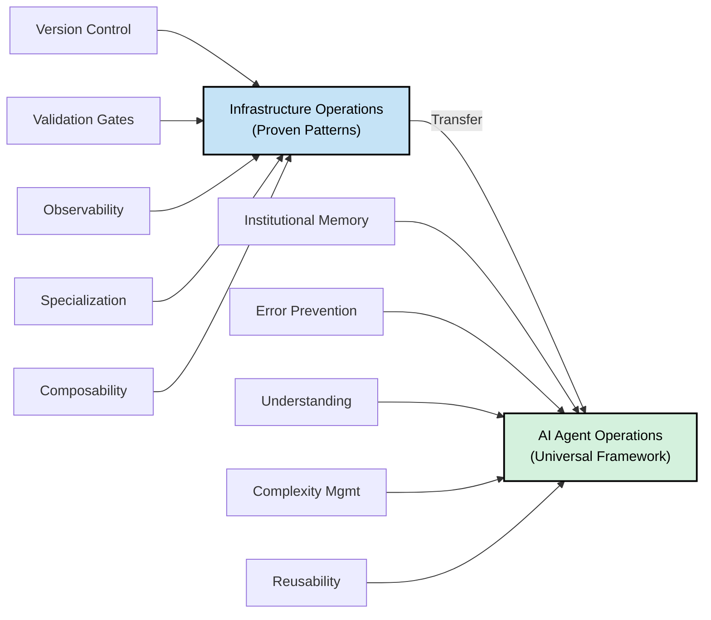

# Why AgentOps?

## The Problem

Everyone's building AI agents. Nobody's figured out how to operate them reliably at scale.

**The pattern:**

- Week 1: "This is amazing!"
- Week 4: Errors piling up
- Week 8: Back to manual work

**Sound familiar?** It mirrors the pre-DevOps era. We solved this for infrastructure. We know how to build reliable systems. **But operating AI agents reliably? We're still figuring that out.**

---

## The Mission

### **Invite people to operationalize AI reliably, at whatever scale they're at, with patterns forged where failure is unacceptable.**

This is Constitutional Principle #0. Everything we build serves this mission.

---

## The Operational Foundation

This framework is built by someone who mastered platform engineering and DevOps at **federal scale for a decade**.

**Federal Operations (10 years):**
- Mastered infrastructure operations under the hardest constraints
- DoD security-hardened environments where failure is unacceptable
- Disconnected networks requiring absolute reliability
- GPU/HPC platforms and 20+ production Kubernetes clusters
- Real consequences: if automation fails, critical missions fail

**Why this matters:** Patterns forged in federal constraints work everywhere. If operations patterns work under disconnected + security-hardened + mission-critical conditions, they're universal.

---

## The Insight

What works for infrastructure should work for AI agents:

- **Version control** for institutional memory
- **Validation gates** to catch errors early
- **Observability** to understand what's happening
- **Specialization** to manage complexity
- **Composable workflows** to enable reuse

**These aren't new ideas. They're proven in production infrastructure.**

This framework applies them to AI agent operations, tested against federal-scale reliability requirements.

---

## Why This Approach

This isn't marketing. This is substance:

**Patterns Forged in Federal Operations**
- Tested under the hardest constraints (disconnected, security-hardened, mission-critical)
- If patterns work there, they generalize everywhere
- Not theoretical—operational principles proven for a decade

**Building in Public**
- You see the thinking, not just polished results
- Participate at inception, shape the framework
- Help test if patterns work in YOUR domain
- Become case studies, not customers

**Educational Ecosystem (Not Just Tools)**
- Make operational thinking accessible at every scale
- Templates for personal projects → students can learn
- Workshops for teams → scaling practices
- Integrations everywhere → meet people where they build
- Case studies → proof it works in real systems

**Honest About Status**
- Alpha stage: Patterns proven, framework generalizing
- Testing hypothesis: Do federal patterns work in other domains?
- Seeking validation: Help us understand scope and limitations
- Community-driven: Your feedback shapes evolution

---

## Building in Public

This isn't a finished product. **You're invited to watch and participate in the evolution.**

**Live Development:**
- Active feature development (weekly/daily updates)
- Work visible in GitHub (every commit, every decision)
- Operational thinking documented as it happens
- Problems discovered and solved in the open

**How to Participate:**
- Try it in your own environment
- Fork and adapt for your domain
- Report what works (and what doesn't)
- Contribute improvements back
- Become a case study

**Why this matters:** You get to shape the framework at its inception. You see the thinking, not just the polished result.

---

**Next:** [Adoption Guide](ADOPTION_GUIDE.md) - How to use AgentOps at your scale

