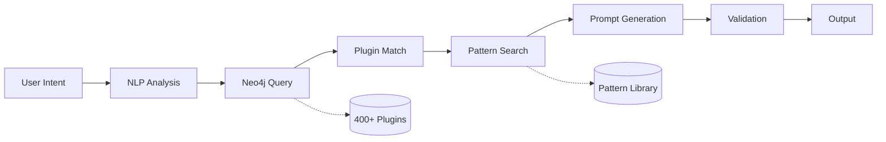

# /craft-prompt - Intelligent Prompt Engineering

**Use this when:** You're not sure how to phrase your request for `/orchestrate`

**Token budget:** 5-10k tokens (quick analysis)

---

## What This Does

Analyzes your intent and generates the perfect prompt for `/orchestrate` by:

1. **Understanding intent** - What you're trying to accomplish
2. **Querying Neo4j** - Finding relevant plugins and past patterns
3. **Composing prompt** - Crafting detailed, specific request
4. **Suggesting plugins** - Showing what will be used
5. **Citing patterns** - Referencing similar successful workflows

---

## Usage

```bash
/craft-prompt "your rough idea"
```

## Examples

### Example 1: Data Analysis

```bash
/craft-prompt "analyze sales data"

# Output:
📝 Suggested prompt for /orchestrate:

"Load sales data from CSV file at ./data/sales.csv, perform comprehensive
statistical analysis including mean, median, mode, standard deviation,
identify trends over time, detect outliers using IQR method, create
interactive visualizations with Plotly including time series charts,
distribution histograms, and correlation matrices, then export results
as HTML dashboard with summary statistics table"

🔌 Plugins this will use:
  • pandas-data-loader (CSV processing)
  • statistical-analyzer (mean, median, std dev, outliers)
  • plotly-visualizer (interactive charts)
  • html-dashboard-generator (export)

📚 Similar successful patterns:
  • Pattern #42: "CSV-to-Dashboard-Pipeline" (95% success, 23 runs)
  • Pattern #67: "Sales-Data-Analysis" (92% success, 15 runs)

💡 Tip: Pattern #42 also added regression forecasting. Want that too?
```

### Example 2: Web Development

```bash
/craft-prompt "make a website for my portfolio"

# Output:
📝 Suggested prompt for /orchestrate:

"Create a modern portfolio website using Next.js 14 with TypeScript,
implement responsive design with Tailwind CSS, add dark mode toggle,
create sections for About/Projects/Contact with smooth scrolling,
integrate contact form with validation, optimize images with next/image,
configure SEO metadata, add sitemap generation, deploy to Vercel with
automatic SSL"

🔌 Plugins this will use:
  • nextjs-scaffolder (project setup)
  • tailwind-styler (responsive CSS)
  • form-validator (contact form)
  • seo-optimizer (metadata + sitemap)
  • vercel-deployer (hosting)

📚 Similar successful patterns:
  • Pattern #128: "Modern-Portfolio-Stack" (97% success, 31 runs)
  • Pattern #89: "Next-Tailwind-Deploy" (94% success, 45 runs)

💡 Tip: 87% of portfolio sites also added a blog section. Include?
```

### Example 3: DevOps Task

```bash
/craft-prompt "setup monitoring"

# Output:
📝 Suggested prompt for /orchestrate:

"Deploy Prometheus + Grafana monitoring stack to Kubernetes cluster,
configure service discovery for all pods in 'production' namespace,
create Grafana dashboards for CPU/memory/network metrics, set up
alerting rules for high resource usage (>80% CPU, >90% memory),
configure Slack webhook for alert notifications, enable persistent
storage for metrics (30 day retention), expose Grafana via Ingress
with authentication"

🔌 Plugins this will use:
  • prometheus-deployer (metrics collection)
  • grafana-configurator (dashboards + alerts)
  • kubernetes-operator (cluster integration)
  • slack-notifier (alert routing)
  • ingress-manager (external access)

📚 Similar successful patterns:
  • Pattern #203: "K8s-Full-Observability" (96% success, 18 runs)
  • Pattern #176: "Prometheus-Grafana-Stack" (93% success, 27 runs)

💡 Tip: Pattern #203 also added distributed tracing. Recommended for microservices.
```

---

## How It Works



1. **Intent Analysis:** Understand what you want to accomplish
2. **Plugin Query:** Search Neo4j for relevant capabilities
3. **Pattern Matching:** Find similar successful workflows
4. **Prompt Crafting:** Generate detailed, specific request
5. **Validation:** Ensure all required plugins exist
6. **Output:** Optimized prompt ready for `/orchestrate`

---

## Neo4j Query Example

Behind the scenes:

```cypher
// Find plugins related to "data analysis"
MATCH (t:Task {intent: "data-analysis"})-[:SOLVED_BY]->(p:Pattern)
MATCH (p)-[:USES]->(plugin:Plugin)
WHERE plugin.category IN ["data", "visualization", "statistics"]
RETURN plugin, p.success_rate
ORDER BY p.success_rate DESC, p.execution_count DESC
LIMIT 10
```

---

## Tips for Best Results

**Be specific about:**
- Data sources (CSV file, API, database)
- Output format (dashboard, report, API)
- Constraints (performance, security, budget)
- Tech stack preferences (if any)

**Examples:**

❌ "analyze data"
✅ "analyze sales CSV with 100k rows, create dashboard"

❌ "make website"
✅ "build portfolio site with Next.js, deploy to Vercel"

❌ "setup CI/CD"
✅ "GitLab CI pipeline for Node.js app, deploy to AWS"

---

## Output Format

```
📝 Suggested prompt for /orchestrate:
[Detailed, specific prompt with all context]

🔌 Plugins this will use:
  • plugin-name-1 (capability)
  • plugin-name-2 (capability)
  ...

📚 Similar successful patterns:
  • Pattern #X: "Name" (success%, runs)
  • Pattern #Y: "Name" (success%, runs)

💡 Tip: [Helpful suggestion based on patterns]
```

---

## When This Helps Most

**Use `/craft-prompt` when:**
- First time doing a task
- Unfamiliar with available plugins
- Want to see what's possible
- Optimize existing workflow
- Learn from successful patterns

**Skip it when:**
- You already know exactly what you want
- Task is very simple
- You're replaying a known pattern

---

**Next step:** Copy the suggested prompt and run `/orchestrate "..."`
