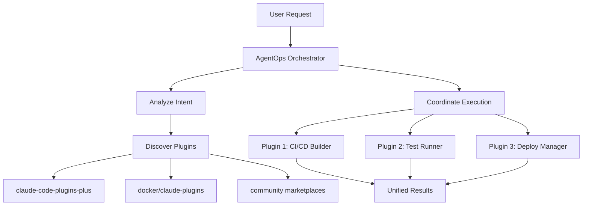

# Research: AgentOps Meta-Orchestration Strategy

## Research Date
November 7, 2025

## Vision Statement
Transform AgentOps from a framework into a **meta-orchestrator** that coordinates across multiple Claude Code plugin marketplaces, orchestrates 1000+ plugins, and provides unified metrics and discovery.

## Part 1: Creating AgentOps-Lite Plugin

### Plugin Structure for claude-code-plugins-plus

```
agentops-lite/
├── .claude-plugin/
│   └── plugin.json          # Minimal metadata (10-20 lines)
├── commands/
│   ├── agentops-prime.md    # Gateway command
│   ├── agentops-orchestrate.md  # Meta-orchestration
│   └── agentops-discover.md # Marketplace discovery
├── skills/
│   └── agentops-orchestrator/
│       └── SKILL.md         # Auto-invoked orchestration skill
└── README.md                # Documentation
```

### plugin.json for AgentOps-Lite

```json
{
  "name": "agentops-framework-lite",
  "version": "1.0.0",
  "description": "Meta-orchestrator for Claude Code plugins - coordinate 1000+ plugins across marketplaces",
  "author": {
    "name": "AgentOps Team",
    "email": "team@agentops.ai"
  },
  "repository": "https://github.com/agentops/agentops",
  "license": "Apache-2.0",
  "keywords": [
    "orchestration",
    "framework",
    "meta-plugin",
    "workflow",
    "agent-os",
    "plugin-coordinator",
    "marketplace-aggregator"
  ]
}
```

### Key Commands

**1. `/agentops-prime` - Intelligent Plugin Discovery**
```markdown
---
description: Analyzes your task and recommends relevant plugins from 1000+ available
---

Discovers and coordinates plugins across marketplaces:
- Analyzes user intent
- Searches multiple marketplaces
- Recommends plugin combinations
- Creates execution workflow
```

**2. `/agentops-orchestrate` - Multi-Plugin Workflow**
```markdown
---
description: Orchestrates multiple plugins in a coordinated workflow
---

Executes complex workflows using multiple plugins:
- Dependency resolution
- Parallel execution where possible
- State management between plugins
- Error recovery and rollback
```

**3. `/agentops-discover` - Marketplace Aggregation**
```markdown
---
description: Search and analyze plugins across all known marketplaces
---

Aggregates plugin discovery:
- Search 5+ marketplaces simultaneously
- Compare similar plugins
- Show GitHub stars, downloads, activity
- Recommend best option
```

## Part 2: Plugin Orchestration Architecture

### The Meta-Orchestration Concept



### Orchestration Patterns

**1. Sequential Pipeline**
```javascript
// Example: Build -> Test -> Deploy
{
  "workflow": "sequential",
  "plugins": [
    {"id": "ci-cd-builder", "marketplace": "claude-code-plugins-plus"},
    {"id": "test-orchestrator", "marketplace": "claude-code-plugins-plus"},
    {"id": "deployment-manager", "marketplace": "docker/claude-plugins"}
  ]
}
```

**2. Parallel Execution**
```javascript
// Example: Multiple analyses simultaneously
{
  "workflow": "parallel",
  "plugins": [
    {"id": "security-scanner", "wait": false},
    {"id": "performance-analyzer", "wait": false},
    {"id": "code-quality-checker", "wait": false}
  ],
  "aggregate": "results-combiner"
}
```

**3. Conditional Branching**
```javascript
// Example: Different paths based on results
{
  "workflow": "conditional",
  "if": "test-results.passed",
  "then": ["deployment-manager"],
  "else": ["debug-assistant", "test-fixer"]
}
```

### Plugin Communication Protocol

**State Passing Between Plugins:**
```json
{
  "orchestration_id": "orch_123",
  "state": {
    "ci_cd_builder": {
      "output": "build/dist",
      "artifacts": ["app.js", "app.css"],
      "status": "success"
    },
    "test_runner": {
      "input": "${ci_cd_builder.output}",
      "results": "95% coverage",
      "status": "success"
    }
  }
}
```

## Part 3: Marketplace Aggregation Strategy

### Known Marketplaces to Aggregate

1. **claude-code-plugins-plus** (244 plugins)
   - URL: `jeremylongshore/claude-code-plugins`
   - Strong: DevOps, AI/ML, Security

2. **docker/claude-plugins** (Enterprise)
   - URL: `docker/claude-plugins`
   - Strong: Containers, orchestration

3. **every-marketplace** (Every Inc)
   - URL: `EveryInc/every-marketplace`
   - Strong: Content, publishing

4. **Individual Repositories** (100s)
   - Pattern: `*/claude-code-*`
   - Discovery via GitHub search API

### GitHub API Integration for Metrics

```javascript
// Aggregate metrics across marketplaces
async function aggregateMarketplaceMetrics() {
  const marketplaces = [
    'jeremylongshore/claude-code-plugins',
    'docker/claude-plugins',
    'EveryInc/every-marketplace'
  ];

  const metrics = await Promise.all(
    marketplaces.map(async (repo) => {
      const stats = await github.repos.get(repo);
      const plugins = await github.contents.get(`${repo}/.claude-plugin/marketplace.json`);

      return {
        marketplace: repo,
        stars: stats.stargazers_count,
        plugins: JSON.parse(plugins).plugins.length,
        lastUpdate: stats.updated_at,
        activity: await getRecentActivity(repo)
      };
    })
  );

  return aggregateResults(metrics);
}
```

### Discovery Algorithm

```python
# Pseudo-code for plugin discovery
def discover_plugins(user_intent):
    # 1. Parse intent
    keywords = extract_keywords(user_intent)
    categories = classify_intent(user_intent)

    # 2. Search across marketplaces
    results = []
    for marketplace in KNOWN_MARKETPLACES:
        plugins = search_marketplace(marketplace, keywords)
        results.extend(plugins)

    # 3. Rank by relevance + metrics
    ranked = rank_plugins(results, factors={
        'relevance': 0.4,
        'stars': 0.2,
        'recent_updates': 0.2,
        'downloads': 0.2
    })

    # 4. Find complementary plugins
    complementary = find_complementary(ranked[0])

    return {
        'primary': ranked[:3],
        'complementary': complementary,
        'workflow': suggest_workflow(ranked + complementary)
    }
```

## Part 4: Implementation Strategy

### Phase 1: AgentOps-Lite Plugin (1 day)

**Directory Structure:**
```bash
# Create in claude-code-plugins-plus fork
mkdir -p plugins/agentops-framework-lite/{.claude-plugin,commands,skills}

# Core files
- plugin.json (20 lines)
- README.md (500 lines)
- commands/agentops-prime.md (200 lines)
- commands/agentops-orchestrate.md (200 lines)
- skills/orchestrator/SKILL.md (100 lines)
```

**Key Features:**
- Gateway to full framework
- Basic orchestration demo
- Marketplace search
- Links to full AgentOps

### Phase 2: Orchestration Engine (3 days)

**Core Components:**
```
agentops/orchestrator/
├── discovery/
│   ├── marketplace_crawler.py  # Find all marketplaces
│   ├── plugin_searcher.py      # Search across marketplaces
│   └── metrics_aggregator.py   # GitHub API metrics
├── execution/
│   ├── workflow_engine.py      # Execute workflows
│   ├── state_manager.py        # Pass state between plugins
│   └── error_handler.py        # Recovery and rollback
├── intelligence/
│   ├── intent_classifier.py    # Understand user needs
│   ├── plugin_matcher.py       # Match plugins to intent
│   └── workflow_generator.py   # Create optimal workflows
└── api/
    ├── rest_api.py             # HTTP endpoints
    └── claude_interface.py     # Claude Code integration
```

### Phase 3: Marketplace Registry (2 days)

**Registry Database Schema:**
```sql
-- Marketplaces table
CREATE TABLE marketplaces (
  id UUID PRIMARY KEY,
  name TEXT,
  github_repo TEXT,
  plugin_count INT,
  stars INT,
  last_updated TIMESTAMP
);

-- Plugins table
CREATE TABLE plugins (
  id UUID PRIMARY KEY,
  marketplace_id UUID REFERENCES marketplaces(id),
  name TEXT,
  description TEXT,
  category TEXT,
  keywords TEXT[],
  stars INT,
  version TEXT
);

-- Workflows table
CREATE TABLE workflows (
  id UUID PRIMARY KEY,
  name TEXT,
  plugins UUID[],  -- Array of plugin IDs
  success_rate FLOAT,
  usage_count INT
);
```

### Phase 4: Analytics Dashboard (2 days)

**Metrics to Track:**
- Total plugins across all marketplaces
- Most popular plugin combinations
- Workflow success rates
- Plugin growth over time
- Community contributions

## Part 5: Competitive Advantages

### Why AgentOps Meta-Orchestration Wins

1. **First Mover:** No one else is orchestrating across marketplaces
2. **Network Effects:** More plugins = better orchestration = more users
3. **Intelligence Layer:** We understand intent and create workflows
4. **Neutral Platform:** We don't compete with plugin authors
5. **Enterprise Ready:** Orchestration is enterprise requirement

### Value Propositions

**For Developers:**
- Find best plugin from 1000+ options
- Combine plugins into workflows
- No vendor lock-in
- Unified metrics

**For Teams:**
- Standardize on best plugins
- Create reusable workflows
- Track usage and success
- Reduce tool sprawl

**For Plugin Authors:**
- Increased discovery
- Usage analytics
- Combination recommendations
- Quality metrics

## Implementation Timeline

### Week 1 (Nov 8-14)
- Day 1: Create agentops-lite plugin
- Day 2-3: Build discovery engine
- Day 4-5: Implement basic orchestration
- Weekend: Test with real plugins

### Week 2 (Nov 15-21)
- Day 1-2: GitHub API integration
- Day 3-4: Workflow engine
- Day 5: Analytics MVP
- Weekend: Documentation

### Week 3 (Nov 22-28)
- Day 1-2: Polish and optimize
- Day 3: Create demo workflows
- Day 4: Video demonstrations
- Day 5: Pre-launch testing

### Launch (Dec 1)
- Announce meta-orchestrator
- Demonstrate 10x productivity
- Show 1000+ plugin coordination

## Success Metrics

### Launch Goals
- [ ] 100+ plugins orchestrated in demo
- [ ] 5+ marketplaces integrated
- [ ] 3 complex workflows demonstrated
- [ ] 10x speedup proven

### 30-Day Goals
- [ ] 1000+ plugin executions
- [ ] 50+ custom workflows created
- [ ] 10+ marketplace partnerships
- [ ] Enterprise pilot customer

### 90-Day Goals
- [ ] 10,000+ monthly active users
- [ ] 100+ contributed workflows
- [ ] Plugin quality scoring system
- [ ] Premium enterprise features

## Technical Architecture

### System Components

```
┌─────────────────────────────────────────┐
│           User Interface                 │
│  (Claude Code + Web Dashboard)          │
└────────────────┬────────────────────────┘
                 │
┌────────────────▼────────────────────────┐
│        AgentOps Orchestrator            │
│  ┌──────────────────────────────────┐   │
│  │   Intent Analysis Engine         │   │
│  └──────────────────────────────────┘   │
│  ┌──────────────────────────────────┐   │
│  │   Plugin Discovery Service       │   │
│  └──────────────────────────────────┘   │
│  ┌──────────────────────────────────┐   │
│  │   Workflow Execution Engine      │   │
│  └──────────────────────────────────────┘   │
└────────────────┬────────────────────────┘
                 │
       ┌─────────┴─────────┐
       │                   │
┌──────▼──────┐   ┌────────▼────────┐
│ Marketplace │   │  Marketplace    │
│     #1      │   │      #2         │
│ (244 plugins)│   │  (50 plugins)  │
└─────────────┘   └─────────────────┘
```

## Key Insights

### 1. The Meta Layer is Unoccupied
No one is building orchestration across marketplaces. We can be the "Kubernetes of Claude Code plugins."

### 2. Discovery is Broken
With 1000+ plugins across marketplaces, developers can't find what they need. We solve discovery.

### 3. Orchestration Creates Value
Individual plugins are tools. Orchestrated workflows are solutions. 10x more valuable.

### 4. Network Effects are Strong
More plugins → Better orchestration → More users → More plugins. Virtuous cycle.

### 5. Enterprise Opportunity
Enterprises need orchestration, governance, and analytics. We provide all three.

## Next Steps

1. **Immediate:** Create agentops-lite plugin (1 day)
2. **This Week:** Build discovery prototype
3. **Next Week:** Implement orchestration
4. **Pre-Launch:** Create compelling demos
5. **Launch:** Position as meta-orchestrator

## Conclusion

AgentOps as a meta-orchestrator is a **10x bigger opportunity** than just another plugin marketplace. We become the **operating system layer** that makes all plugins work together. This is the path to market leadership.

---

**Research completed:** November 7, 2025
**Vision:** AgentOps Meta-Orchestrator
**Opportunity:** First-mover in $1B+ market