# Git Commit Conventions for AgentOps

> **MANDATORY for all commits:** Use semantic commit prefixes to enable tracking, automation, and release notes generation.

## Quick Reference

```text
<type>(<scope>): <subject>

<body>

<footer>
```

**Example:**
```text
feat(monitoring): add Prometheus metrics exporter

- Added /metrics endpoint for Prometheus scraping
- Configured default scrape interval to 30s
- Tested with make test-app APP=monitoring

Closes #123
```

---

## Commit Types (REQUIRED)

Every commit MUST start with one of these types:

| Type | Description | Example | When to Use |
|------|-------------|---------|-------------|
| `feat:` | New feature | `feat(policy): add network isolation` | Adding new functionality |
| `fix:` | Bug fix | `fix(nginx): correct worker count` | Fixing a bug |
| `docs:` | Documentation only | `docs(readme): add AgentOps context` | Documentation changes |
| `refactor:` | Code refactoring | `refactor(api): simplify error handling` | Code restructuring without changing behavior |
| `test:` | Adding/fixing tests | `test(validation): add schema tests` | Test additions or modifications |
| `chore:` | Maintenance | `chore: update dependencies` | Build process, tooling, dependencies |
| `ci:` | CI/CD changes | `ci: add validation pipeline` | CI/CD configuration |
| `perf:` | Performance improvements | `perf(db): optimize query` | Performance optimizations |
| `style:` | Code style | `style: fix linting errors` | Formatting, whitespace (not CSS) |
| `revert:` | Revert previous commit | `revert: "feat(policy): add rule"` | Reverting a previous commit |

---

## Choosing the Right Commit Type

**Not sure which type to use?** Follow this decision tree to select the appropriate commit type for your changes:

```mermaid
graph TB
    Start[📝 What did you change?] --> Question1{Is it new<br/>functionality?}

    Question1 -->|Yes| Feat[feat:<br/>New feature]
    Question1 -->|No| Question2{Does it fix<br/>a bug?}

    Question2 -->|Yes| Fix[fix:<br/>Bug fix]
    Question2 -->|No| Question3{Documentation<br/>only?}

    Question3 -->|Yes| Docs[docs:<br/>Documentation]
    Question3 -->|No| Question4{Code cleanup<br/>or restructure?}

    Question4 -->|Yes| Refactor[refactor:<br/>Code refactor]
    Question4 -->|No| Question5{Adding or<br/>fixing tests?}

    Question5 -->|Yes| Test[test:<br/>Testing]
    Question5 -->|No| Question6{Performance<br/>improvement?}

    Question6 -->|Yes| Perf[perf:<br/>Performance]
    Question6 -->|No| Question7{CI/CD pipeline<br/>changes?}

    Question7 -->|Yes| CI[ci:<br/>CI/CD]
    Question7 -->|No| Question8{Code style<br/>or formatting?}

    Question8 -->|Yes| Style[style:<br/>Code style]
    Question8 -->|No| Chore[chore:<br/>Maintenance]

    Feat --> Example1[Example:<br/>feat: add metrics]
    Fix --> Example2[Example:<br/>fix: correct count]
    Docs --> Example3[Example:<br/>docs: add guide]
    Refactor --> Example4[Example:<br/>refactor: simplify]
    Test --> Example5[Example:<br/>test: add coverage]
    Perf --> Example6[Example:<br/>perf: optimize query]
    CI --> Example7[Example:<br/>ci: add pipeline]
    Style --> Example8[Example:<br/>style: fix linting]
    Chore --> Example9[Example:<br/>chore: update deps]

    classDef questionNode fill:#d97757,stroke:#141413,stroke-width:3px,color:#141413
    classDef typeNode fill:#6a9bcc,stroke:#141413,stroke-width:2px,color:#141413
    classDef exampleNode fill:#788c5d,stroke:#141413,stroke-width:2px,color:#141413
    classDef startNode fill:#e8e6dc,stroke:#b0aea5,stroke-width:2px,color:#141413

    class Start startNode
    class Question1,Question2,Question3,Question4,Question5,Question6,Question7,Question8 questionNode
    class Feat,Fix,Docs,Refactor,Test,Perf,CI,Style,Chore typeNode
    class Example1,Example2,Example3,Example4,Example5,Example6,Example7,Example8,Example9 exampleNode
```



**How to use this tree:**
1. Start at the top: "What did you change?"
2. Answer each question honestly
3. Follow the path to your commit type
4. Use the example format shown

---

## Scope (RECOMMENDED)

Add scope in parentheses to clarify what part of the codebase is affected:

**Common scopes:**
- `(policy)` - Policy-related changes
- `(monitoring)` - Monitoring stack changes
- `(nginx)` - Nginx app changes
- `(readme)` - README file changes
- `(agents)` - Agent definitions
- `(docs)` - Documentation
- `(makefile)` - Makefile changes
- `(ci)` - CI/CD pipelines

**Examples:**
```text
feat(monitoring): add Grafana dashboard
fix(policy): correct RBAC permissions
docs(agents): update harmonize guide
chore(deps): update Helm to v3.12
```

---

## Subject Line Rules

1. **Use imperative mood** — "add feature" not "added feature"
2. **Don't capitalize first letter** — `fix: update config` not `Fix: Update config`
3. **No period at end** — `feat: add api` not `feat: add api.`
4. **Keep it under 72 characters**
5. **Be specific** — "add Prometheus metrics" not "add monitoring"

**Good:**
```text
feat(nginx): increase worker processes to 4
fix(policy): correct namespace selector syntax
docs(readme): add installation instructions
```

**Bad:**
```text
Fixed stuff
Update
Changed config file
```

---

## Commit Workflow from Edit to Push

**The complete workflow** showing how commits fit into the development cycle, including validation steps:

```mermaid
graph LR
    Edit[📝 Edit Files<br/>Make changes] --> Stage[git add .<br/>Stage changes]

    Stage --> Quick{make quick<br/>5 seconds<br/>YAML validation}

    Quick -->|❌ Fail| FixYAML[Fix YAML<br/>syntax errors]
    FixYAML --> Edit

    Quick -->|✅ Pass| CI{make ci-all<br/>30 seconds<br/>Full test suite}

    CI -->|❌ Fail| FixTests[Fix test<br/>failures]
    FixTests --> Edit

    CI -->|✅ Pass| Commit[git commit<br/>Semantic message]

    Commit --> Push[git push<br/>Deploy to remote]

    Push --> ArgoCD[ArgoCD sync<br/>Deploy to cluster]
    ArgoCD --> Success[✅ Complete]

    classDef editNode fill:#e8e6dc,stroke:#b0aea5,stroke-width:2px,color:#141413
    classDef validateNode fill:#6a9bcc,stroke:#141413,stroke-width:2px,color:#141413
    classDef errorNode fill:#d65d4e,stroke:#141413,stroke-width:2px,color:#141413
    classDef commitNode fill:#d97757,stroke:#141413,stroke-width:2px,color:#141413
    classDef successNode fill:#788c5d,stroke:#141413,stroke-width:2px,color:#141413

    class Edit,Stage editNode
    class Quick,CI validateNode
    class FixYAML,FixTests errorNode
    class Commit,Push commitNode
    class ArgoCD,Success successNode
```



**Key points:**
- **Always validate before committing** - Run `make quick` (5s) and `make ci-all` (30s)
- **Fix errors immediately** - Don't bypass validation
- **Use semantic commits** - Follow type(scope): subject format
- **Push triggers deployment** - ArgoCD syncs automatically

---

## Body (OPTIONAL but RECOMMENDED)

Add details after a blank line:

```text
feat(monitoring): add Prometheus metrics exporter

- Added /metrics endpoint for Prometheus scraping
- Configured default scrape interval to 30s
- Updated documentation with metrics examples
- Tested with make test-app APP=monitoring

This enables observability for all applications following
the monitoring pattern in examples/monitoring-pattern.
```

**Body guidelines:**
- Use bullet points for multiple changes
- Explain WHY, not just WHAT
- Reference related docs or issues
- Mention testing performed

---

## Footer (OPTIONAL)

Add references to issues, breaking changes, or reviewers:

```text
feat(api): add authentication layer

BREAKING CHANGE: All API endpoints now require authentication.
Update client code to include auth tokens.

Closes #42
Reviewed-by: @team-lead
```

**Common footers:**
- `Closes #123` - Links to issue
- `BREAKING CHANGE:` - Indicates breaking change
- `Reviewed-by:` - Reviewer attribution
- `Co-Authored-By:` - For pair programming or AI assistance

---

## Agent-Generated Commits

When commits are generated by AI agents (like Claude Code), add:

```text
feat(policy): add network isolation rules

- Added NetworkPolicy for app isolation
- Updated default deny rules
- Tested with make test-app

Context: Applications needed network-level isolation
Solution: Implemented Kubernetes NetworkPolicy resources
Learning: NetworkPolicy requires CNI plugin support
Impact: Improved security posture across 8 production sites

🤖 Generated with [Claude Code](https://claude.com/claude-code)

Co-Authored-By: Claude <noreply@anthropic.com>
```

**AgentOps commit template:**
```text
<type>(<scope>): <subject>

<bullet points of changes>

Context: <why this was needed>
Solution: <what was done>
Learning: <insights for future>
Impact: <value delivered>

🤖 Generated with [Claude Code](https://claude.com/claude-code)

Co-Authored-By: Claude <noreply@anthropic.com>
```

---

## Branch Naming (Related)

Branch names should match commit type conventions:

```text
feat/<description>       # New feature branches
fix/<description>        # Bug fix branches
docs/<description>       # Documentation branches
chore/<description>      # Maintenance branches
site/<site>/<description> # Site-specific branches
```

**Examples:**
```bash
git checkout -b feat/prometheus-metrics
git checkout -b fix/nginx-worker-count
git checkout -b docs/agentops-integration
git checkout -b site/ocptest/increase-replicas
```

---

## Examples by Type

### feat: (New Feature)
```text
feat(monitoring): add Prometheus metrics exporter

- Added /metrics endpoint for Prometheus scraping
- Configured default scrape interval to 30s
- Updated values.yaml with metrics configuration
- Tested with make test-app APP=monitoring

Enables observability for all applications following
the monitoring pattern. Metrics include:
- HTTP request counts
- Response time histograms
- Error rates by status code
```

### fix: (Bug Fix)
```text
fix(nginx): correct worker process count

Changed NGINX_WORKERS from 2 to 4 to handle
increased load during peak hours. Previous value
was causing 502 errors under load testing.

Tested with:
- make test-app APP=nginx
- Load test with 1000 concurrent requests
- No errors observed

Closes #456
```

### docs: (Documentation)
```text
docs(readme): add AgentOps integration context

- Added AgentOps Integration section
- Enhanced "Concepts That Matter" with AgentOps alignment
- Updated closing statement for ecosystem integration
- Linked to gitops Knowledge OS and related agents

Makes the AgentOps framework visible to both human
engineers and AI agents working in the repository.
```

### refactor: (Code Refactoring)
```text
refactor(api): simplify error handling logic

- Consolidated duplicate error handling code
- Created shared ErrorHandler class
- Reduced code duplication by 40%
- No functional changes

All tests pass. Performance benchmarks show no regression.
```

### test: (Testing)
```text
test(validation): add schema validation tests

- Added JSON schema validation for all configs
- Created test fixtures for edge cases
- Improved test coverage from 60% to 85%
- All tests pass in CI pipeline

Prevents schema regressions and ensures consistent
configuration format across environments.
```

### chore: (Maintenance)
```text
chore(deps): update Helm charts to v3.12

- Updated Helm from v3.10 to v3.12
- Updated Chart dependencies
- Regenerated Chart.lock files
- Tested render with make test

No breaking changes. Security patches included.
```

---

## Validation

**Pre-commit hook checks:**
```bash
# Hook validates:
1. Commit starts with valid type (feat, fix, docs, etc.)
2. Format matches: type(scope): subject
3. Subject line is under 72 characters
4. No secrets in commit message
```

**Manual validation:**
```bash
# Check your last commit follows conventions
git log -1 --pretty=format:"%s"

# Should output something like:
# feat(monitoring): add Prometheus metrics

# If it doesn't match the pattern, amend it:
git commit --amend
```

---

## Why This Matters

### For Humans:
- **Clear history** — Easy to understand what changed
- **Better reviews** — Reviewers know what to expect
- **Release notes** — Auto-generate from commit types
- **Debugging** — Find when features were added or bugs fixed

### For Agents:
- **Pattern recognition** — AI can learn from semantic commits
- **Automation** — CI/CD can trigger different actions per type
- **Metrics** — Track feat vs fix ratio, productivity trends
- **Rollbacks** — Easily identify what to revert

### For the Team:
- **Consistency** — Everyone follows the same format
- **Searchability** — `git log --grep="feat(policy)"` finds features
- **Compliance** — Audit trail for security/compliance reviews
- **Knowledge OS** — Git becomes institutional memory

---

## Common Mistakes

### ❌ Wrong:
```text
Updated stuff
Fixed bug
Changes
WIP
```

### ✅ Right:
```text
feat(policy): add network isolation rules
fix(nginx): correct worker process configuration
docs(readme): update installation instructions
chore(deps): update dependencies to latest versions
```

### ❌ Wrong:
```text
Feat: Add monitoring  (capitalized)
fix nginx config      (missing colon and scope)
feat add api.         (period at end)
```

### ✅ Right:
```text
feat(monitoring): add Prometheus metrics
fix(nginx): correct worker configuration
feat(api): add authentication layer
```

---

## Tools

### Git Aliases
```bash
# Add to ~/.gitconfig
[alias]
  # Commit with conventional format
  cf = "!f() { git commit -m \"feat($1): $2\"; }; f"
  cfx = "!f() { git commit -m \"fix($1): $2\"; }; f"
  cd = "!f() { git commit -m \"docs($1): $2\"; }; f"

# Usage:
# git cf monitoring "add Prometheus metrics"
# git cfx nginx "correct worker count"
```

### Commit Message Template
```bash
# Save to ~/.gitmessage
<type>(<scope>): <subject>

-
-
-

Context:
Solution:
Learning:
Impact:

# Then configure:
git config --global commit.template ~/.gitmessage
```

---

## Integration with CI/CD

Our pipelines use commit types to:

1. **Determine release type:**
   - `feat:` → Minor version bump (1.2.0 → 1.3.0)
   - `fix:` → Patch version bump (1.2.0 → 1.2.1)
   - `BREAKING CHANGE:` → Major version bump (1.2.0 → 2.0.0)

2. **Generate release notes:**
   - Group commits by type
   - Create changelog automatically
   - Link to issues/PRs

3. **Trigger actions:**
   - `docs:` → Update documentation site
   - `ci:` → Run extended CI tests
   - `perf:` → Run performance benchmarks

---

## Appendix: Semantic Commit Structure

**Visual breakdown** of all components in a semantic commit message:

```mermaid
graph TB
    subgraph Required["✅ Required Components"]
        Type[type<br/>feat, fix, docs, etc.]
        Colon1[: colon]
        Subject[subject line<br/>imperative mood<br/>no period<br/>max 72 chars]

        Type --> Scope
        Scope --> Colon1
        Colon1 --> Subject
    end

    subgraph Optional["⚙️ Optional Components"]
        Scope[scope in parens<br/>monitoring, nginx, etc.]
        Blank1[blank line]
        Body[body text<br/>bullet points<br/>explain WHY<br/>reference docs]
        Blank2[blank line]
        Footer[footer<br/>Closes #123<br/>BREAKING CHANGE:<br/>Co-Authored-By:]

        Blank1 --> Body
        Body --> Blank2
        Blank2 --> Footer
    end

    Subject --> Blank1

    subgraph Examples["📋 Complete Examples"]
        Ex1["feat(monitoring): add metrics<br/><br/>- Added /metrics endpoint<br/>- Configured scrape interval<br/><br/>Closes #123"]
        Ex2["fix(nginx): correct worker count<br/><br/>Changed from 2 to 4 workers<br/>to handle increased load.<br/><br/>Tested with load test."]
    end

    Footer -.->|"Assembled into"| Ex1
    Footer -.->|"Assembled into"| Ex2

    classDef requiredNode fill:#d97757,stroke:#141413,stroke-width:2px,color:#141413
    classDef optionalNode fill:#6a9bcc,stroke:#141413,stroke-width:2px,color:#141413
    classDef exampleNode fill:#788c5d,stroke:#141413,stroke-width:2px,color:#141413

    class Type,Colon1,Subject requiredNode
    class Scope,Blank1,Body,Blank2,Footer optionalNode
    class Ex1,Ex2 exampleNode
```



**Anatomy breakdown:**

1. **Type (required):** One of 10 types - `feat`, `fix`, `docs`, `refactor`, `test`, `chore`, `ci`, `perf`, `style`, `revert`
2. **Scope (optional but recommended):** Component or area affected - `(monitoring)`, `(nginx)`, `(policy)`
3. **Colon (required):** Separator between type/scope and subject
4. **Subject (required):** Brief description in imperative mood, no period, under 72 characters
5. **Blank line:** Required if body is present
6. **Body (optional):** Detailed explanation with bullet points, WHY not just WHAT
7. **Blank line:** Required if footer is present
8. **Footer (optional):** Issue references, breaking changes, co-authors

---

## References

- [Conventional Commits Specification](https://www.conventionalcommits.org/)
- [Angular Commit Guidelines](https://github.com/angular/angular/blob/main/CONTRIBUTING.md#commit)
- [Semantic Versioning](https://semver.org/)
- [Git Workflow Guide](git-workflow-guide.md) - Our complete git workflow

---

## Summary

**The Rule:** Every commit MUST use semantic prefix

**The Format:** `<type>(<scope>): <subject>`

**The Types:** feat, fix, docs, refactor, test, chore, ci, perf, style, revert

**The Goal:** Clear history, better automation, institutional memory

**Remember:** Future-you at 2am debugging will thank past-you for writing clear, semantic commits.
